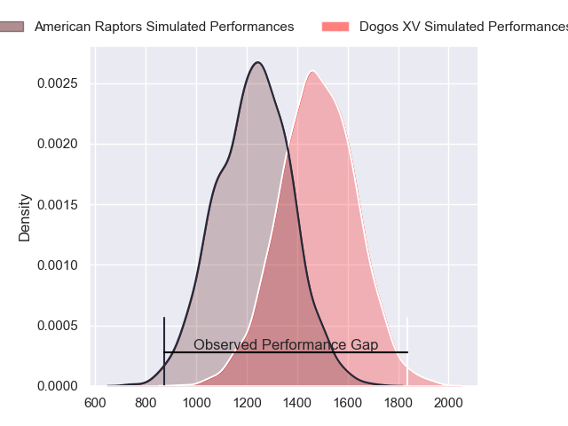
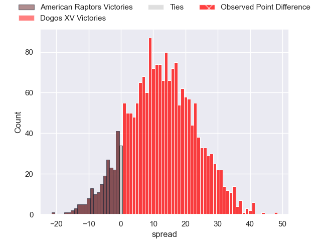
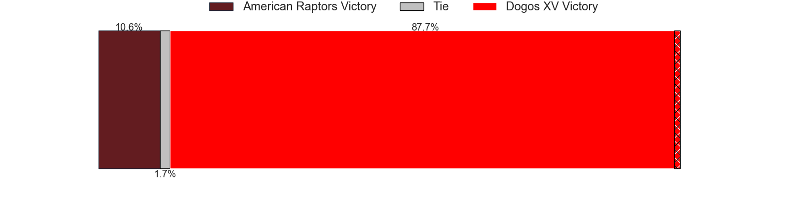
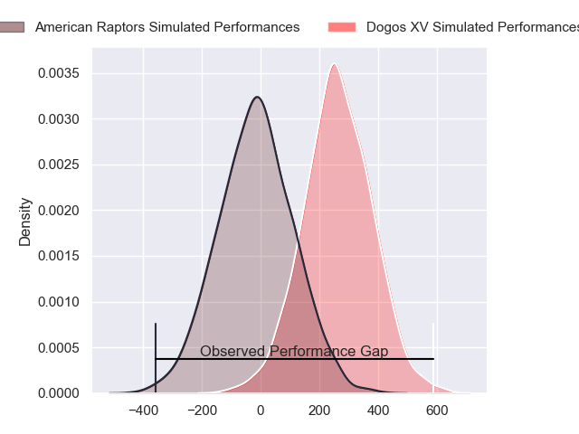
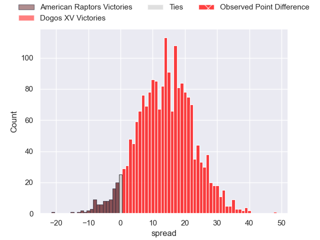
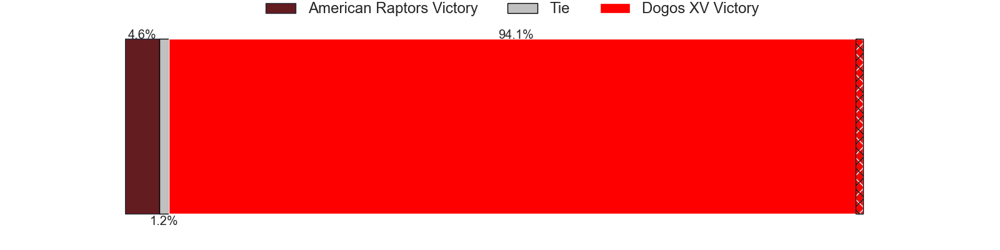

---  
layout: page  
title: American Raptors at Dogos XV; 8-56  
date: 2024-02-16 18:00:00 -0500  
categories: "Super Rugby Americas 2024" match review  
---
# American Raptors at Dogos XV; 8-56

# Club Level Predictions

The first set of predictions treats a club as the smallest object, as the club develops its members, organizes a gameplan, and deploys its players as needed for each match. This club model has a prediction of 0.789, which translates to predicting Dogos XV to win by 12.6.

Our Over/Under is 70.5 - and combined with the spread above, we have a predicted scoreline of 29 to 42

Each club has a rating and a rating deviation (similar to a Glicko rating), and expected performances can be generated. This allows for simulated matches and spreads like the ones below.
## Projected Performances - Club Model

## Projected Spreads - Club Model

## Projected Results - Club Model

# Player Level Predictions - Version 2

Treating teams instead as an entity made up of the currently active players, I have ratings for each player in an altogether different system. These can be combined to form team ratings once teamsheets are announced, weighting starters a bit higher than the reserves. After the match is played, players can be weighted by their minutes on the field, allowing for an accurate measure of the team's composition. With these compiled team ratings, we can make predictions, measure inaccuracy, and update the individual player ratings.
## Prediction without Player Minutes: Dogos XV by 15.2

Dogos XV by 13.0 on a neutral pitch

## Projected Performances - Player Model

## Projected Spreads - Player Model

## Projected Results - Player Model

|   Away Minutes | Away Player           |   Away Percentile |   Number |   Home Percentile | Home Player               |   Home Minutes |
|---------------:|:----------------------|------------------:|---------:|------------------:|:--------------------------|---------------:|
|             68 | Ma'ake Muti           |             15.18 |        1 |             88.84 | Santiago Pulella          |             59 |
|             70 | Diego Fortuny         |             12.29 |        2 |             74.68 | Boris Wenger              |             47 |
|             54 | Facundo Pomponio      |             46.79 |        3 |             78.3  | Octavio Filippa           |             53 |
|             40 | Javon Camp-Villalovos |             15.63 |        4 |             69.54 | Lautaro Simes             |             80 |
|             80 | Mikey Grandy          |             16.32 |        5 |             96.09 | Franco Molina             |             47 |
|             62 | Alexander Vainikolo   |             34.21 |        6 |             45.23 | Aitor Bildosola           |             80 |
|             80 | Aidan Christians      |             32.32 |        7 |             41.03 | Ignacio Jose Gandini      |             62 |
|             65 | Diego Magno           |              1.41 |        8 |             72.54 | Efrain Elias              |             80 |
|             80 | Devereaux Ferris      |              0.2  |        9 |             73.53 | Agustin Moyano            |             58 |
|             53 | Patrick Madden        |             24.17 |       10 |             65.88 | Julian Ignacio Hernandez  |             49 |
|             60 | Thomas Morani         |             79.04 |       11 |             71.28 | Ernesto Giudice           |             80 |
|             80 | Aki Pulu              |             26.48 |       12 |             48.9  | Leonardo Gea Salim        |             48 |
|             80 | Zach Hall             |             35.19 |       13 |             88.62 | Agustin Segura            |             80 |
|             80 | Rufus McLean          |             63.21 |       14 |             42.77 | Lautaro Cipriani          |             80 |
|             80 | Francisco Quinn       |             31.72 |       15 |             53.33 | Mateo Soler               |             80 |
|             40 | Will Crawford         |              4.83 |       16 |             17.59 | Tomas Bartolini           |             33 |
|             27 | John LeFevre          |             23.33 |       17 |             55.98 | Lorenzo Colidio           |             33 |
|             26 | Clay Markoff          |            nan    |       18 |             64    | Faustino Sánchez Valarolo |             32 |
|             20 | Watson Filikitonga    |             21.72 |       19 |             50.24 | Juan Baronio              |             31 |
|             15 | Shawn Clark           |             35.47 |       20 |            nan    | Pedro Delgado             |             27 |
|             18 | Tommy Clark           |             57.82 |       21 |            nan    | Nicolas Viola             |             22 |
|             12 | Koby Baker            |            nan    |       22 |             51.31 | Valentin Cabral           |             18 |
|             10 | Jackson Zabierek      |            nan    |       23 |            nan    | Juan Aguirre              |             21 |

