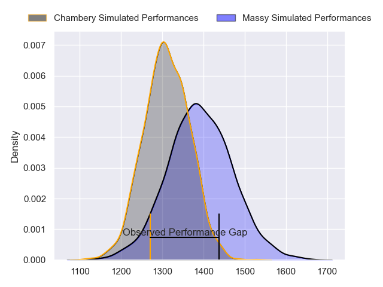
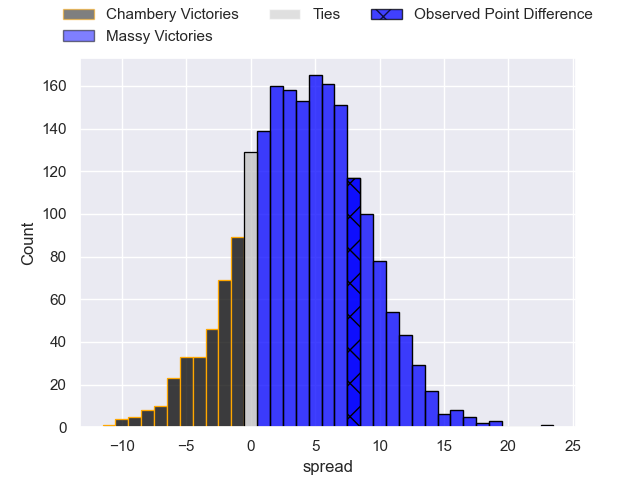
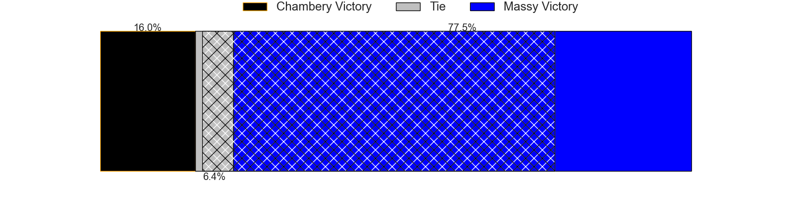
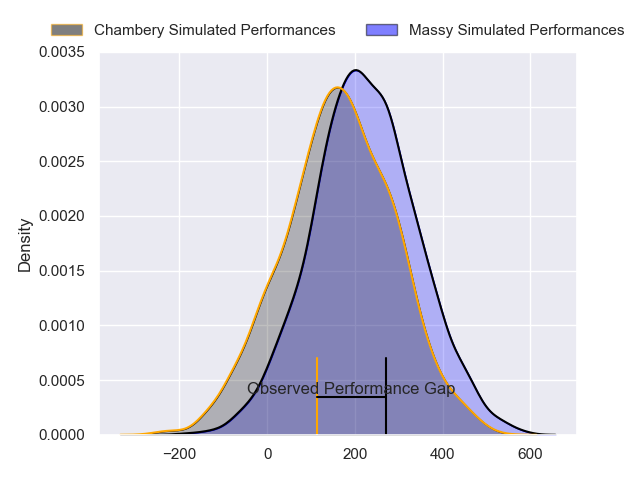
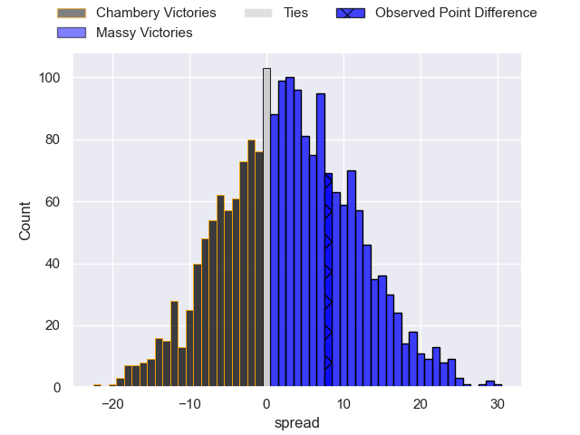
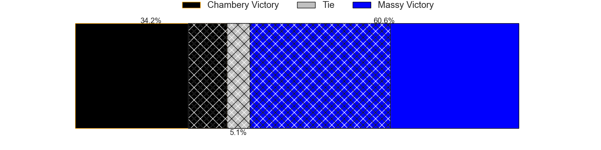

---  
layout: page  
title: Chambery at Massy; 15-23  
date: 2024-02-16 18:00:00 -0500  
categories: "Nationale 2023" match review  
---
# Chambery at Massy; 15-23

# Club Level Predictions

The first set of predictions treats a club as the smallest object, as the club develops its members, organizes a gameplan, and deploys its players as needed for each match. This club model has a prediction of 0.615, which translates to predicting Massy to win by 4.1.

Our Over/Under is 35.5 - and combined with the spread above, we have a predicted scoreline of 16 to 20

Each club has a rating and a rating deviation (similar to a Glicko rating), and expected performances can be generated. This allows for simulated matches and spreads like the ones below.
## Projected Performances - Club Model

## Projected Spreads - Club Model

## Projected Results - Club Model

# Player Level Predictions - Version 2

Treating teams instead as an entity made up of the currently active players, I have ratings for each player in an altogether different system. These can be combined to form team ratings once teamsheets are announced, weighting starters a bit higher than the reserves. After the match is played, players can be weighted by their minutes on the field, allowing for an accurate measure of the team's composition. With these compiled team ratings, we can make predictions, measure inaccuracy, and update the individual player ratings.
## Prediction without Player Minutes: Massy by 2.7

Chambery by 1.5 on a neutral pitch

## Projected Performances - Player Model

## Projected Spreads - Player Model

## Projected Results - Player Model

|   Away Minutes | Away Player                  |   Away Percentile |   Number |   Home Percentile | Home Player          |   Home Minutes |
|---------------:|:-----------------------------|------------------:|---------:|------------------:|:---------------------|---------------:|
|             65 | Enzo Segui                   |             37.1  |        1 |              5.2  | Fernandez Correa     |             52 |
|             70 | Gauthier Brute de Remur      |             73.62 |        2 |             92.44 | Pierre Trassoudaine  |             70 |
|             49 | Giorgi Pertaia               |             67.83 |        3 |             79.75 | Tijde Visser         |             52 |
|             80 | Fabien Witz                  |             65.09 |        4 |              1.15 | Abongile Nonkontwana |             80 |
|             34 | Corentin Astier              |             66.13 |        5 |             87.1  | Andrei Mahu          |             80 |
|             36 | Colin Lebian                 |             70.37 |        6 |             17.14 | Tony Tissot          |             52 |
|             80 | Ahmed Tidiane Kane           |             29.42 |        7 |             95.24 | Clément Vidoni       |             70 |
|             80 | Thomas Coignat               |             57.81 |        8 |             68.76 | Samuel Nollet        |             80 |
|             49 | Hugo Deschaux                |             31.83 |        9 |             73.08 | Benjamin Prier       |             66 |
|             80 | Jean-Luc Alewyn Cilliers     |             74.58 |       10 |              4.75 | Hugo Verdu           |             80 |
|             80 | Va'aufauese Apelu Maliko     |             30.48 |       11 |             55.87 | Giorgi Gogoladze     |             80 |
|             80 | Bastien Reymond              |             40.28 |       12 |             88.59 | Arthur Seigneuret    |             80 |
|             49 | Vereniki Goneva              |              8.61 |       13 |              0.7  | Kimami Sitauti       |             52 |
|             80 | Paul Baptiste Florent Altier |             53.33 |       14 |             97.25 | Alex Preira          |             66 |
|             79 | Thomas Hecquet               |             49.89 |       15 |             70.8  | Tom Deleuze          |             80 |
|             46 | Taniela Matakaiongo          |             51.05 |       16 |             91.11 | Hugo Boutin          |             28 |
|             44 | Pierre-Nicolas Dance         |             47.62 |       17 |             76.08 | Robin Poipy          |             28 |
|             31 | Maewen Sao                   |             66.24 |       18 |             87.01 | Nicolas Ferrer       |             28 |
|             31 | Thibault Dufau               |             12.97 |       19 |             50.52 | Victorien Jacomme    |             28 |
|             31 | Nail Audoire                 |             68.55 |       20 |              8.99 | Yanis Dit Robaglia   |             14 |
|             15 | Nugzar Somkhishvili          |             38.62 |       21 |             76.42 | Lucas Rubio          |             14 |
|             10 | Julien Pierdomenico          |            nan    |       22 |            nan    | Jayson Rodrigues     |             10 |
|              1 | Victor Pisano                |             33.73 |       23 |             84.79 | Lilian Rousset       |             10 |

