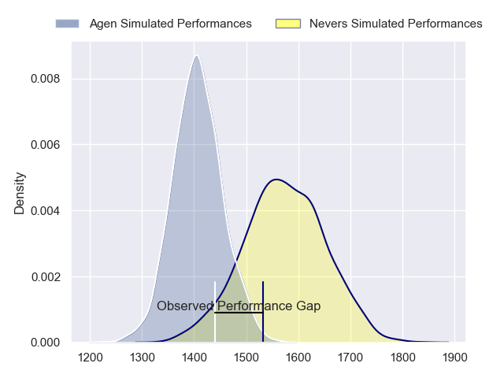
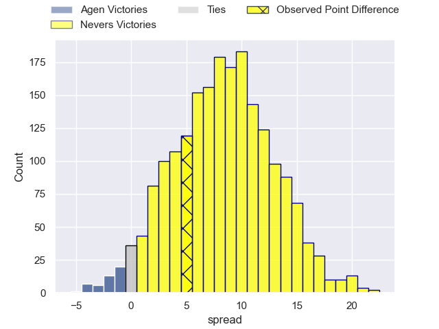
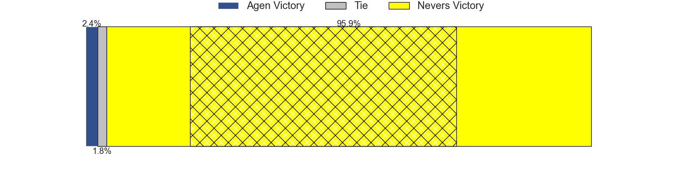
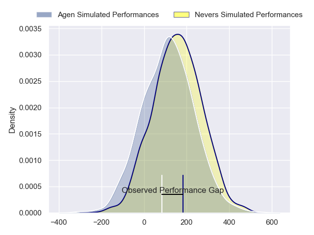
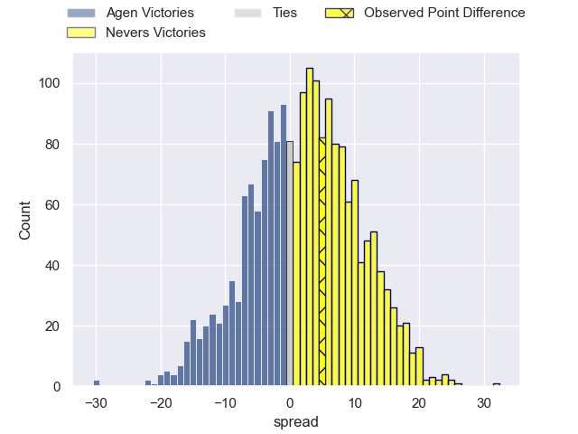

---  
layout: page  
title: Agen at Nevers; 19-24  
date: 2024-02-16 18:00:00 -0500  
categories: "Pro D2 2023" match review  
---
# Agen at Nevers; 19-24

# Club Level Predictions

The first set of predictions treats a club as the smallest object, as the club develops its members, organizes a gameplan, and deploys its players as needed for each match. This club model has a prediction of 0.723, which translates to predicting Nevers to win by 8.4.

Our Over/Under is 45.5 - and combined with the spread above, we have a predicted scoreline of 19 to 27

Each club has a rating and a rating deviation (similar to a Glicko rating), and expected performances can be generated. This allows for simulated matches and spreads like the ones below.
## Projected Performances - Club Model

## Projected Spreads - Club Model

## Projected Results - Club Model

# Player Level Predictions - Version 2

Treating teams instead as an entity made up of the currently active players, I have ratings for each player in an altogether different system. These can be combined to form team ratings once teamsheets are announced, weighting starters a bit higher than the reserves. After the match is played, players can be weighted by their minutes on the field, allowing for an accurate measure of the team's composition. With these compiled team ratings, we can make predictions, measure inaccuracy, and update the individual player ratings.
## Prediction without Player Minutes: Nevers by 1.9

Agen by 1.8 on a neutral pitch

## Projected Performances - Player Model

## Projected Spreads - Player Model

## Projected Results - Player Model

|   Away Minutes | Away Player          |   Away Percentile |   Number |   Home Percentile | Home Player              |   Home Minutes |
|---------------:|:---------------------|------------------:|---------:|------------------:|:-------------------------|---------------:|
|             53 | Hans Lombard-Buret   |             57.95 |        1 |             56.88 | Tornike Mataradze        |             50 |
|             53 | Mike Sosene-Feagai   |             13.39 |        2 |             64.04 | Elia Elia                |             79 |
|             58 | Beau Farrance        |             43.84 |        3 |             36.96 | Cleopas Kundiona         |             54 |
|             53 | Corentin Vernet      |             42.41 |        4 |              7.47 | Christiaan van der Merwe |             65 |
|             80 | Zak Farrance         |             23.45 |        5 |             34.94 | Kevin Noah               |             50 |
|             80 | Matthieu Bonnet      |             52.47 |        6 |             78.91 | Luka Plataret            |             80 |
|             80 | Valentin Gayraud     |             42.71 |        7 |             84.16 | Julien Kazubek           |             80 |
|             69 | Martin Devergie      |             26.29 |        8 |             55.16 | Robin Dione              |             50 |
|             69 | Theo Idjellidaine    |             27.06 |        9 |             11.57 | Hugo Bouyssou            |             69 |
|             56 | Emile Dayral         |             20.14 |       10 |             73.46 | Yohan Le Bourhis         |             51 |
|             80 | Tevita Railevu       |             63.31 |       11 |             50.1  | Arthur Mathiron          |             80 |
|             80 | Harry Sloan          |             75.61 |       12 |             87.22 | Rudy Derrieux            |             80 |
|             80 | Jean-Marcelin Buttin |             43.9  |       13 |             76.89 | Alifereti Loaloa         |             80 |
|             63 | Timilai Rokoduru     |             62.89 |       14 |             58.81 | Christian Ambadiang      |             80 |
|             80 | Mathieu Lamoulie     |             84.14 |       15 |             68.28 | Dylan Jaminet            |             80 |
|             27 | Pierre Jouvin        |             23.67 |       16 |             32.05 | Jordan Seneca            |             30 |
|             27 | Richard Barrington   |             64.02 |       17 |             71.67 | Steven David             |             30 |
|             27 | Joe Maksymiw         |             10.23 |       18 |            nan    | Chris Gabriel            |             30 |
|             24 | Ben Volavola         |             38.63 |       19 |             32.23 | Shaun Reynolds           |             29 |
|             22 | Théo Sauzaret        |             60    |       20 |             56.96 | Ilia Kaikatsishvili      |             26 |
|             17 | Henry Purdy          |             92.03 |       21 |             51.03 | Lado Chachanidze         |             15 |
|             11 | Tomasi Fineanganofo  |            nan    |       22 |             17.25 | Guillaume Manevy         |             11 |
|             11 | Sonatane Takulua     |              6.86 |       23 |             21.65 | Jonathan Maiau           |              1 |

