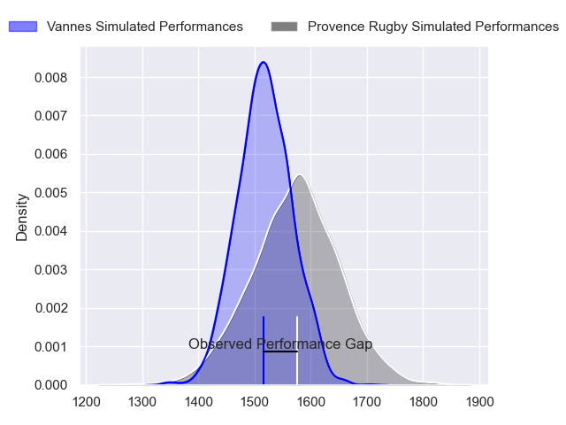
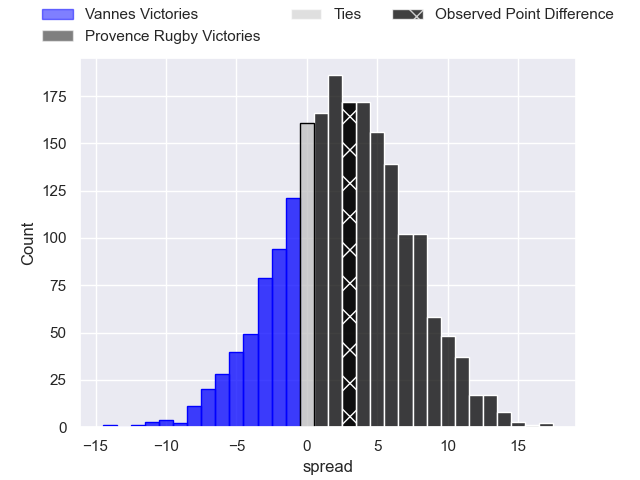
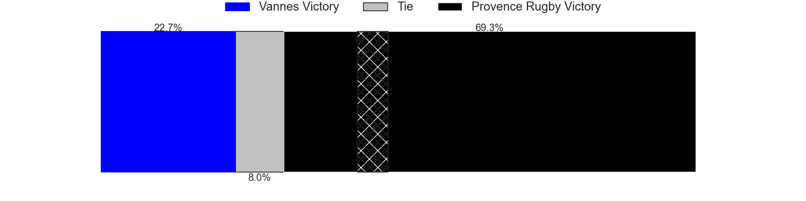
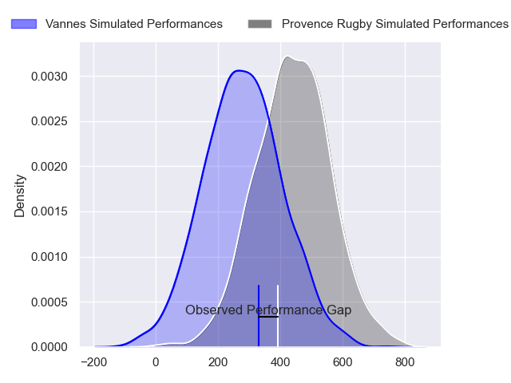
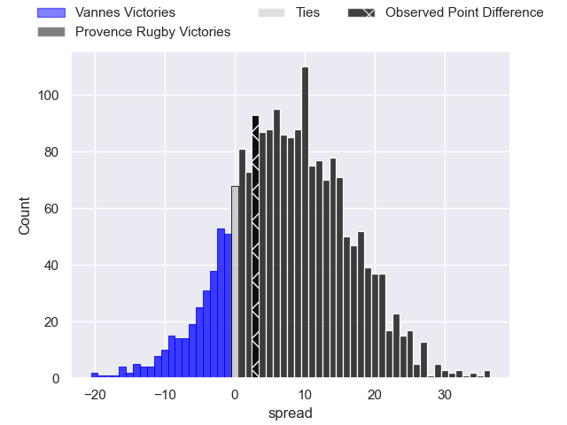
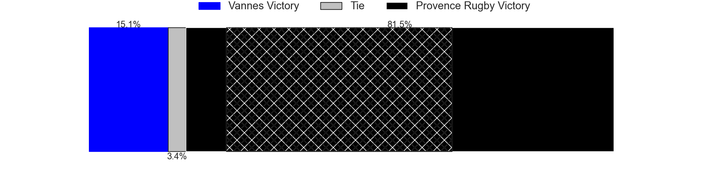

---  
layout: page  
title: Vannes at Provence Rugby; 13-16  
date: 2024-02-16 18:00:00 -0500  
categories: "Pro D2 2023" match review  
---
# Vannes at Provence Rugby; 13-16

# Club Level Predictions

The first set of predictions treats a club as the smallest object, as the club develops its members, organizes a gameplan, and deploys its players as needed for each match. This club model has a prediction of 0.574, which translates to predicting Provence Rugby to win by 2.6.

Our Over/Under is 41.5 - and combined with the spread above, we have a predicted scoreline of 20 to 22

Each club has a rating and a rating deviation (similar to a Glicko rating), and expected performances can be generated. This allows for simulated matches and spreads like the ones below.
## Projected Performances - Club Model

## Projected Spreads - Club Model

## Projected Results - Club Model

# Player Level Predictions - Version 2

Treating teams instead as an entity made up of the currently active players, I have ratings for each player in an altogether different system. These can be combined to form team ratings once teamsheets are announced, weighting starters a bit higher than the reserves. After the match is played, players can be weighted by their minutes on the field, allowing for an accurate measure of the team's composition. With these compiled team ratings, we can make predictions, measure inaccuracy, and update the individual player ratings.
## Prediction without Player Minutes: Provence Rugby by 10.4

Provence Rugby by 4.8 on a neutral pitch

## Projected Performances - Player Model

## Projected Spreads - Player Model

## Projected Results - Player Model

|   Away Minutes | Away Player             |   Away Percentile |   Number |   Home Percentile | Home Player           |   Home Minutes |
|---------------:|:------------------------|------------------:|---------:|------------------:|:----------------------|---------------:|
|             57 | Andy Bordelai           |             85.04 |        1 |             72.85 | Federico Wegrzyn      |             72 |
|             65 | Théo Beziat             |             55.54 |        2 |             87.45 | Lucas Martin          |             68 |
|             57 | Paga Tafili             |             92.38 |        3 |             99.01 | Tomas Francis         |             72 |
|             80 | Anton Bresler           |             69.47 |        4 |             74.08 | Jérôme Dufour         |             57 |
|             61 | Mattéo Desjeux          |             22.12 |        5 |             77.19 | Josh Tyrell           |             80 |
|             49 | Juan Bautista Pedemonte |             21.16 |        6 |             58.1  | Guillaume Piazzoli    |             58 |
|             80 | Francisco Gorrissen     |             98.73 |        7 |             55.45 | Charly Gambini        |             80 |
|             49 | Sione Kalamafoni        |             62.7  |        8 |             72.26 | Teimana Harrison      |             70 |
|             80 | Michael Ruru            |             92.73 |        9 |             51.87 | Arthur Coville        |             66 |
|             80 | Maxime Lafage           |             95.49 |       10 |             82.66 | Jimmy Gopperth        |             80 |
|             29 | Martin Alonso Munoz     |             22.33 |       11 |              8.51 | Adrien Lapegue-Lafaye |             80 |
|             80 | Alex Arrate             |             16.18 |       12 |             83.7  | Kaveinga Finau        |             80 |
|             80 | Sacha Valleau           |             87.78 |       13 |             42.61 | Atila Septar          |             66 |
|             80 | Enzo Benmegal           |             54.71 |       14 |             76.3  | Sione Tui             |             80 |
|             80 | Gwenaël Duplenne        |             98.85 |       15 |             77.2  | Enzo Selponi          |             80 |
|             51 | Thibault Debaes         |             36.1  |       16 |             44.93 | Clément Chartier      |             23 |
|             31 | Léon Boulier            |             26.35 |       17 |             35.2  | Malohi Suta           |             22 |
|             31 | Joe Edwards             |             91.84 |       18 |             31.24 | Simon Tarel           |             14 |
|             23 | Charles-Henri Berguet   |             38.71 |       19 |             27.01 | Eto Bainivalu         |             14 |
|             23 | Phil Kite               |             80.73 |       20 |              3.87 | Loick Jammes          |             12 |
|             15 | Pat Leafa               |             89.67 |       21 |             26.56 | Carl Axtens           |             10 |
|             19 | Eric Marks              |             12.44 |       22 |             55.02 | Thomas Vernet         |              8 |
|            nan | nan                     |            nan    |       23 |             31.9  | Nicolas Toth          |              8 |

