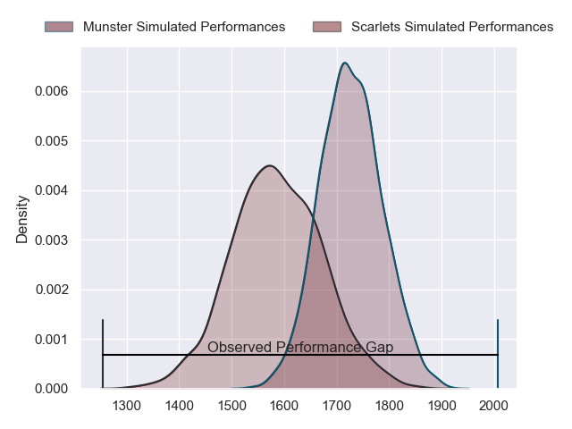
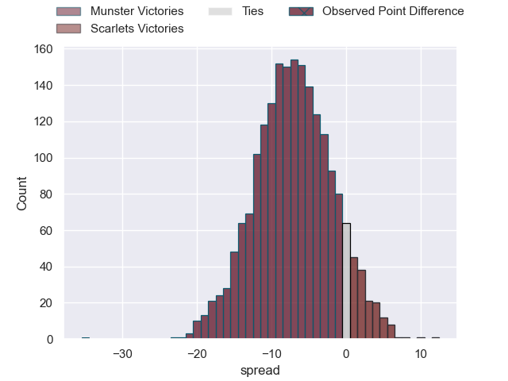
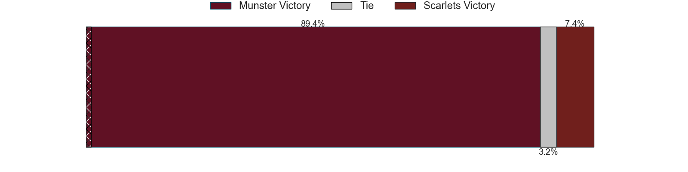
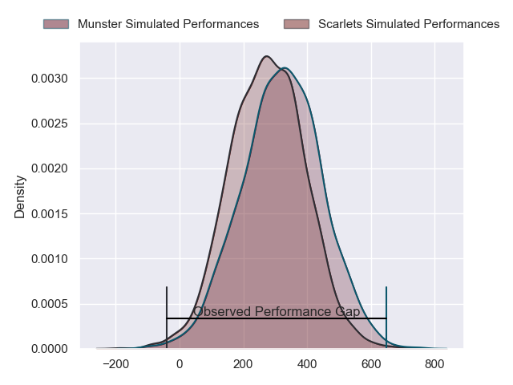
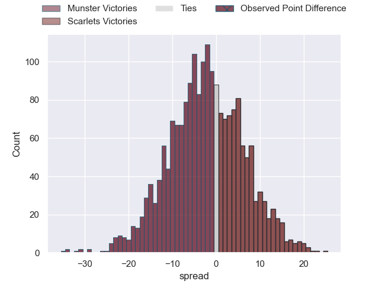

---  
layout: page  
title: Munster at Scarlets; 42-7  
date: 2024-02-16 18:00:00 -0500  
categories: "United Rugby Championship 2023" match review  
---
# Munster at Scarlets; 42-7

# Club Level Predictions

The first set of predictions treats a club as the smallest object, as the club develops its members, organizes a gameplan, and deploys its players as needed for each match. This club model has a prediction of 0.314, which translates to predicting Munster to win by 6.9.

Our Over/Under is 41.5 - and combined with the spread above, we have a predicted scoreline of 24 to 17

Each club has a rating and a rating deviation (similar to a Glicko rating), and expected performances can be generated. This allows for simulated matches and spreads like the ones below.
## Projected Performances - Club Model

## Projected Spreads - Club Model

## Projected Results - Club Model

# Player Level Predictions - Version 2

Treating teams instead as an entity made up of the currently active players, I have ratings for each player in an altogether different system. These can be combined to form team ratings once teamsheets are announced, weighting starters a bit higher than the reserves. After the match is played, players can be weighted by their minutes on the field, allowing for an accurate measure of the team's composition. With these compiled team ratings, we can make predictions, measure inaccuracy, and update the individual player ratings.
## Prediction without Player Minutes: Munster by 2.8

Munster by 8.4 on a neutral pitch

## Projected Performances - Player Model

## Projected Spreads - Player Model

## Projected Results - Player Model

|   Away Minutes | Away Player      |   Away Percentile |   Number |   Home Percentile | Home Player         |   Home Minutes |
|---------------:|:-----------------|------------------:|---------:|------------------:|:--------------------|---------------:|
|             50 | Jeremy Loughman  |             95.27 |        1 |             60.8  | Kemsley Mathias     |             50 |
|             69 | Niall Scannell   |             90.83 |        2 |             25.14 | Eduan Swart         |             80 |
|             53 | Oli Jager        |             89.82 |        3 |             33.04 | Harri O'Connor      |             40 |
|             80 | Thomas Ahern     |             58.16 |        4 |             27.82 | Alex Craig          |             80 |
|             51 | RG Snyman        |             99.08 |        5 |             73.91 | Sam Lousi           |             52 |
|             42 | Ruadhan Quinn    |             53.1  |        6 |             30.33 | Jarrod Taylor       |             41 |
|             80 | Alex Kendellen   |             69.57 |        7 |             22.77 | Dan Davis           |             80 |
|             80 | Gavin Coombes    |             80.52 |        8 |             96.48 | Vaea Fifita         |             67 |
|             59 | Conor Murray     |             98.04 |        9 |             32.75 | Archie Hughes       |             50 |
|             80 | Joey Carbery     |             68.25 |       10 |             28.2  | Dan Jones           |             50 |
|             80 | Shane Daly       |             95.6  |       11 |             26.42 | Ioan Nicholas       |             80 |
|             67 | Alex Nankivell   |             90.82 |       12 |             26.02 | Eddie James         |             80 |
|             80 | Antoine Frisch   |             88.04 |       13 |             31.59 | Joe Roberts         |             67 |
|             80 | Sean O'Brien     |             19.71 |       14 |             26.73 | Tomi Lewis          |             80 |
|             74 | Mike Haley       |             56.55 |       15 |             22.99 | Johnny McNicholl    |             80 |
|             11 | Eoghan Clarke    |            nan    |       16 |            nan    | Harry Thomas        |             13 |
|             30 | Josh Wycherley   |             35.8  |       17 |             73.48 | Wyn Jones           |             30 |
|             27 | John Ryan        |             92.05 |       18 |            nan    | Sam Wainwright      |             40 |
|             29 | Fineen Wycherley |            nan    |       19 |            nan    | Jac Price           |             28 |
|             38 | Jack O'Sullivan  |            nan    |       20 |            nan    | Teddy Leatherbarrow |             34 |
|             21 | Ethan Coughlan   |            nan    |       21 |            nan    | Efan Jones          |             30 |
|             13 | Rory Scannell    |            nan    |       22 |            nan    | Charlie Titcombe    |             30 |
|              6 | Shay McCarthy    |            nan    |       23 |            nan    | Steffan Evans       |             13 |

