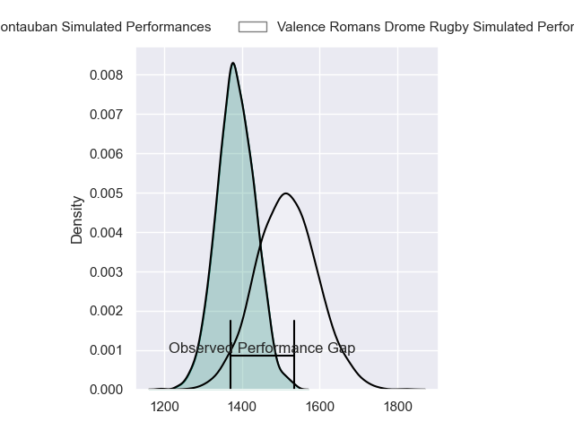
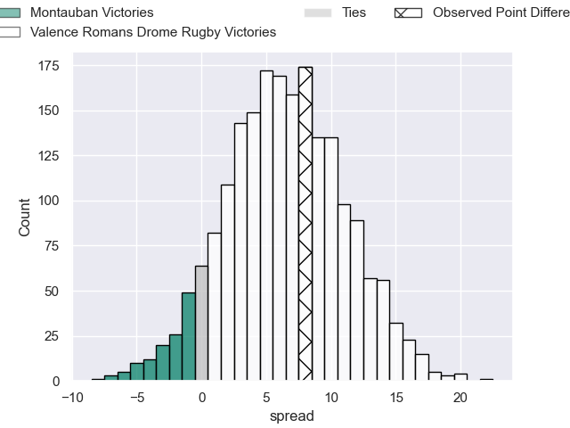
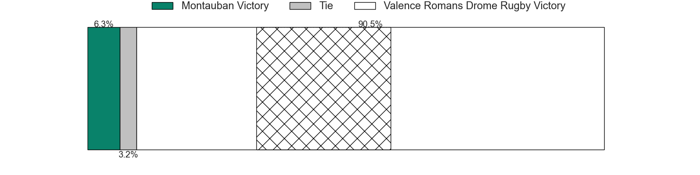
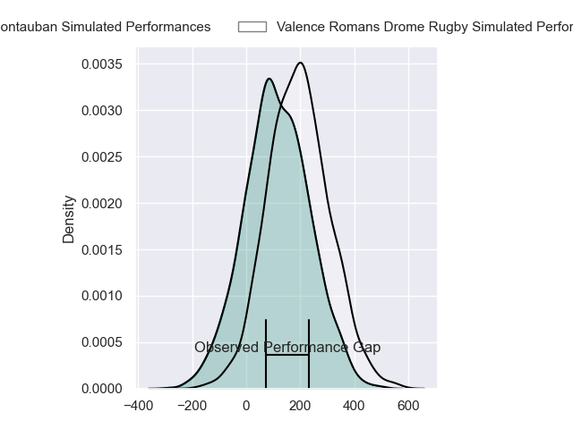
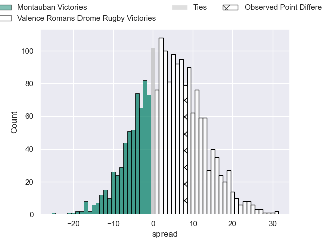
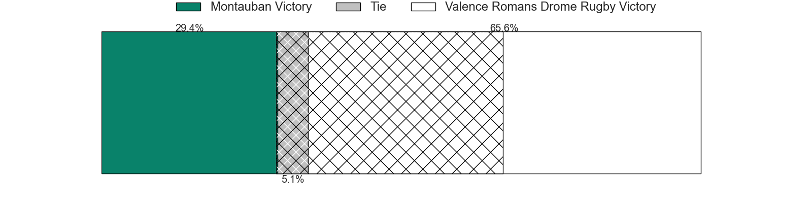

---  
layout: page  
title: Montauban at Valence Romans Drome Rugby; 13-21  
date: 2024-02-16 18:00:00 -0500  
categories: "Pro D2 2023" match review  
---
# Montauban at Valence Romans Drome Rugby; 13-21

# Club Level Predictions

The first set of predictions treats a club as the smallest object, as the club develops its members, organizes a gameplan, and deploys its players as needed for each match. This club model has a prediction of 0.674, which translates to predicting Valence Romans Drome Rugby to win by 6.4.

Our Over/Under is 40.5 - and combined with the spread above, we have a predicted scoreline of 17 to 23

Each club has a rating and a rating deviation (similar to a Glicko rating), and expected performances can be generated. This allows for simulated matches and spreads like the ones below.
## Projected Performances - Club Model

## Projected Spreads - Club Model

## Projected Results - Club Model

# Player Level Predictions - Version 2

Treating teams instead as an entity made up of the currently active players, I have ratings for each player in an altogether different system. These can be combined to form team ratings once teamsheets are announced, weighting starters a bit higher than the reserves. After the match is played, players can be weighted by their minutes on the field, allowing for an accurate measure of the team's composition. With these compiled team ratings, we can make predictions, measure inaccuracy, and update the individual player ratings.
## Prediction without Player Minutes: Valence Romans Drome Rugby by 3.7

Valence Romans Drome Rugby by 0.7 on a neutral pitch

## Projected Performances - Player Model

## Projected Spreads - Player Model

## Projected Results - Player Model

|   Away Minutes | Away Player             |   Away Percentile |   Number |   Home Percentile | Home Player         |   Home Minutes |
|---------------:|:------------------------|------------------:|---------:|------------------:|:--------------------|---------------:|
|             41 | Lucas Seyrolle          |             12.05 |        1 |             70.8  | Andrea Pontanier    |             28 |
|             57 | Ru-Hann Greyling        |             22.94 |        2 |              3.3  | Cyril Deligny       |             51 |
|             41 | Mirian Burduli          |              6.43 |        3 |             27.05 | Gareth Milasinovich |             56 |
|             80 | Tjuee Uanivi            |              8.97 |        4 |             28.74 | Ryan McCauley       |             68 |
|             51 | Lewis Bean              |             34.14 |        5 |             51.15 | Yassine Maamry      |             57 |
|             80 | Frank Bradshaw          |             88.67 |        6 |             32.21 | Axel Bruchet        |             69 |
|             41 | Stéphane Munoz          |             44.39 |        7 |             80.48 | Thembelani Bholi    |             80 |
|             41 | Corentin Coularis       |             26.06 |        8 |             83.33 | Ioane Iashagashvili |             80 |
|             55 | Alexis Bernadet         |             65.49 |        9 |             52.35 | Léopold Dupas       |             50 |
|             57 | Jérôme Bosviel          |             85.78 |       10 |             19.19 | Lucas Meret         |             80 |
|             80 | Yvan Reilhac            |             53.88 |       11 |             81.55 | Mosese Mawalu       |             80 |
|             80 | Dan Goggin              |             79.79 |       12 |             10.34 | Mathieu Guillomot   |             65 |
|             80 | Simon Renda             |             68.29 |       13 |             81.53 | Ben Neiceru         |             80 |
|             80 | Josua Vici              |             28.41 |       14 |             94.55 | Adam Vargas         |             80 |
|             80 | Semesa Rokoduguni       |             88.05 |       15 |             22.3  | George Worth        |             80 |
|             39 | Malino Vanai            |              1.88 |       16 |             26.61 | Anthony Aléo        |             52 |
|             39 | Tietie Tuimauga         |             62.59 |       17 |             82.94 | Joris Moura         |             30 |
|             39 | Frédéric Quercy         |              4.2  |       18 |             69.17 | Dorian Marco Pena   |             29 |
|             39 | Taumua Lui Sanft Naeata |            nan    |       19 |             23.04 | Chris Talakai       |             24 |
|             29 | Dimitri Vaotoa          |             34.02 |       20 |             71.15 | Florian Goumat      |             23 |
|             25 | Shaun Venter            |              5.69 |       21 |             69.57 | Anatole Pauvert     |             15 |
|             23 | Thomas Fortunel         |             21.33 |       22 |              2.83 | Éloi Massot         |             11 |
|             23 | Kevin Firmin            |              6.24 |       23 |             86.55 | Darrell Dyer        |             12 |

