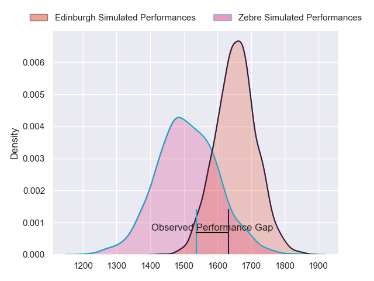
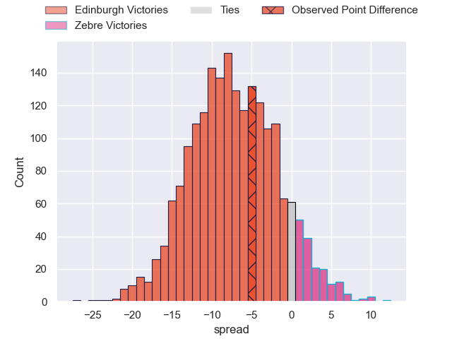
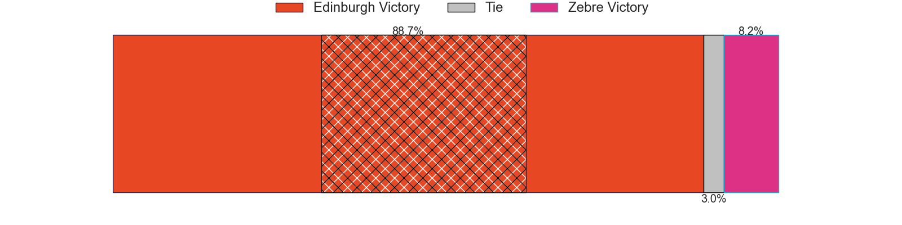
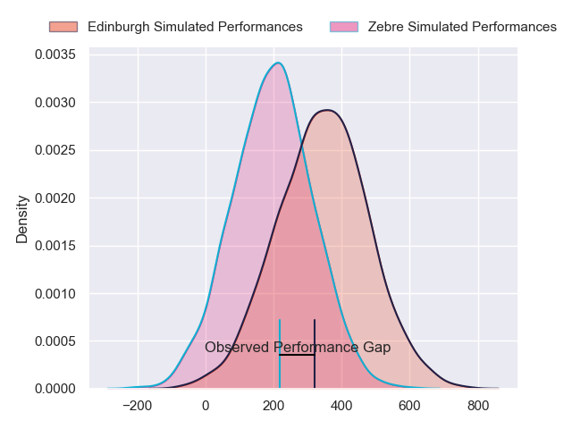
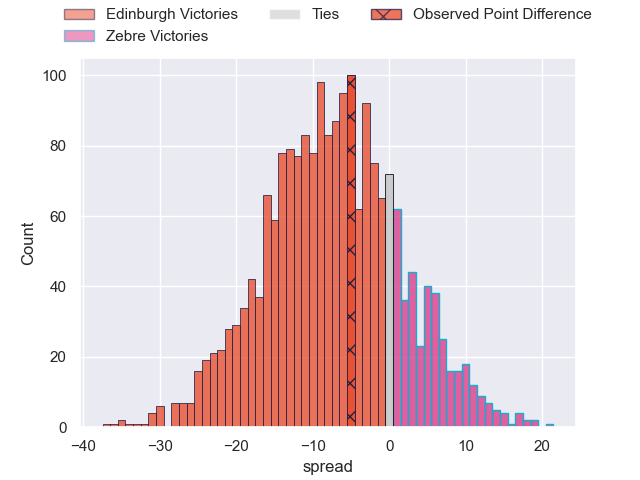

---  
layout: page  
title: Edinburgh at Zebre; 24-19  
date: 2024-02-16 18:00:00 -0500  
categories: "United Rugby Championship 2023" match review  
---
# Edinburgh at Zebre; 24-19

# Club Level Predictions

The first set of predictions treats a club as the smallest object, as the club develops its members, organizes a gameplan, and deploys its players as needed for each match. This club model has a prediction of 0.302, which translates to predicting Edinburgh to win by 7.4.

Our Over/Under is 41.5 - and combined with the spread above, we have a predicted scoreline of 24 to 17

Each club has a rating and a rating deviation (similar to a Glicko rating), and expected performances can be generated. This allows for simulated matches and spreads like the ones below.
## Projected Performances - Club Model

## Projected Spreads - Club Model

## Projected Results - Club Model

# Player Level Predictions - Version 2

Treating teams instead as an entity made up of the currently active players, I have ratings for each player in an altogether different system. These can be combined to form team ratings once teamsheets are announced, weighting starters a bit higher than the reserves. After the match is played, players can be weighted by their minutes on the field, allowing for an accurate measure of the team's composition. With these compiled team ratings, we can make predictions, measure inaccuracy, and update the individual player ratings.
## Prediction without Player Minutes: Edinburgh by 6.8

Edinburgh by 11.1 on a neutral pitch

## Projected Performances - Player Model

## Projected Spreads - Player Model

## Projected Results - Player Model

|   Away Minutes | Away Player       |   Away Percentile |   Number |   Home Percentile | Home Player            |   Home Minutes |
|---------------:|:------------------|------------------:|---------:|------------------:|:-----------------------|---------------:|
|             81 | Boan Venter       |             45.88 |        1 |             46.42 | Muhamed Hasa           |             50 |
|             80 | Dave Cherry       |             66.24 |        2 |             67.71 | Luca Bigi              |             57 |
|             54 | WP Nel            |             99.64 |        3 |             46.68 | Matteo Nocera          |             68 |
|             81 | Marshall Sykes    |             47.87 |        4 |             49.19 | Matteo Canali          |             81 |
|             81 | Glen Young        |             47.87 |        5 |             48.62 | Leonard Krumov         |             60 |
|             80 | Jamie Ritchie     |            100    |        6 |             42.75 | Bautista Stavile       |             81 |
|             59 | Hamish Watson     |             74.5  |        7 |             42.01 | Iacopo Bianchi         |             57 |
|             81 | Viliame Mata      |             84.85 |        8 |             44.29 | Giovanni Licata        |             60 |
|             56 | Ali Price         |             88.02 |        9 |             47.54 | Gonzalo Garcia         |             57 |
|             81 | Ben Healy         |             88.6  |       10 |             41.33 | Giovanni Montemauri    |             81 |
|             81 | Chris Dean        |             44.76 |       11 |              8.78 | Simone Gesi            |             81 |
|             60 | James Lang        |             42.49 |       12 |             44.12 | Damiano Mazza          |             81 |
|             81 | Matt Currie       |             42.84 |       13 |             94.76 | Luca Morisi            |             81 |
|             81 | Harry Paterson    |             49.95 |       14 |             34.18 | Pierre Bruno           |             71 |
|             81 | Emiliano Boffelli |             65.29 |       15 |             42.07 | Geronimo Prisciantelli |             81 |
|              1 | Patrick Harrison  |            nan    |       16 |             10.52 | Marco Manfredi         |             24 |
|              0 | Luan de Bruin     |            nan    |       17 |            nan    | Luca Rizzoli           |             31 |
|             27 | Javan Sebastian   |             71.15 |       18 |            nan    | Riccardo Genovese      |             13 |
|              1 | Tom Dodd          |            nan    |       19 |            nan    | Dylan De Leeuw         |             21 |
|             22 | Connor Boyle      |            nan    |       20 |            nan    | Taina Fox-Matamua      |             24 |
|             25 | Ben Vellacott     |            nan    |       21 |              9.82 | Alessandro Fusco       |             24 |
|             21 | Mark Bennett      |            nan    |       22 |             52.8  | Scott Gregory          |             10 |
|              0 | Nathan Sweeney    |            nan    |       23 |            nan    | Giacomo Ferrari        |             21 |

