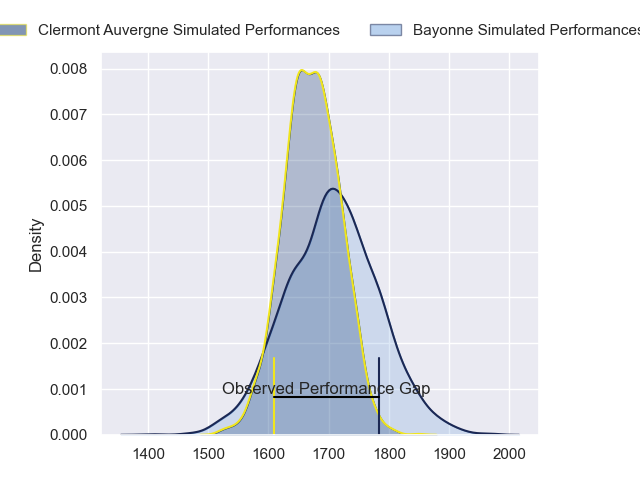
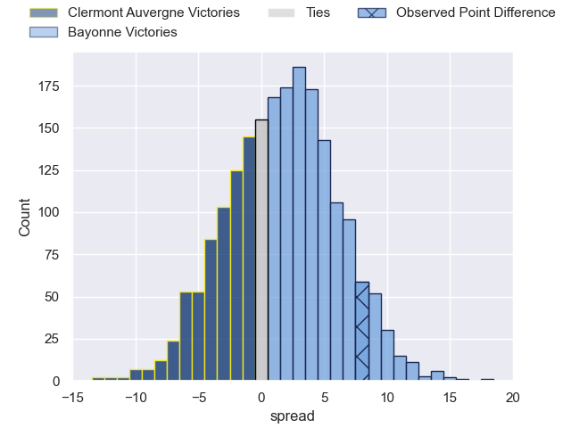
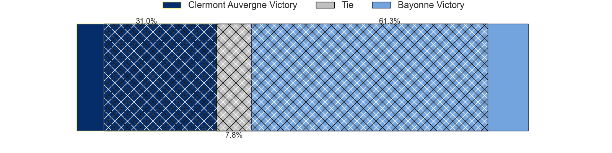
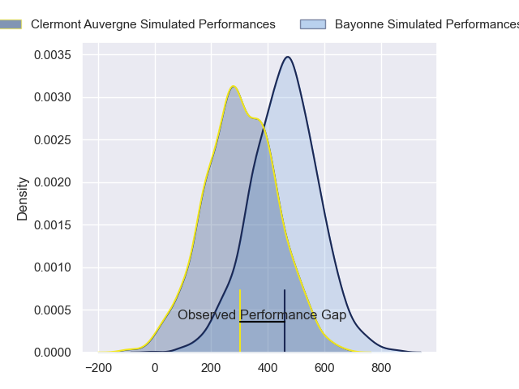
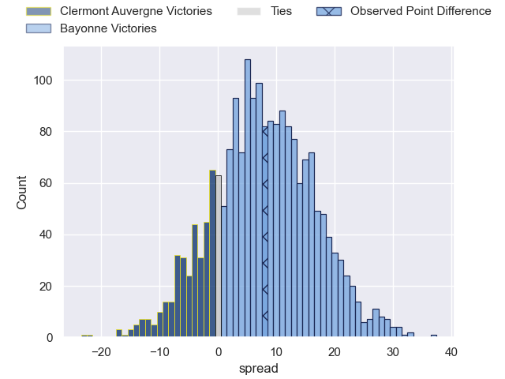
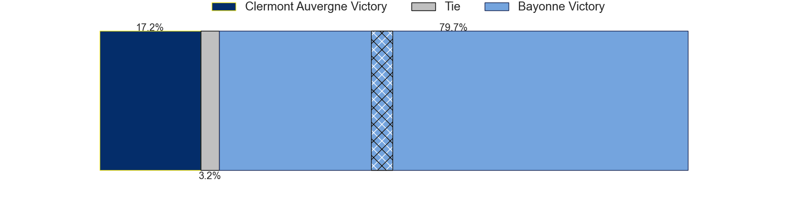

---  
layout: page  
title: Clermont Auvergne at Bayonne; 13-21  
date: 2024-02-17 18:00:00 -0500  
categories: "Top 14 Orange 2023" match review  
---
# Clermont Auvergne at Bayonne; 13-21

# Club Level Predictions

The first set of predictions treats a club as the smallest object, as the club develops its members, organizes a gameplan, and deploys its players as needed for each match. This club model has a prediction of 0.549, which translates to predicting Bayonne to win by 1.7.

Our Over/Under is 41.5 - and combined with the spread above, we have a predicted scoreline of 20 to 21

Each club has a rating and a rating deviation (similar to a Glicko rating), and expected performances can be generated. This allows for simulated matches and spreads like the ones below.
## Projected Performances - Club Model

## Projected Spreads - Club Model

## Projected Results - Club Model

# Player Level Predictions - Version 2

Treating teams instead as an entity made up of the currently active players, I have ratings for each player in an altogether different system. These can be combined to form team ratings once teamsheets are announced, weighting starters a bit higher than the reserves. After the match is played, players can be weighted by their minutes on the field, allowing for an accurate measure of the team's composition. With these compiled team ratings, we can make predictions, measure inaccuracy, and update the individual player ratings.
## Prediction without Player Minutes: Bayonne by 9.1

Bayonne by 1.1 on a neutral pitch

## Projected Performances - Player Model

## Projected Spreads - Player Model

## Projected Results - Player Model

|   Away Minutes | Away Player          |   Away Percentile |   Number |   Home Percentile | Home Player           |   Home Minutes |
|---------------:|:---------------------|------------------:|---------:|------------------:|:----------------------|---------------:|
|             52 | Giorgi Beria         |             58.66 |        1 |             54.37 | Matis Perchaud        |             61 |
|             61 | Yohan Beheregaray    |             29.72 |        2 |             13.58 | Vincent Giudicelli    |             52 |
|             52 | Rabah Slimani        |             91.07 |        3 |             78.75 | Luke Tagi             |             61 |
|             52 | Thibaud Lanen        |             83.22 |        4 |             96.9  | Denis Marchois        |             52 |
|             80 | Rob Simmons          |             96.32 |        5 |             44.25 | Thomas Ceyte          |             80 |
|             23 | Killian Tixeront     |             76.08 |        6 |             95.38 | Remi Bourdeau         |             68 |
|             64 | Marcos Kremer        |             85.73 |        7 |             87.51 | Arthur Iturria        |             64 |
|             80 | Fritz Lee            |             92.49 |        8 |             81.22 | Uzair Cassiem         |             69 |
|             80 | Baptiste Jauneau     |             51.76 |        9 |             92.55 | Maxime Machenaud      |             80 |
|             80 | Benjamin Urdapilleta |             91.71 |       10 |             95.26 | Camille Lopez         |             80 |
|             74 | Alivereti Raka       |             36.27 |       11 |             88.57 | Remy Baget            |             80 |
|             80 | Pierre Fouyssac      |             31.01 |       12 |             52.73 | Federico Mori         |             80 |
|             80 | Alex Newsome         |             82.93 |       13 |             32.75 | Guillaume Martocq     |             80 |
|             67 | Joris Jurand         |             79.87 |       14 |             39.73 | Arnaud Erbinartegaray |             80 |
|             80 | Thomas Roziere       |             40.69 |       15 |             15.86 | Cheikh Tiberghien     |             80 |
|             19 | Robin Couly          |            nan    |       16 |             90.64 | Facundo Bosch         |             28 |
|             28 | Daniel Bibi Biziwu   |            nan    |       17 |             53.3  | Swan Cormenier        |             19 |
|             28 | Tomas Lavanini       |             94.25 |       18 |              7.13 | Manuel Leindekar      |             28 |
|             16 | Peceli Yato          |             42.6  |       19 |             90.45 | Baptiste Heguy        |             39 |
|             57 | Lucas Dessaigne      |            nan    |       20 |             60.98 | Gela Aprasidze        |              0 |
|              0 | Theo Giral           |            nan    |       21 |             45.5  | Thomas Dolhagaray     |              0 |
|             19 | Bautista Delguy      |            nan    |       22 |            nan    | Aurelien Callandret   |              0 |
|             28 | Cristian Ojovan      |            nan    |       23 |            nan    | Tevita Tatafu         |             19 |

