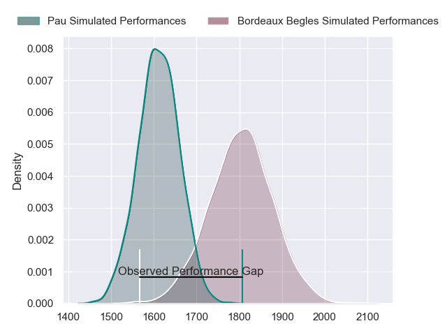
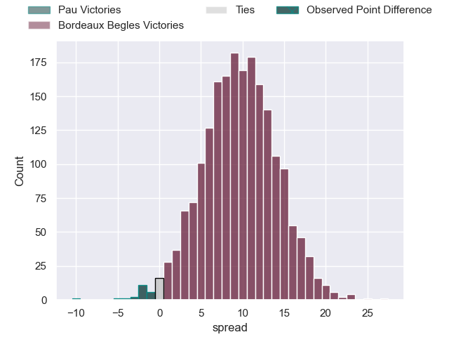
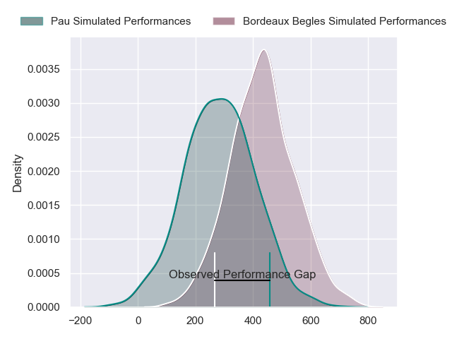
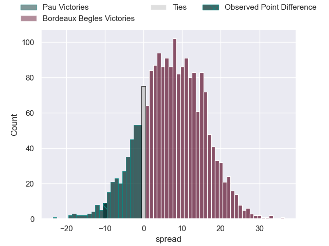
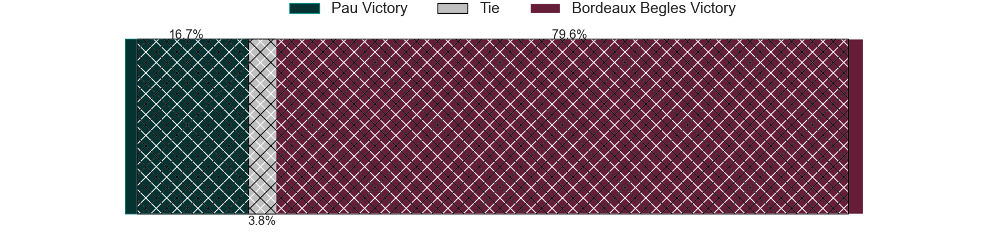

---  
layout: page  
title: Pau at Bordeaux Begles; 20-10  
date: 2024-02-17 18:00:00 -0500  
categories: "Top 14 Orange 2023" match review  
---
# Pau at Bordeaux Begles; 20-10

# Club Level Predictions

The first set of predictions treats a club as the smallest object, as the club develops its members, organizes a gameplan, and deploys its players as needed for each match. This club model has a prediction of 0.75, which translates to predicting Bordeaux Begles to win by 9.6.

Our Over/Under is 55.5 - and combined with the spread above, we have a predicted scoreline of 23 to 32

Each club has a rating and a rating deviation (similar to a Glicko rating), and expected performances can be generated. This allows for simulated matches and spreads like the ones below.
## Projected Performances - Club Model

## Projected Spreads - Club Model

## Projected Results - Club Model

# Player Level Predictions - Version 2

Treating teams instead as an entity made up of the currently active players, I have ratings for each player in an altogether different system. These can be combined to form team ratings once teamsheets are announced, weighting starters a bit higher than the reserves. After the match is played, players can be weighted by their minutes on the field, allowing for an accurate measure of the team's composition. With these compiled team ratings, we can make predictions, measure inaccuracy, and update the individual player ratings.
## Prediction without Player Minutes: Bordeaux Begles by 8.0

Bordeaux Begles by 0.8 on a neutral pitch

## Projected Performances - Player Model

## Projected Spreads - Player Model

## Projected Results - Player Model

|   Away Minutes | Away Player          |   Away Percentile |   Number |   Home Percentile | Home Player        |   Home Minutes |
|---------------:|:---------------------|------------------:|---------:|------------------:|:-------------------|---------------:|
|             56 | Simon-Pierre Chauvac |             60.75 |        1 |             69.18 | Jefferson Poirot   |             67 |
|             56 | Romain Ruffenach     |             61.44 |        2 |             58.3  | Maxime Lamothe     |             57 |
|             56 | Nicolas Corato       |              8.24 |        3 |             97.94 | Ben Tameifuna      |             59 |
|             82 | Hugo Auradou         |             62.56 |        4 |             89.4  | Pierre Bochaton    |             82 |
|             41 | Samuel Whitelock     |             99.31 |        5 |             77.53 | Kane Douglas       |             52 |
|             82 | Luke Whitelock       |             98.62 |        6 |             30.16 | Marko Gazzotti     |             63 |
|             73 | Reece Hewat          |             64.97 |        7 |             84.38 | Pete Samu          |             41 |
|             61 | Beka Gorgadze        |             55.01 |        8 |             84.62 | Tevita Tatafu      |             67 |
|             59 | Thibault Daubagna    |             89    |        9 |              2.95 | Paul Abadie        |             64 |
|             82 | Axel Desperes        |             57.72 |       10 |             29.69 | Mateo Garcia       |             82 |
|             65 | Samuel Ezeala        |              6.14 |       11 |             19.58 | Pablo Uberti       |             82 |
|             78 | Tumua Manu           |             94.88 |       12 |             49.24 | Tani Vili          |             48 |
|             82 | Emilien Gailleton    |             37.49 |       13 |             38.65 | Nicolas Depoortere |             82 |
|             82 | Theo Attissogbe      |             40.46 |       14 |             95.03 | Madosh Tambwe      |             82 |
|             73 | Jack Maddocks        |             80.23 |       15 |             96.55 | Romain Buros       |             82 |
|             26 | Youri Delhommel      |             44.65 |       16 |             93.17 | Clement Maynadier  |             25 |
|             26 | Guram Papidze        |             12.37 |       17 |            nan    | Yahnis El Maslouhi |             15 |
|             41 | Lekima Tagitagivalu  |             70.26 |       18 |             61.18 | Alexandre Ricard   |             30 |
|             30 | Sacha Zegueur        |            nan    |       19 |             89.75 | Guido Petti        |             41 |
|             23 | Dan Robson           |             98.04 |       20 |             78.31 | Mahamadou Diaby    |             34 |
|              9 | Elliot Roudil        |            nan    |       21 |              2.75 | Theo Nanette       |             18 |
|             21 | Thomas Carol         |             67.51 |       22 |            nan    | Zack Holmes        |             34 |
|             26 | Siate Tokolahi       |             84.95 |       23 |            nan    | Zaccharie Affane   |             23 |

