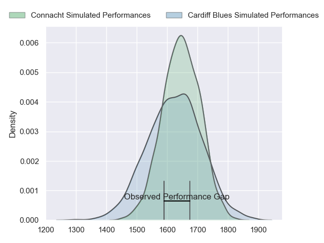
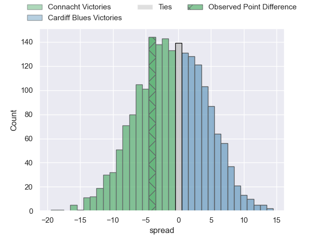
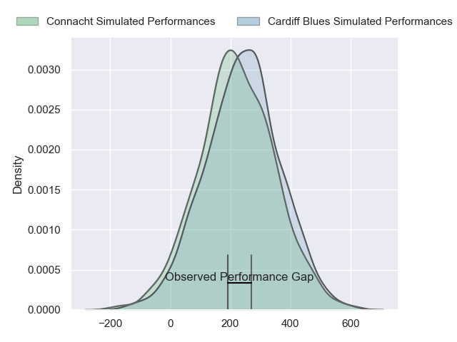
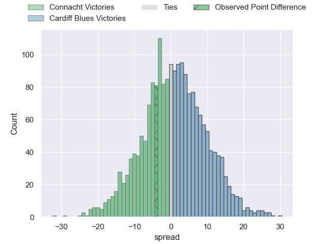

---  
layout: page  
title: Connacht at Cardiff Blues; 16-12  
date: 2024-02-17 18:00:00 -0500  
categories: "United Rugby Championship 2023" match review  
---
# Connacht at Cardiff Blues; 16-12

# Club Level Predictions

The first set of predictions treats a club as the smallest object, as the club develops its members, organizes a gameplan, and deploys its players as needed for each match. This club model has a prediction of 0.467, which translates to predicting Connacht to win by 1.2.

Our Over/Under is 46.5 - and combined with the spread above, we have a predicted scoreline of 24 to 23

Each club has a rating and a rating deviation (similar to a Glicko rating), and expected performances can be generated. This allows for simulated matches and spreads like the ones below.
## Projected Performances - Club Model

## Projected Spreads - Club Model

## Projected Results - Club Model

# Player Level Predictions - Version 2

Treating teams instead as an entity made up of the currently active players, I have ratings for each player in an altogether different system. These can be combined to form team ratings once teamsheets are announced, weighting starters a bit higher than the reserves. After the match is played, players can be weighted by their minutes on the field, allowing for an accurate measure of the team's composition. With these compiled team ratings, we can make predictions, measure inaccuracy, and update the individual player ratings.
## Prediction without Player Minutes: Cardiff Blues by 1.4

Connacht by 5.5 on a neutral pitch

## Projected Performances - Player Model

## Projected Spreads - Player Model

## Projected Results - Player Model

|   Away Minutes | Away Player           |   Away Percentile |   Number |   Home Percentile | Home Player        |   Home Minutes |
|---------------:|:----------------------|------------------:|---------:|------------------:|:-------------------|---------------:|
|             52 | Denis Buckley         |             89.87 |        1 |             36.47 | Rhys Carré         |             80 |
|             52 | Dave Heffernan        |             51.29 |        2 |             47.42 | Liam Belcher       |             68 |
|             52 | Jack Aungier          |             51.7  |        3 |             38.8  | Will Davies-King   |             58 |
|             80 | Niall Murray          |             56.11 |        4 |             39.63 | Shane Lewis-Hughes |             80 |
|             52 | Joe Joyce             |             95.51 |        5 |             14.63 | Seb Davies         |             80 |
|             80 | Shamus Hurley-Langton |             51.43 |        6 |             73.54 | Ben Donnell        |             18 |
|             61 | Conor Oliver          |             83.92 |        7 |             85.08 | Thomas Young       |             80 |
|             80 | Cian Prendergast      |             61.54 |        8 |             73.19 | Lopeti Timani      |             80 |
|             72 | Caolin Blade          |             81.73 |        9 |             35.56 | Ellis Bevan        |             69 |
|             72 | JJ Hanrahan           |             90.5  |       10 |             46.32 | Tinus de Beer      |             69 |
|             80 | Andrew Smith          |             11.43 |       11 |              4.76 | Aled Summerhill    |             80 |
|             80 | Cathal Forde          |             48.89 |       12 |             37.14 | Ben Thomas         |             80 |
|             80 | David Hawkshaw        |             55.65 |       13 |             89.29 | Rey Lee-Lo         |             80 |
|             15 | Shayne Bolton         |             59.15 |       14 |              1.8  | Owen Lane          |             80 |
|             80 | Tiernan O'Halloran    |             45.98 |       15 |             34.48 | Jacob Beetham      |             75 |
|             28 | Tadgh McElroy         |             40.41 |       16 |             20.66 | Efan Daniel        |             12 |
|             28 | Peter Dooley          |             97.31 |       17 |            nan    | Rhys Barratt       |              0 |
|             28 | Sam Illo              |            nan    |       18 |            nan    | Ciaran Parker      |             22 |
|             28 | Oisin Dowling         |             63.48 |       19 |            nan    | Alun Lawrence      |              0 |
|             19 | Jarrad Butler         |             83.68 |       20 |             28.44 | Mackenzie Martin   |             62 |
|              8 | Michael McDonald      |             33.79 |       21 |            nan    | Jamie Hill         |             11 |
|              8 | Jack Carty            |             92.87 |       22 |            nan    | Arwel Robson       |             11 |
|             65 | Tom Farrell           |             54.37 |       23 |             92.32 | Uilisi Halaholo    |              5 |

