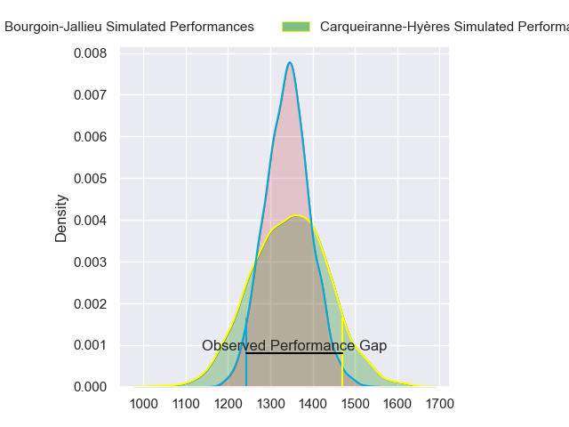
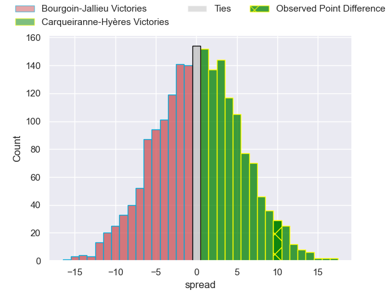
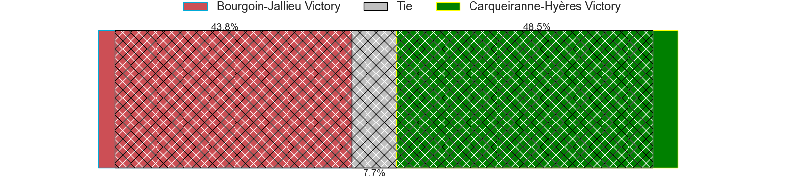
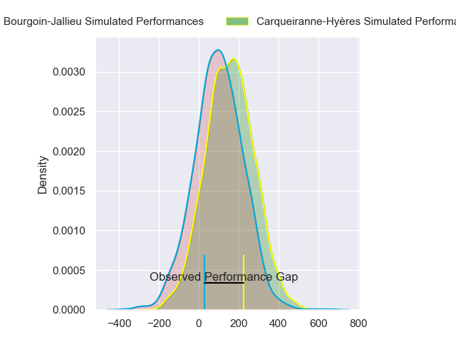
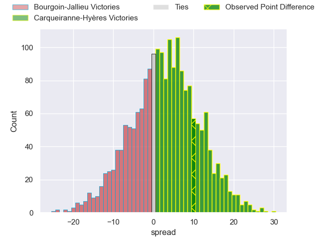
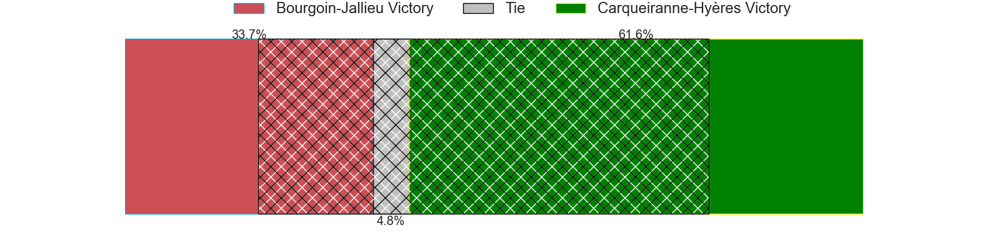

---  
layout: page  
title: Bourgoin-Jallieu at Carqueiranne-Hyeres; 10-20  
date: 2024-02-17 18:00:00 -0500  
categories: "Nationale 2023" match review  
---
# Bourgoin-Jallieu at Carqueiranne-Hyeres; 10-20

# Club Level Predictions

The first set of predictions treats a club as the smallest object, as the club develops its members, organizes a gameplan, and deploys its players as needed for each match. This club model has a prediction of 0.507, which translates to predicting Carqueiranne-Hyères to win by 0.3.

Our Over/Under is 39.5 - and combined with the spread above, we have a predicted scoreline of 19 to 20

Each club has a rating and a rating deviation (similar to a Glicko rating), and expected performances can be generated. This allows for simulated matches and spreads like the ones below.
## Projected Performances - Club Model

## Projected Spreads - Club Model

## Projected Results - Club Model

# Player Level Predictions - Version 2

Treating teams instead as an entity made up of the currently active players, I have ratings for each player in an altogether different system. These can be combined to form team ratings once teamsheets are announced, weighting starters a bit higher than the reserves. After the match is played, players can be weighted by their minutes on the field, allowing for an accurate measure of the team's composition. With these compiled team ratings, we can make predictions, measure inaccuracy, and update the individual player ratings.
## Prediction without Player Minutes: Carqueiranne-Hyères by 2.8

Carqueiranne-Hyères by 0.4 on a neutral pitch

## Projected Performances - Player Model

## Projected Spreads - Player Model

## Projected Results - Player Model

|   Away Minutes | Away Player              |   Away Percentile |   Number |   Home Percentile | Home Player         |   Home Minutes |
|---------------:|:-------------------------|------------------:|---------:|------------------:|:--------------------|---------------:|
|             55 | Zhorzhi (Jorji) Saldadze |             12.97 |        1 |             72.99 | Eli Serra-Miglietti |             48 |
|             57 | Killian Tripier          |             66.36 |        2 |             57.17 | Theo Lachaud        |             56 |
|             49 | Maxime Calliet           |             16.37 |        3 |             56.17 | Lasha Mchelidze     |             56 |
|             63 | Robin Gascou             |             58.44 |        4 |             38.23 | Nathan Gendre       |             64 |
|             80 | Léandre Cotte            |             21.47 |        5 |             31.69 | Lucas Cazac         |             80 |
|             80 | Kevin Chaudouard         |             40.62 |        6 |             31.5  | Nicolas Baquer      |             68 |
|             45 | Aitor Hourcade           |              9.44 |        7 |             60.87 | Joachim Beaumont    |             80 |
|             80 | Théo Lepage              |             44.52 |        8 |             95.8  | Andre Gorin         |             80 |
|             55 | Tomas Munilla lo Duca    |             81.3  |        9 |             82.48 | Thomas Sonetti      |             48 |
|             63 | Nicolas Vuillemin        |             84.05 |       10 |             49.05 | Juan Kotze          |             80 |
|             80 | Quentin Lefort           |             74.05 |       11 |             36.55 | Paul Gadea          |             80 |
|             63 | Isaiah Leota             |             68.26 |       12 |             86.05 | Romain Leveque      |             75 |
|             80 | Christopher Bosch        |             28.37 |       13 |             14.07 | Charles Brousse     |             21 |
|             80 | Makalea Foliaki          |             52.97 |       14 |             32.21 | Dylan Sage          |             80 |
|             80 | Paul-Hugo Champ          |             46.65 |       15 |             69.28 | Josselyn Bouchon    |             80 |
|             35 | Matteo Broeders          |            nan    |       16 |             60.81 | Theo Moitrier       |             59 |
|             31 | Osman Dimen              |             30.68 |       17 |             75.67 | Sti Sithole         |             32 |
|             25 | Romain Favaretto         |             55.19 |       18 |             40.16 | Rémi Dubié          |             32 |
|             25 | Martin Doan              |             61.02 |       19 |             21.14 | Yan Tabarot         |             24 |
|             23 | Mohamed Khribache        |             24.08 |       20 |             62.34 | Costel Burtila      |             24 |
|             17 | Poutasi Luafutu          |             34.27 |       21 |             43.4  | Shade Barkallah     |             16 |
|             17 | Aviata Silago            |             30.12 |       22 |             67.23 | Spike Salman        |             12 |
|             17 | Pieter Morton            |             43.84 |       23 |             67.21 | Ionel Melinte       |              5 |

