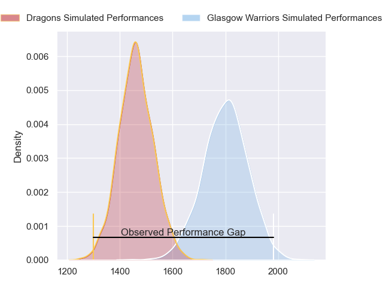
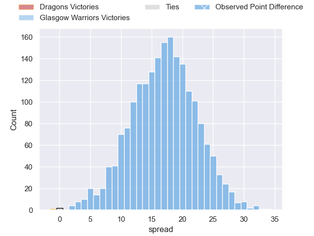
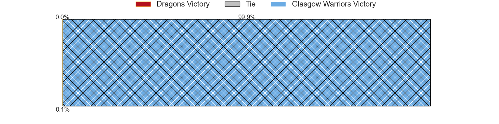
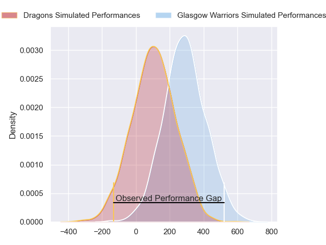
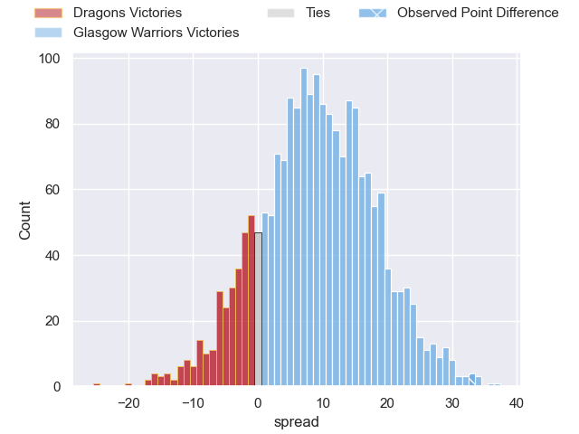
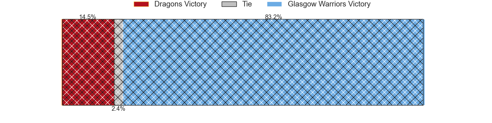

---  
layout: page  
title: Dragons at Glasgow Warriors; 7-40  
date: 2024-02-17 18:00:00 -0500  
categories: "United Rugby Championship 2023" match review  
---
# Dragons at Glasgow Warriors; 7-40

# Club Level Predictions

The first set of predictions treats a club as the smallest object, as the club develops its members, organizes a gameplan, and deploys its players as needed for each match. This club model has a prediction of 0.872, which translates to predicting Glasgow Warriors to win by 17.0.

Our Over/Under is 60.5 - and combined with the spread above, we have a predicted scoreline of 22 to 39

Each club has a rating and a rating deviation (similar to a Glicko rating), and expected performances can be generated. This allows for simulated matches and spreads like the ones below.
## Projected Performances - Club Model

## Projected Spreads - Club Model

## Projected Results - Club Model

# Player Level Predictions - Version 2

Treating teams instead as an entity made up of the currently active players, I have ratings for each player in an altogether different system. These can be combined to form team ratings once teamsheets are announced, weighting starters a bit higher than the reserves. After the match is played, players can be weighted by their minutes on the field, allowing for an accurate measure of the team's composition. With these compiled team ratings, we can make predictions, measure inaccuracy, and update the individual player ratings.
## Prediction without Player Minutes: Glasgow Warriors by 10.7

Glasgow Warriors by 4.4 on a neutral pitch

## Projected Performances - Player Model

## Projected Spreads - Player Model

## Projected Results - Player Model

|   Away Minutes | Away Player     |   Away Percentile |   Number |   Home Percentile | Home Player       |   Home Minutes |
|---------------:|:----------------|------------------:|---------:|------------------:|:------------------|---------------:|
|             46 | Rhodri Jones    |             37.12 |        1 |             95.89 | Jamie Bhatti      |             57 |
|             80 | James Benjamin  |             35.48 |        2 |             32.35 | Johnny Matthews   |             71 |
|             59 | Chris Coleman   |             35.51 |        3 |             92.4  | Lucio Sordoni     |             57 |
|             63 | Joseph Davies   |             38.69 |        4 |             59.24 | Max Williamson    |             77 |
|             80 | Matthew Screech |             36.62 |        5 |             56.37 | Alex Samuel       |             57 |
|             80 | Sean Lonsdale   |             30.54 |        6 |             54.08 | Euan Ferrie       |             80 |
|             11 | George Young    |             39.02 |        7 |             51.96 | Tom Gordon        |             63 |
|             63 | Dan Lydiate     |             33.33 |        8 |             52.91 | Henco Venter      |             80 |
|             63 | Dane Blacker    |             37.2  |        9 |             54.92 | Ben Afshar        |             63 |
|             80 | Angus O'Brien   |             31.19 |       10 |             48.81 | Ross Thompson     |             59 |
|             80 | Oli Andrew      |             34.11 |       11 |             70.34 | Jamie Dobie       |             80 |
|             80 | Aneurin Owen    |             32.97 |       12 |             51.98 | Tom Jordan        |             80 |
|             80 | Steffan Hughes  |             32.97 |       13 |             89.3  | Stafford McDowall |             80 |
|             61 | Jared Rosser    |             36.33 |       14 |             53.07 | Facundo Cordero   |             80 |
|             18 | Cai Evans       |             13.16 |       15 |             49.88 | Josh McKay        |             80 |
|             69 | Brodie Coghlan  |            nan    |       16 |            nan    | Angus Fraser      |              9 |
|             34 | Aki Seiuli      |            nan    |       17 |            nan    | Nathan McBeth     |             23 |
|             21 | Luke Yendle     |            nan    |       18 |            nan    | Oli Kebble        |             23 |
|             17 | Barny Langton   |            nan    |       19 |            nan    | Ruaraidh Hart     |              3 |
|             17 | Sam Scarfe      |            nan    |       20 |            nan    | Sintu Manjezi     |             23 |
|             17 | Che Hope        |            nan    |       21 |            nan    | Gregor Hiddleston |             17 |
|             62 | Will Reed       |            nan    |       22 |            nan    | Sean Kennedy      |             17 |
|             19 | Joe Westwood    |            nan    |       23 |            nan    | Duncan Weir       |             21 |

