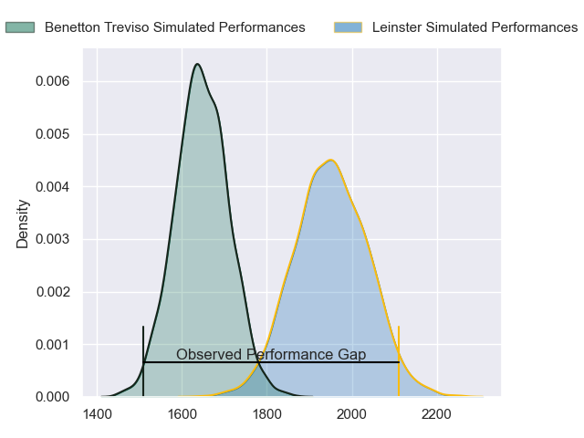
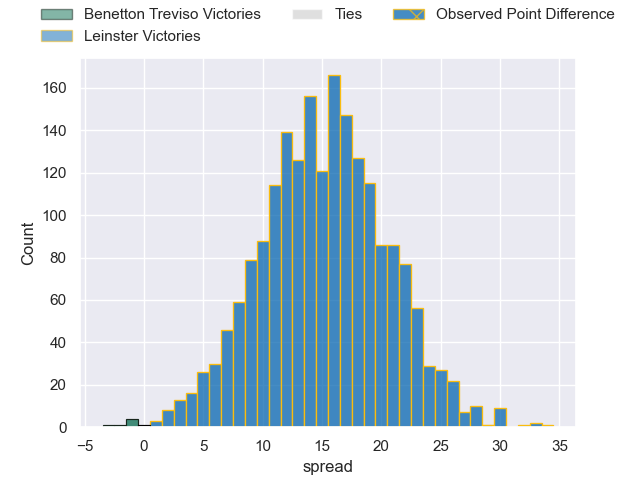
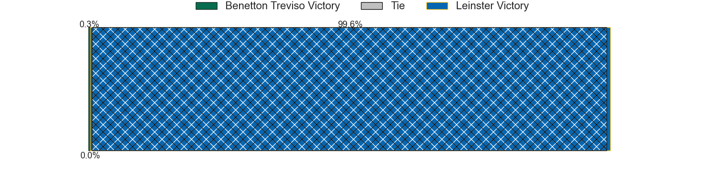
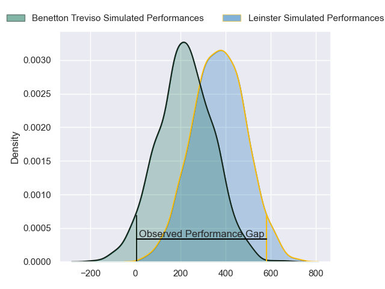
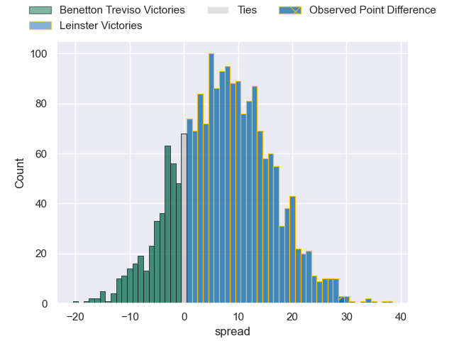
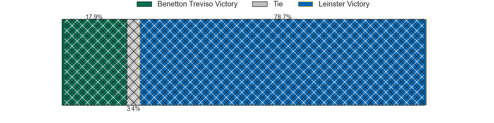

---  
layout: page  
title: Benetton Treviso at Leinster; 18-47  
date: 2024-02-17 18:00:00 -0500  
categories: "United Rugby Championship 2023" match review  
---
# Benetton Treviso at Leinster; 18-47

# Club Level Predictions

The first set of predictions treats a club as the smallest object, as the club develops its members, organizes a gameplan, and deploys its players as needed for each match. This club model has a prediction of 0.847, which translates to predicting Leinster to win by 15.2.

Our Over/Under is 61.5 - and combined with the spread above, we have a predicted scoreline of 23 to 38

Each club has a rating and a rating deviation (similar to a Glicko rating), and expected performances can be generated. This allows for simulated matches and spreads like the ones below.
## Projected Performances - Club Model

## Projected Spreads - Club Model

## Projected Results - Club Model

# Player Level Predictions - Version 2

Treating teams instead as an entity made up of the currently active players, I have ratings for each player in an altogether different system. These can be combined to form team ratings once teamsheets are announced, weighting starters a bit higher than the reserves. After the match is played, players can be weighted by their minutes on the field, allowing for an accurate measure of the team's composition. With these compiled team ratings, we can make predictions, measure inaccuracy, and update the individual player ratings.
## Prediction without Player Minutes: Leinster by 9.6

Leinster by 3.5 on a neutral pitch

## Projected Performances - Player Model

## Projected Spreads - Player Model

## Projected Results - Player Model

|   Away Minutes | Away Player         |   Away Percentile |   Number |   Home Percentile | Home Player        |   Home Minutes |
|---------------:|:--------------------|------------------:|---------:|------------------:|:-------------------|---------------:|
|             80 | Thomas Gallo        |             91.22 |        1 |             53.9  | Jack Boyle         |             47 |
|             47 | Siua Maile          |              2.03 |        2 |             53.69 | Lee Barron         |             47 |
|             51 | Tiziano Pasquali    |             36.02 |        3 |             53.9  | Thomas Clarkson    |             47 |
|             80 | Gideon Koegelenberg |             35.94 |        4 |             95.05 | Ross Molony        |             80 |
|             80 | Eli Snyman          |             81.8  |        5 |             78.92 | Jason Jenkins      |             67 |
|             47 | Giovanni Pettinelli |             28.89 |        6 |             52.28 | Will Connors       |             59 |
|             72 | Toa Halafihi        |             81.8  |        7 |             55.03 | Scott Penny        |             80 |
|             51 | Henry Time-Stowers  |             37.06 |        8 |             54.08 | Max Deegan         |             80 |
|             56 | Andy Uren           |             19.06 |        9 |             98.82 | Luke McGrath       |             59 |
|             64 | Tomas Albornoz      |             80.76 |       10 |             95.96 | Ross Byrne         |             70 |
|             80 | Onisi Ratave        |             33.76 |       11 |             53.44 | Rob Russell        |             80 |
|             70 | Marco Zanon         |             69.73 |       12 |             53.03 | Jamie Osborne      |             80 |
|             80 | Malakai Fekitoa     |             83.59 |       13 |             53.03 | Liam Turner        |             80 |
|             80 | Ignacio Mendy       |             29.63 |       14 |             53.12 | Tommy O'Brien      |             49 |
|             80 | Jacob Umaga         |             28.97 |       15 |             51.03 | Henry McErlean     |             80 |
|             33 | Giacomo Nicotera    |             98.15 |       16 |            nan    | John McKee         |             33 |
|              8 | Federico Zani       |             14.43 |       17 |            nan    | Ed Byrne           |             33 |
|             29 | Filippo Alongi      |             19.8  |       18 |             95.34 | Michael Ala'alatoa |             33 |
|             29 | Riccardo Favretto   |            nan    |       19 |            nan    | Brian Deeny        |             13 |
|             33 | Alessandro Izekor   |             72.7  |       20 |            nan    | Rhys Ruddock       |             21 |
|             24 | Alessandro Garbisi  |             78.19 |       21 |            nan    | Ben Murphy         |             21 |
|             16 | Leonardo Marin      |            nan    |       22 |            nan    | Sam Prendergast    |             10 |
|             10 | Filippo Drago       |            nan    |       23 |            nan    | Ben Brownlee       |             31 |

