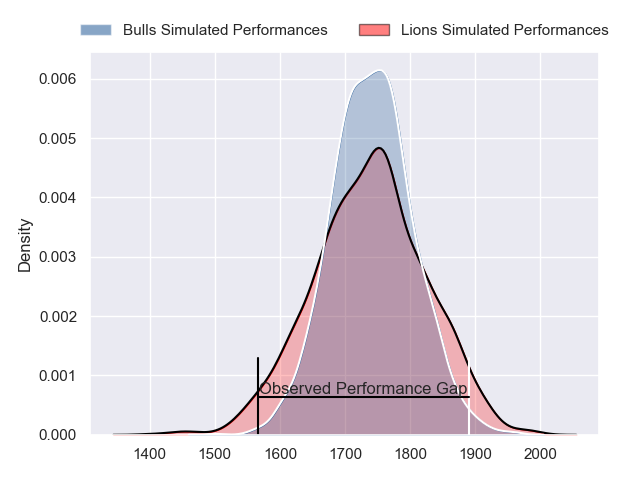
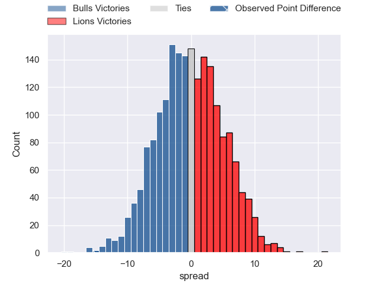
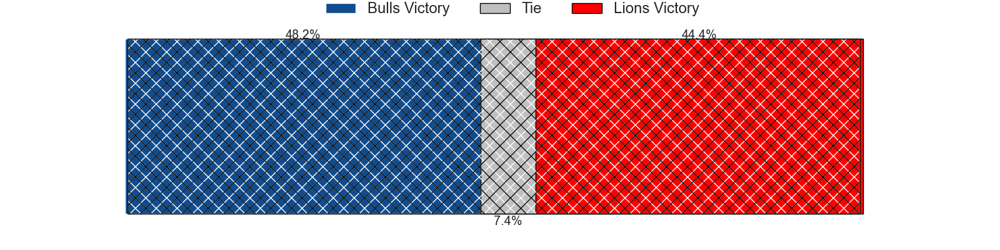
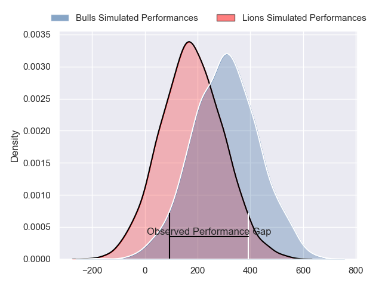
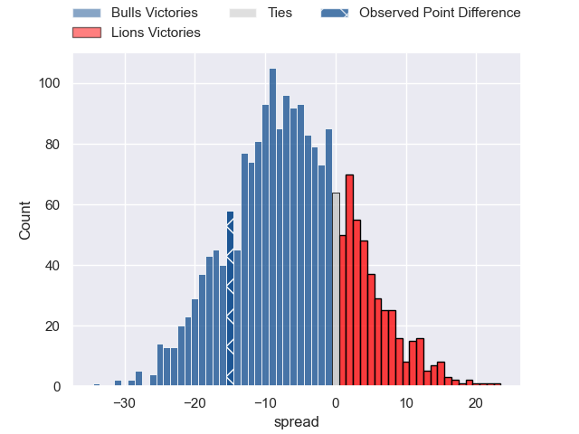
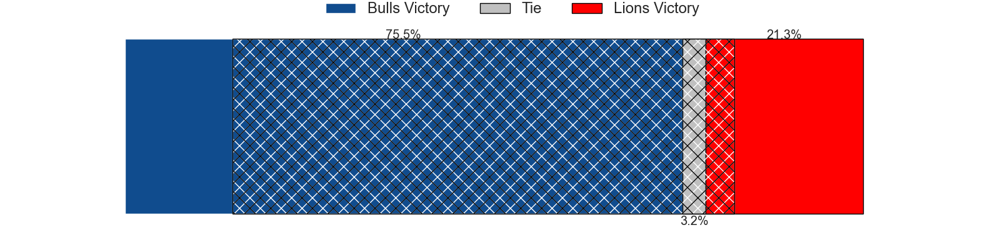

---  
layout: page  
title: Bulls at Lions; 25-10  
date: 2024-02-17 18:00:00 -0500  
categories: "United Rugby Championship 2023" match review  
---
# Bulls at Lions; 25-10

# Club Level Predictions

The first set of predictions treats a club as the smallest object, as the club develops its members, organizes a gameplan, and deploys its players as needed for each match. This club model has a prediction of 0.495, which translates to predicting Bulls to win by 0.2.

Our Over/Under is 52.5 - and combined with the spread above, we have a predicted scoreline of 26 to 26

Each club has a rating and a rating deviation (similar to a Glicko rating), and expected performances can be generated. This allows for simulated matches and spreads like the ones below.
## Projected Performances - Club Model

## Projected Spreads - Club Model

## Projected Results - Club Model

# Player Level Predictions - Version 2

Treating teams instead as an entity made up of the currently active players, I have ratings for each player in an altogether different system. These can be combined to form team ratings once teamsheets are announced, weighting starters a bit higher than the reserves. After the match is played, players can be weighted by their minutes on the field, allowing for an accurate measure of the team's composition. With these compiled team ratings, we can make predictions, measure inaccuracy, and update the individual player ratings.
## Prediction without Player Minutes: Bulls by 4.8

Bulls by 8.5 on a neutral pitch

## Projected Performances - Player Model

## Projected Spreads - Player Model

## Projected Results - Player Model

|   Away Minutes | Away Player         |   Away Percentile |   Number |   Home Percentile | Home Player            |   Home Minutes |
|---------------:|:--------------------|------------------:|---------:|------------------:|:-----------------------|---------------:|
|             66 | Gerhard Steenekamp  |             93.39 |        1 |             37.23 | Jean-Pierre Smith      |             51 |
|             46 | Johan Grobbelaar    |             52.29 |        2 |             39.27 | Jaco Visagie           |             51 |
|             61 | Mornay Smith        |             54.55 |        3 |             44.38 | Asenathi Ntlabakanye   |             52 |
|             72 | Reinhardt Ludwig    |             57.82 |        4 |             40.34 | Etienne Oosthuizen     |             57 |
|             80 | Ruan Nortje         |             58.39 |        5 |             37.82 | Reinhard Nothnagel     |             80 |
|             80 | Marco van Staden    |             92.13 |        6 |             41.34 | Hanru Sirgel           |             57 |
|             31 | Elrigh Louw         |             45.86 |        7 |             32.11 | Ruan Venter            |             72 |
|             59 | Cameron Hanekom     |             50    |        8 |             35.45 | Francke Horn           |             80 |
|             75 | Embrose Papier      |             54.9  |        9 |             47.65 | Morne van den Berg     |             59 |
|             46 | Jaco van der Walt   |             44.79 |       10 |             31.75 | Sanele Nohamba         |             80 |
|             80 | Kurt-Lee Arendse    |             98.85 |       11 |             35.43 | Edwill van der Merwe   |             80 |
|             80 | David Kriel         |             51.16 |       12 |             34.96 | Marius Louw            |             72 |
|             80 | Stedman Gans        |             51.16 |       13 |             34.03 | Henco van Wyk          |             80 |
|             80 | Canan Moodie        |             99.69 |       14 |             27.46 | Richard Kriel          |             80 |
|             80 | Devon Williams      |             46.67 |       15 |             30.8  | Quan Horn              |             80 |
|             34 | Akker van der Merwe |             99.27 |       16 |            nan    | PJ Botha               |             29 |
|             14 | Simphiwe Matanzima  |            nan    |       17 |            nan    | Morgan Naude           |             29 |
|             19 | Francois Klopper    |            nan    |       18 |            nan    | Conraad van Vuuren     |             28 |
|              8 | Janko Swanepoel     |            nan    |       19 |            nan    | Darrien-Lane Landsberg |             23 |
|             21 | Marcell Coetzee     |            nan    |       20 |            nan    | Izan Esterhuizen       |              8 |
|              5 | Keagan Johannes     |            nan    |       21 |            nan    | JC Pretorius           |             23 |
|             34 | Johan Goosen        |            nan    |       22 |            nan    | Jordan Hendrikse       |             21 |
|             49 | Celimpilo Gumede    |            nan    |       23 |            nan    | Erich Cronje           |              8 |

