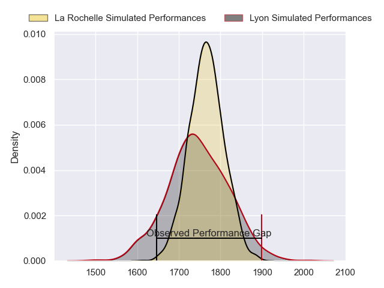
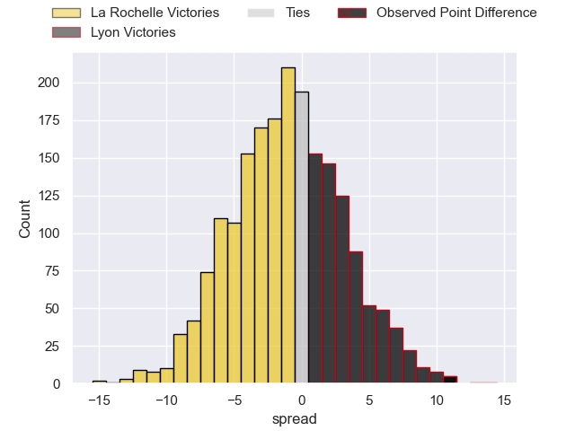
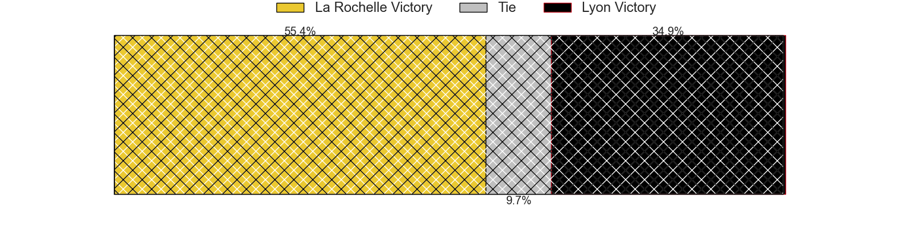
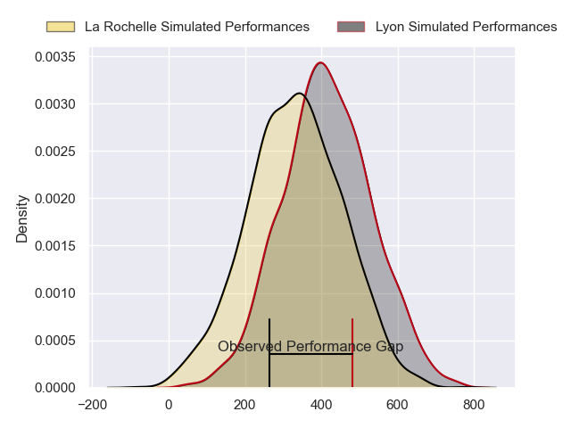
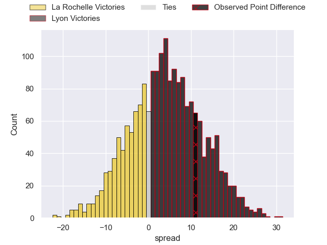
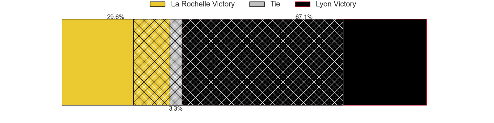

---  
layout: page  
title: La Rochelle at Lyon; 17-28  
date: 2024-02-17 18:00:00 -0500  
categories: "Top 14 Orange 2023" match review  
---
# La Rochelle at Lyon; 17-28

# Club Level Predictions

The first set of predictions treats a club as the smallest object, as the club develops its members, organizes a gameplan, and deploys its players as needed for each match. This club model has a prediction of 0.471, which translates to predicting La Rochelle to win by 1.0.

Our Over/Under is 62.5 - and combined with the spread above, we have a predicted scoreline of 32 to 31

Each club has a rating and a rating deviation (similar to a Glicko rating), and expected performances can be generated. This allows for simulated matches and spreads like the ones below.
## Projected Performances - Club Model

## Projected Spreads - Club Model

## Projected Results - Club Model

# Player Level Predictions - Version 2

Treating teams instead as an entity made up of the currently active players, I have ratings for each player in an altogether different system. These can be combined to form team ratings once teamsheets are announced, weighting starters a bit higher than the reserves. After the match is played, players can be weighted by their minutes on the field, allowing for an accurate measure of the team's composition. With these compiled team ratings, we can make predictions, measure inaccuracy, and update the individual player ratings.
## Prediction without Player Minutes: Lyon by 5.7

La Rochelle by 1.7 on a neutral pitch

## Projected Performances - Player Model

## Projected Spreads - Player Model

## Projected Results - Player Model

|   Away Minutes | Away Player           |   Away Percentile |   Number |   Home Percentile | Home Player          |   Home Minutes |
|---------------:|:----------------------|------------------:|---------:|------------------:|:---------------------|---------------:|
|             53 | Louis Penverne        |             28.32 |        1 |             15.23 | Sebastien Taofifenua |             58 |
|             66 | Quentin Lespiaucq     |             71.22 |        2 |             81.73 | Liam Coltman         |             58 |
|             45 | Georges-Henri Colombe |              2.96 |        3 |             61.29 | Feao Fotuaika        |             54 |
|             80 | Thomas Lavault        |             87.21 |        4 |             59.56 | Joel Kpoku           |             60 |
|             53 | Remi Picquette        |             50.69 |        5 |             67.6  | Mickael Guillard     |             68 |
|             80 | Judicael Cancoriet    |             22.96 |        6 |             22.75 | Theo William         |             80 |
|             69 | Levani Botia          |             97.04 |        7 |             68.25 | Liam Allen           |             57 |
|             64 | Yoan Tanga            |             59.44 |        8 |             38.46 | Maxime Gouzou        |             80 |
|             72 | Tawera Kerr-Barlow    |             97.64 |        9 |             93.91 | Baptiste Couilloud   |             60 |
|             66 | Hugo Reus             |             40.14 |       10 |             81.95 | Paddy Jackson        |             65 |
|             62 | Thomas Berjon         |             80.53 |       11 |             98.94 | Monty Ioane          |             80 |
|             69 | Jules Favre           |             38.18 |       12 |             92.55 | Thibault Regard      |             65 |
|             73 | Ulupano Seuteni       |             61.93 |       13 |             99.42 | Semi Radradra        |             80 |
|             80 | Teddy Thomas          |             87.51 |       14 |             62.05 | Alfred Parisien      |             80 |
|             80 | Antoine Hastoy        |             49.17 |       15 |             55.63 | Alexandre Tchaptchet |             73 |
|             14 | Tolu Latu             |             88.75 |       16 |             51.11 | Yanis Charcosset     |             22 |
|             27 | Joel Sclavi           |             85.57 |       17 |              7.71 | Hamza Kaabeche       |             22 |
|             27 | Thomas Ployet         |            nan    |       18 |             52.76 | Loann Goujon         |             20 |
|             27 | Oscar Jegou           |            nan    |       19 |             48.73 | Romain Taofifenua    |             35 |
|              8 | Teddy Iribaren        |            nan    |       20 |             79.37 | Martin Page-Relo     |             20 |
|             25 | Ihaia West            |             53.2  |       21 |             64.85 | Leo Berdeu           |             22 |
|             25 | Simeli Daunivucu      |            nan    |       22 |             18.51 | Josiah Maraku        |             15 |
|             35 | Alexandre Kuntelia    |             54.12 |       23 |            nan    | Valentin Simutoga    |             26 |

