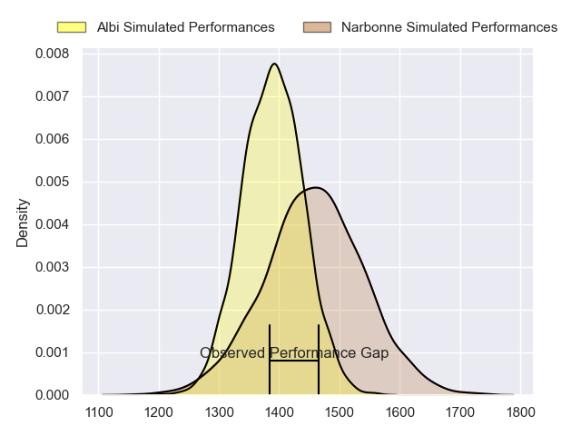
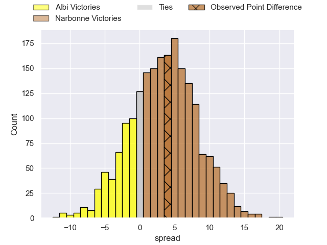
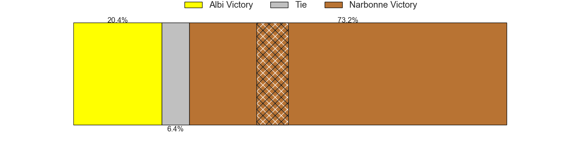
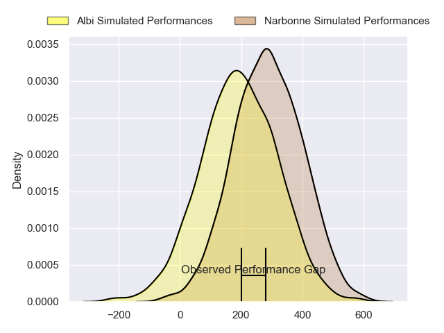
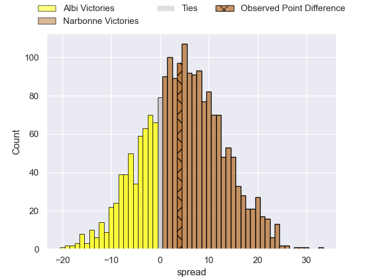
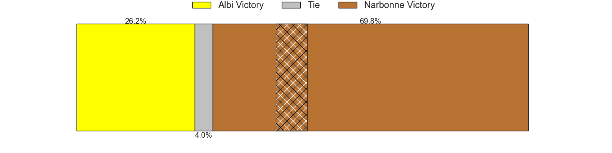

---  
layout: page  
title: Albi at Narbonne; 25-29  
date: 2024-02-17 18:00:00 -0500  
categories: "Nationale 2023" match review  
---
# Albi at Narbonne; 25-29

# Club Level Predictions

The first set of predictions treats a club as the smallest object, as the club develops its members, organizes a gameplan, and deploys its players as needed for each match. This club model has a prediction of 0.593, which translates to predicting Narbonne to win by 3.3.

Our Over/Under is 46.5 - and combined with the spread above, we have a predicted scoreline of 22 to 25

Each club has a rating and a rating deviation (similar to a Glicko rating), and expected performances can be generated. This allows for simulated matches and spreads like the ones below.
## Projected Performances - Club Model

## Projected Spreads - Club Model

## Projected Results - Club Model

# Player Level Predictions - Version 2

Treating teams instead as an entity made up of the currently active players, I have ratings for each player in an altogether different system. These can be combined to form team ratings once teamsheets are announced, weighting starters a bit higher than the reserves. After the match is played, players can be weighted by their minutes on the field, allowing for an accurate measure of the team's composition. With these compiled team ratings, we can make predictions, measure inaccuracy, and update the individual player ratings.
## Prediction without Player Minutes: Narbonne by 5.9

Albi by 1.9 on a neutral pitch

## Projected Performances - Player Model

## Projected Spreads - Player Model

## Projected Results - Player Model

|   Away Minutes | Away Player             |   Away Percentile |   Number |   Home Percentile | Home Player            |   Home Minutes |
|---------------:|:------------------------|------------------:|---------:|------------------:|:-----------------------|---------------:|
|             56 | Antoine Soave           |             86.49 |        1 |             55.1  | Sylvain Abadie         |             54 |
|             56 | Romain Maurice          |             87.32 |        2 |             24.26 | Clément Esteriola      |             65 |
|             59 | Jean Baptiste De Clercq |             77.82 |        3 |             64.13 | Jamie Hagan            |             54 |
|             80 | Simon Meka              |             89.08 |        4 |             74.51 | Marius Antonescu       |             80 |
|             80 | Dion Evrard Oulai       |             17.68 |        5 |             26.18 | Dennis Visser          |             63 |
|             56 | Vincent Calas           |             56.2  |        6 |             69.78 | Luke Nakobukobua       |             50 |
|             80 | Pierre Roussel          |             42.42 |        7 |             46.87 | Baptiste Abescat-Leroy |             80 |
|             56 | Guillem Calmon          |             33.1  |        8 |             31.7  | Charles Malet          |             80 |
|             70 | Gilen Queheille         |             82.68 |        9 |             18.11 | Pierrick Nova          |             70 |
|             70 | Benjamin Pehau          |             76.9  |       10 |              4.05 | Gilles Bosch           |             67 |
|             80 | Enzo Marzocca           |             74.36 |       11 |             66.74 | Ambrose Curtis         |             80 |
|             56 | Gabriel Aviragnet       |             64.88 |       12 |             98.84 | Peter Betham           |             50 |
|             80 | Baptiste Couchinave     |             89.65 |       13 |             45.12 | Pierre Nueno           |             80 |
|             80 | Kamilieni Raivono       |             38.67 |       14 |             23.94 | Pierre-Hugo Ducom      |             80 |
|             80 | Téo Dospital            |             27.94 |       15 |             60.28 | Paul Auradou           |             80 |
|             24 | Thibaud Sebire          |             56.08 |       16 |             64.58 | Théo Castinel          |             26 |
|             24 | Arthur Castant          |             87.87 |       17 |             70.4  | Christophe David       |             15 |
|             21 | Dimitri Tchapnga        |             83.99 |       18 |             58.41 | Levi Tikoipau          |             26 |
|             24 | Mohsen Essid            |             64.87 |       19 |             11.37 | Leva Fifita            |             17 |
|             24 | Camille Jarreau         |             64.8  |       20 |             44.54 | Thibault Clauzade      |             30 |
|             10 | Théo Vidal              |             94.88 |       21 |             53.35 | Pablo Barbaste         |             10 |
|             10 | James Haydn Tedder      |              3.33 |       22 |             26.67 | Tom Chauvet            |             13 |
|             24 | Jarrod Poi              |             24.19 |       23 |             18.75 | Sébastien Giorgis      |             30 |

