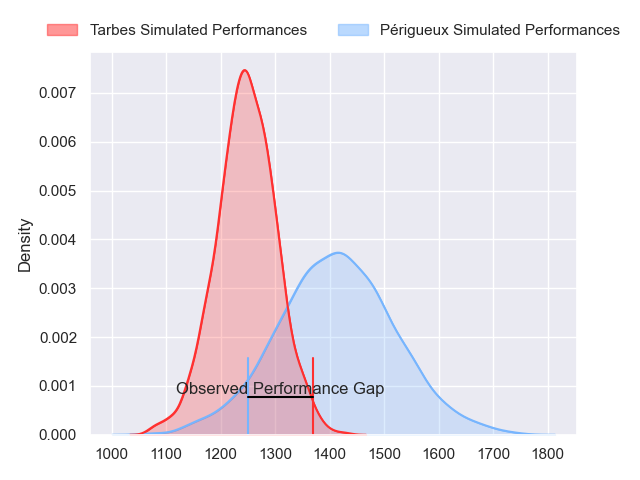
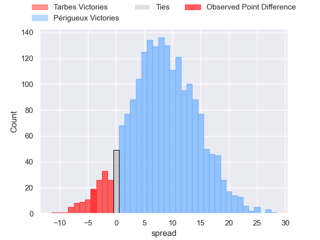
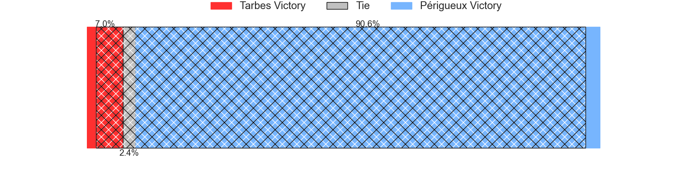
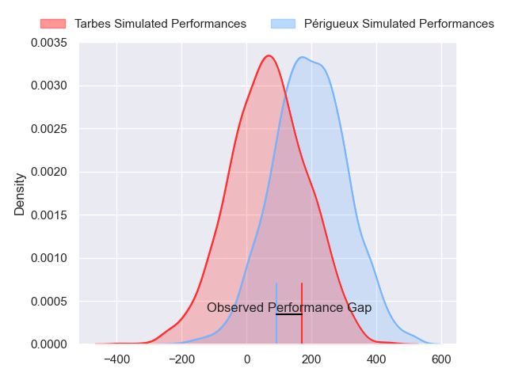
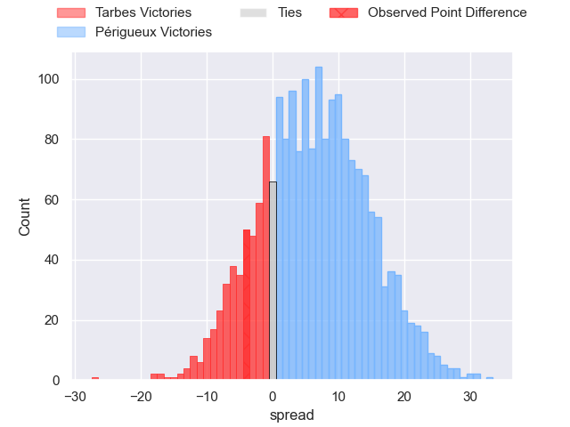
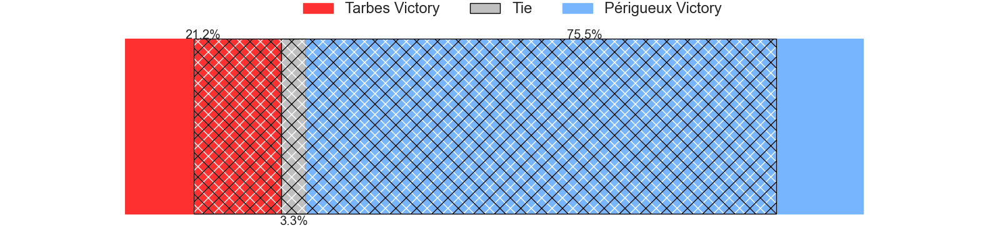

---  
layout: page  
title: Tarbes at Perigueux; 30-26  
date: 2024-02-17 18:00:00 -0500  
categories: "Nationale 2023" match review  
---
# Tarbes at Perigueux; 30-26

# Club Level Predictions

The first set of predictions treats a club as the smallest object, as the club develops its members, organizes a gameplan, and deploys its players as needed for each match. This club model has a prediction of 0.724, which translates to predicting Périgueux to win by 8.5.

Our Over/Under is 53.5 - and combined with the spread above, we have a predicted scoreline of 22 to 31

Each club has a rating and a rating deviation (similar to a Glicko rating), and expected performances can be generated. This allows for simulated matches and spreads like the ones below.
## Projected Performances - Club Model

## Projected Spreads - Club Model

## Projected Results - Club Model

# Player Level Predictions - Version 2

Treating teams instead as an entity made up of the currently active players, I have ratings for each player in an altogether different system. These can be combined to form team ratings once teamsheets are announced, weighting starters a bit higher than the reserves. After the match is played, players can be weighted by their minutes on the field, allowing for an accurate measure of the team's composition. With these compiled team ratings, we can make predictions, measure inaccuracy, and update the individual player ratings.
## Prediction without Player Minutes: Périgueux by 6.8

Périgueux by 4.3 on a neutral pitch

## Projected Performances - Player Model

## Projected Spreads - Player Model

## Projected Results - Player Model

|   Away Minutes | Away Player            |   Away Percentile |   Number |   Home Percentile | Home Player        |   Home Minutes |
|---------------:|:-----------------------|------------------:|---------:|------------------:|:-------------------|---------------:|
|             62 | Johan Mees Erasmus     |             33.3  |        1 |             19.02 | Damien Lavergne    |             40 |
|             51 | Vincent Dolier         |             58.72 |        2 |             72.29 | Louis Martin       |             11 |
|             51 | Aleksi Tchitchiashvili |             13.66 |        3 |             55    | Anthony Pelmard    |             40 |
|             80 | Léo Saint-Guilhem      |             73.45 |        4 |             11.26 | Madioke Konate     |             56 |
|             55 | Baptiste Peytavi       |             71.84 |        5 |             18.85 | Jaco Willemse      |             56 |
|             80 | Alexis Armary          |             92.86 |        6 |             19.41 | Clement Lanen      |             80 |
|             57 | Jean Guicherd          |             65.27 |        7 |             94.02 | Afaesetiti Amosa   |             80 |
|             55 | Julien Cantan          |             22.54 |        8 |             48.83 | Karl Lambert       |             80 |
|             57 | Thibaut Dulucq         |             41.37 |        9 |             34.12 | Matteo Bordenave   |             40 |
|             55 | Mathieu Berbizier      |             31.04 |       10 |             59    | Greg Hutley        |             40 |
|             80 | Jone Tuva              |              1.89 |       11 |             82.08 | Arthur Duhau       |             80 |
|             80 | Clement Latorre        |             46.81 |       12 |             85.37 | Fred Hickes        |             80 |
|             80 | Savenaca Rawaca        |             67.83 |       13 |             79.09 | Cyril Couturier    |             40 |
|             80 | Johan Paulet           |              2.31 |       14 |             29.35 | Paul Piveteau      |             80 |
|             80 | Yon Camou              |             67.82 |       15 |             11.49 | Thibault Rabourdin |             80 |
|             29 | Alexandre Duny         |             41.34 |       16 |             75.6  | Lucas Marijon      |             69 |
|             29 | Florian Lamothe        |             51.38 |       17 |             56.45 | Vincent Fouillade  |             40 |
|             25 | Léo Estaque            |             22.67 |       18 |             27.01 | Yann Caillat       |             40 |
|             25 | Filipe Manu            |             10.8  |       19 |             79.2  | Thomas Vidal       |             40 |
|             25 | Anthony Fuertes        |              6.16 |       20 |             25.62 | Martin Augeix      |             40 |
|             23 | Mickael Thébault       |             66.27 |       21 |             32.55 | Enzo Hardy         |             40 |
|             23 | Jon Abadie             |            nan    |       22 |             21.72 | Richard Fourcade   |             24 |
|             18 | Léo Baratgin           |            nan    |       23 |             68.05 | Mathieu Pace       |             24 |

