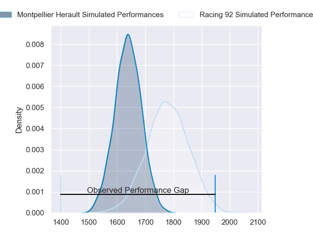
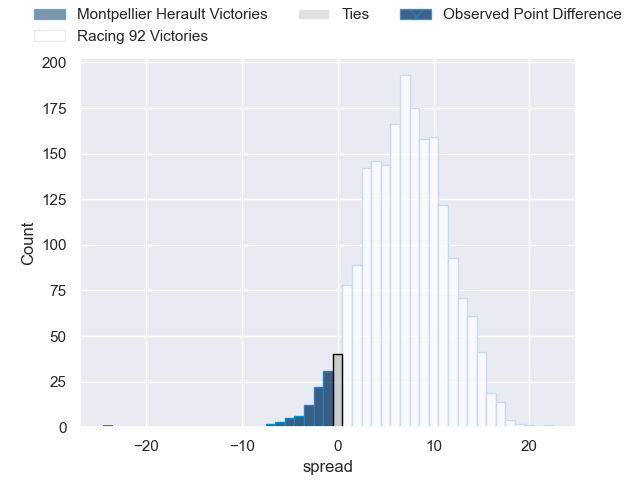
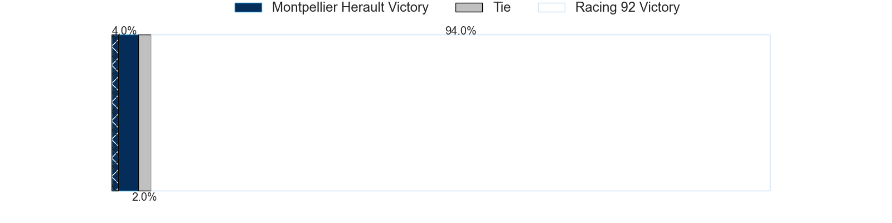
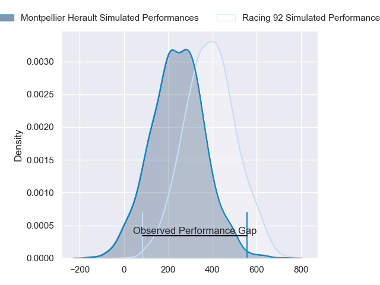
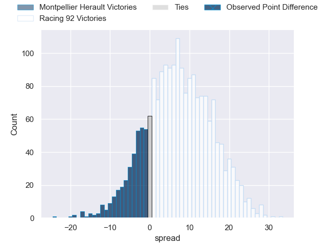
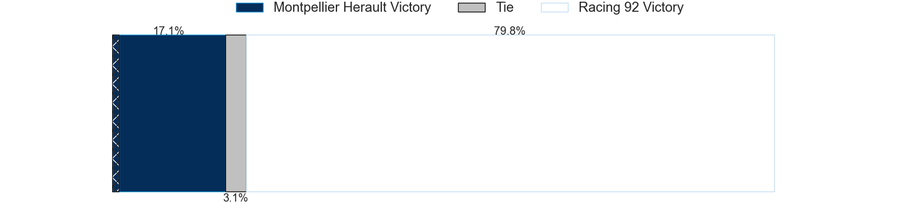

---  
layout: page  
title: Montpellier Herault at Racing 92; 44-20  
date: 2024-02-17 18:00:00 -0500  
categories: "Top 14 Orange 2023" match review  
---
# Montpellier Herault at Racing 92; 44-20

# Club Level Predictions

The first set of predictions treats a club as the smallest object, as the club develops its members, organizes a gameplan, and deploys its players as needed for each match. This club model has a prediction of 0.687, which translates to predicting Racing 92 to win by 6.9.

Our Over/Under is 48.5 - and combined with the spread above, we have a predicted scoreline of 21 to 28

Each club has a rating and a rating deviation (similar to a Glicko rating), and expected performances can be generated. This allows for simulated matches and spreads like the ones below.
## Projected Performances - Club Model

## Projected Spreads - Club Model

## Projected Results - Club Model

# Player Level Predictions - Version 2

Treating teams instead as an entity made up of the currently active players, I have ratings for each player in an altogether different system. These can be combined to form team ratings once teamsheets are announced, weighting starters a bit higher than the reserves. After the match is played, players can be weighted by their minutes on the field, allowing for an accurate measure of the team's composition. With these compiled team ratings, we can make predictions, measure inaccuracy, and update the individual player ratings.
## Prediction without Player Minutes: Racing 92 by 7.5

Racing 92 by 0.8 on a neutral pitch

## Projected Performances - Player Model

## Projected Spreads - Player Model

## Projected Results - Player Model

|   Away Minutes | Away Player                 |   Away Percentile |   Number |   Home Percentile | Home Player        |   Home Minutes |
|---------------:|:----------------------------|------------------:|---------:|------------------:|:-------------------|---------------:|
|             46 | Baptiste Erdocio            |             10.84 |        1 |              6.18 | Hassane Kolingar   |             61 |
|             46 | Brandon Paenga-Amosa        |             86.53 |        2 |             15.68 | Janick Tarrit      |             65 |
|             43 | Lasha Macharashvili         |             59.41 |        3 |             60.04 | Thomas Laclayat    |             49 |
|             77 | Florian Verhaeghe           |             75.58 |        4 |             71.54 | Boris Palu         |             65 |
|             74 | Tyler Duguid                |             66.36 |        5 |             23.27 | Will Rowlands      |             84 |
|             37 | Yacouba Camara              |             94.81 |        6 |             86.71 | Wenceslas Lauret   |             84 |
|             59 | Lenni Nouchi                |             59.37 |        7 |             90.69 | Siya Kolisi        |             84 |
|             53 | Marco Tauleigne             |             93.89 |        8 |             27.51 | Jordan Joseph      |             53 |
|             71 | Cobus Reinach               |             95.09 |        9 |             15.72 | Clovis Le Bail     |             70 |
|             84 | Louis Carbonel              |             67.93 |       10 |             26.9  | Tristan Tedder     |             84 |
|             72 | Ben Lam                     |             99.58 |       11 |             10.16 | Wame Naituvi       |             84 |
|             84 | Auguste Cadot               |             40.75 |       12 |             44.24 | Inia Tabuavou      |             46 |
|             84 | Thomas Darmon               |             65.66 |       13 |              6.52 | Olivier Klemenczak |             84 |
|             67 | Gabriel Ngandebe            |             65.19 |       14 |              7.94 | Henry Arundell     |             59 |
|             61 | Alexandre de Nardi          |             56.09 |       15 |             22.2  | Max Spring         |             84 |
|             38 | Christopher Tolofua         |             93.54 |       16 |             97.85 | Eddy Ben Arous     |             19 |
|             38 | Enzo Forletta               |             77.69 |       17 |            nan    | Cedate Gomes Sa    |             23 |
|             35 | Bastien Chalureau           |             83.87 |       18 |             75    | Anthime Hemery     |             19 |
|             47 | Nicolaas Janse van Rensburg |             90.05 |       19 |              6.14 | Ibrahim Diallo     |             31 |
|             38 | Clement Doumenc             |            nan    |       20 |             11.16 | Martin Meliande    |             14 |
|             36 | Leo Coly                    |             53.63 |       21 |             97.67 | Henry Chavancy     |             38 |
|             29 | Masivesi Dakuwaqa           |            nan    |       22 |             94.92 | Christian Wade     |             25 |
|             41 | Luka Japaridze              |             70.97 |       23 |            nan    | Gia Kharaishvili   |             35 |

