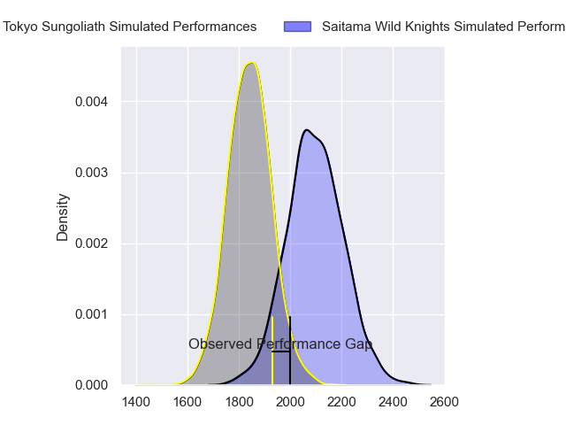
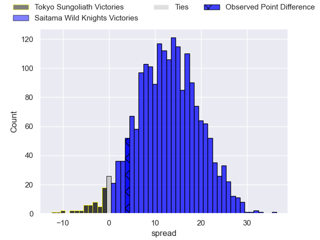
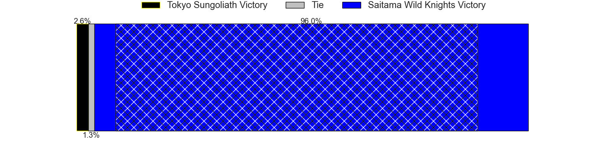
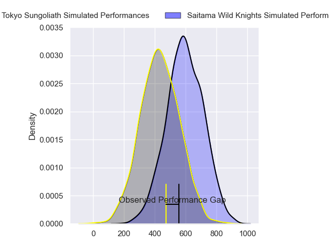
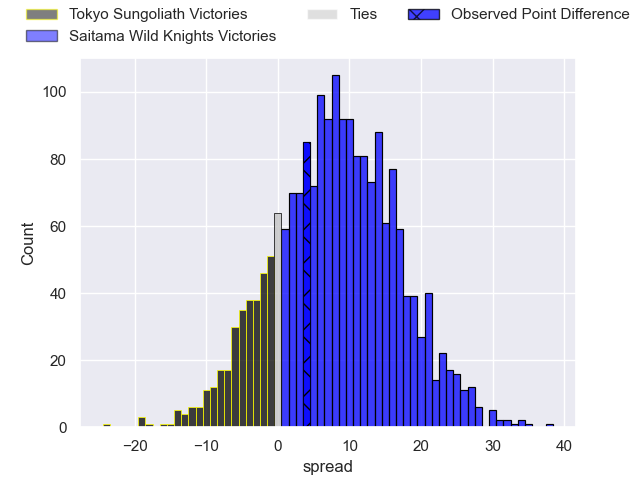
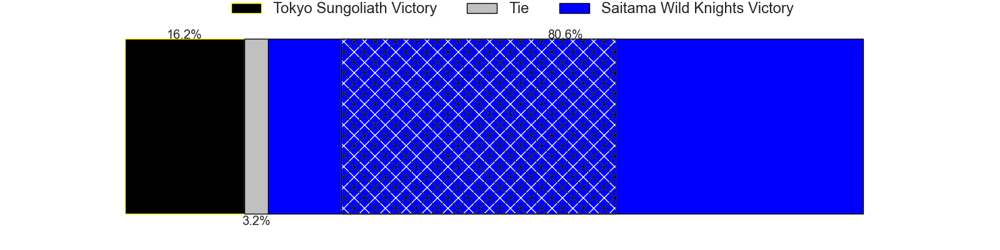

---  
layout: page  
title: Tokyo Sungoliath at Saitama Wild Knights; 20-24  
date: 2024-02-17 18:00:00 -0500  
categories: "Japan Rugby League One 2023" match review  
---
# Tokyo Sungoliath at Saitama Wild Knights; 20-24

# Club Level Predictions

The first set of predictions treats a club as the smallest object, as the club develops its members, organizes a gameplan, and deploys its players as needed for each match. This club model has a prediction of 0.807, which translates to predicting Saitama Wild Knights to win by 12.9.

Our Over/Under is 51.5 - and combined with the spread above, we have a predicted scoreline of 19 to 32

Each club has a rating and a rating deviation (similar to a Glicko rating), and expected performances can be generated. This allows for simulated matches and spreads like the ones below.
## Projected Performances - Club Model

## Projected Spreads - Club Model

## Projected Results - Club Model

# Player Level Predictions - Version 2

Treating teams instead as an entity made up of the currently active players, I have ratings for each player in an altogether different system. These can be combined to form team ratings once teamsheets are announced, weighting starters a bit higher than the reserves. After the match is played, players can be weighted by their minutes on the field, allowing for an accurate measure of the team's composition. With these compiled team ratings, we can make predictions, measure inaccuracy, and update the individual player ratings.
## Prediction without Player Minutes: Saitama Wild Knights by 9.6

Saitama Wild Knights by 6.2 on a neutral pitch

## Projected Performances - Player Model

## Projected Spreads - Player Model

## Projected Results - Player Model

|   Away Minutes | Away Player         |   Away Percentile |   Number |   Home Percentile | Home Player       |   Home Minutes |
|---------------:|:--------------------|------------------:|---------:|------------------:|:------------------|---------------:|
|             75 | Yukio Morikawa      |             90.86 |        1 |             44.27 | Craig Millar      |             52 |
|             54 | Kosuke Horikoshi    |             66.42 |        2 |             79.52 | Atsushi Sakate    |             48 |
|             47 | Shinnosuke Kakinaga |             82.89 |        3 |             78.85 | Taiki Fujii       |             48 |
|             40 | Sam Jeffries        |             94.47 |        4 |             14.52 | Mark Abbott       |             68 |
|             80 | Harry Hockings      |             98.5  |        5 |             94.01 | Lood de Jager     |             80 |
|             80 | Kanji Shimokawa     |             68.99 |        6 |             78.62 | Shota Fukui       |             24 |
|             80 | Sota Oketani        |             63.81 |        7 |             96.4  | Lachlan Boshier   |             80 |
|             33 | Hendrik Tui         |             63.4  |        8 |             89.74 | Jack Cornelsen    |             80 |
|             62 | Yutaka Nagare       |             84.09 |        9 |             91.94 | Taiki Koyama      |             80 |
|             80 | Mikiya Takamoto     |             61.76 |       10 |             96.91 | Rikiya Matsuda    |             80 |
|             80 | Shota Emi           |             72.38 |       11 |             94.07 | Marika Koroibete  |             68 |
|             80 | Ryoto Nakamura      |             95.23 |       12 |             97.79 | Damian de Allende |             80 |
|             62 | Taiga Ozaki         |             68.92 |       13 |             97.09 | Dylan Riley       |             51 |
|             51 | Seiya Ozaki         |             91.43 |       14 |             42.12 | Tomoki Osada      |             80 |
|             80 | Cheslin Kolbe       |            100    |       15 |             97.7  | Ryuji Noguchi     |             80 |
|             47 | Ryuga Hashimoto     |             45.92 |       16 |             85.82 | Itsuki Onishi     |             56 |
|             33 | Kan Nakano          |             51.52 |       17 |             93.36 | Shota Horie       |             32 |
|             40 | Sione Lavemai       |             72.58 |       18 |             95.79 | Asaeli Ai Valu    |             32 |
|             29 | Kotaro Matsushima   |             94.48 |       19 |             58.39 | Kyohei Yamasawa   |             29 |
|             26 | Kienori Go          |            nan    |       20 |             39.61 | Daniel Perez      |             28 |
|             18 | Naoto Saito         |             26.13 |       21 |             97.84 | Keisuke Uchida    |             12 |
|             18 | Isaiah Punivai      |             36.09 |       22 |             32.03 | Liam Mitchell     |             12 |
|              5 | William Hay         |            nan    |       23 |            nan    | nan               |            nan |

