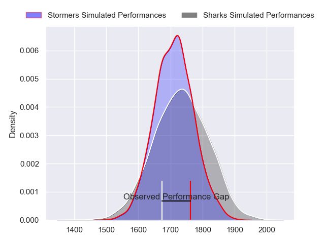
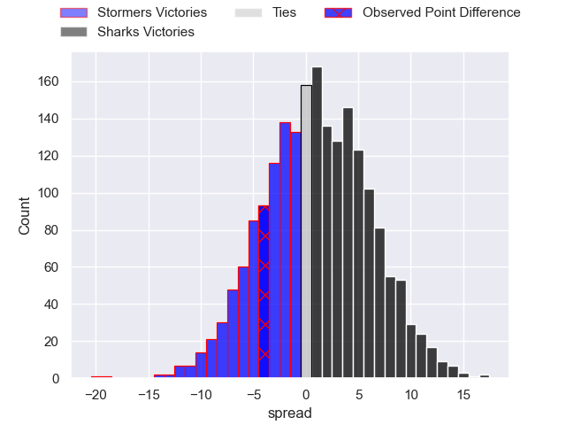
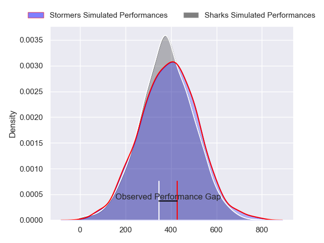
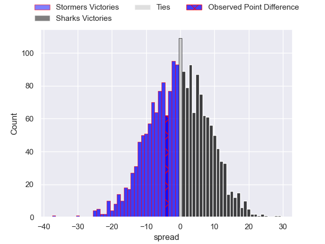

---  
layout: page  
title: Stormers at Sharks; 25-21  
date: 2024-02-17 18:00:00 -0500  
categories: "United Rugby Championship 2023" match review  
---
# Stormers at Sharks; 25-21

# Club Level Predictions

The first set of predictions treats a club as the smallest object, as the club develops its members, organizes a gameplan, and deploys its players as needed for each match. This club model has a prediction of 0.528, which translates to predicting Sharks to win by 1.0.

Our Over/Under is 46.5 - and combined with the spread above, we have a predicted scoreline of 23 to 24

Each club has a rating and a rating deviation (similar to a Glicko rating), and expected performances can be generated. This allows for simulated matches and spreads like the ones below.
## Projected Performances - Club Model

## Projected Spreads - Club Model

## Projected Results - Club Model

# Player Level Predictions - Version 2

Treating teams instead as an entity made up of the currently active players, I have ratings for each player in an altogether different system. These can be combined to form team ratings once teamsheets are announced, weighting starters a bit higher than the reserves. After the match is played, players can be weighted by their minutes on the field, allowing for an accurate measure of the team's composition. With these compiled team ratings, we can make predictions, measure inaccuracy, and update the individual player ratings.
## Prediction without Player Minutes: Stormers by 0.4

Stormers by 4.7 on a neutral pitch

## Projected Performances - Player Model

## Projected Spreads - Player Model

## Projected Results - Player Model

|   Away Minutes | Away Player          |   Away Percentile |   Number |   Home Percentile | Home Player         |   Home Minutes |
|---------------:|:---------------------|------------------:|---------:|------------------:|:--------------------|---------------:|
|             11 | Alistair Vermaak     |             87.99 |        1 |             99.37 | Ox Nche             |             50 |
|             50 | Joseph Dweba         |             62.73 |        2 |             41.88 | Fez Mbatha          |             45 |
|             80 | Neethling Fouche     |             78.94 |        3 |             42.56 | Hanru Jacobs        |             33 |
|             54 | Adre Smith           |             87.33 |        4 |             43.78 | Le Roux Roets       |             50 |
|             80 | Ruben van Heerden    |             76.96 |        5 |             42.17 | Gerbrandt Grobler   |             70 |
|             50 | Marcel Theunissen    |             58.52 |        6 |             34.97 | James Venter        |             80 |
|             80 | Evan Roos            |             86.98 |        7 |             34.97 | Jeandre Labuschagne |             80 |
|             80 | Hacjivah Dayimani    |             93.71 |        8 |             38    | Phepsi Buthelezi    |             80 |
|             59 | Paul de Wet          |             85.85 |        9 |             84.68 | Jaden Hendrikse     |             80 |
|             80 | Jurie Matthee        |             47.74 |       10 |             36.82 | Curwin Bosch        |             52 |
|             80 | Leolin Zas           |             89.74 |       11 |             99.68 | Makazole Mapimpi    |             80 |
|             80 | Sacha Mngomezulu     |             48.43 |       12 |             37.02 | Francois Venter     |             80 |
|             52 | Suleiman Hartzenberg |             65.08 |       13 |             83.35 | Lukhanyo Am         |             80 |
|             73 | Ben Loader           |             92.7  |       14 |             40.32 | Werner Kok          |             52 |
|             80 | Warrick Gelant       |             99.31 |       15 |             34.94 | Aphelele Fassi      |             80 |
|             30 | Andre-Hugo Venter    |             59.78 |       16 |             98.34 | Bongi Mbonambi      |             35 |
|             48 | Sti Sithole          |             93.73 |       17 |            nan    | Ntuthuko Mchunu     |             30 |
|             21 | Brok Harris          |             99.91 |       18 |             99.55 | Coenie Oosthuizen   |             47 |
|             26 | Salmaan Moerat       |            nan    |       19 |            nan    | Hyron Andrews       |             10 |
|             30 | Ben-Jason Dixon      |             32.49 |       20 |            nan    | Vincent Tshituka    |             30 |
|             21 | Herschel Jantjies    |             91.55 |       21 |            nan    | Bradley Davids      |              0 |
|              7 | Angelo Davids        |             94.6  |       22 |            nan    | Siya Masuku         |             28 |
|             28 | Wandisile Simelane   |            nan    |       23 |            nan    | Aphiwe Dyantyi      |             28 |

