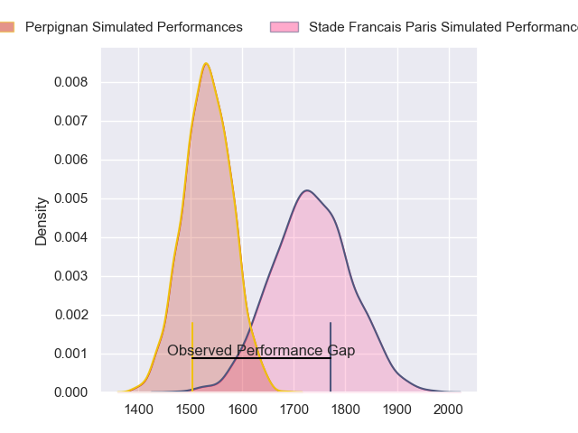
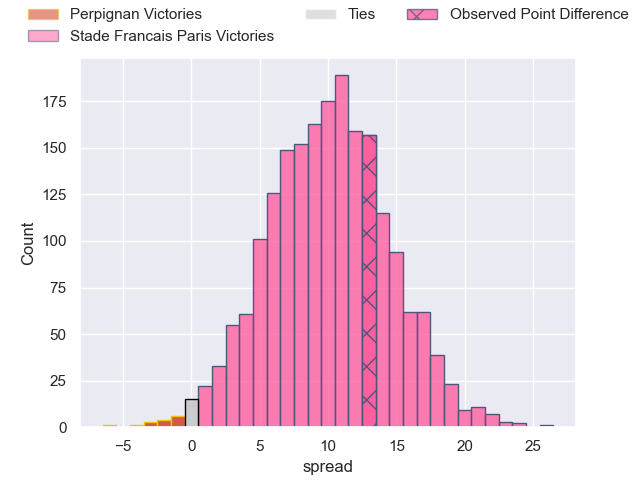
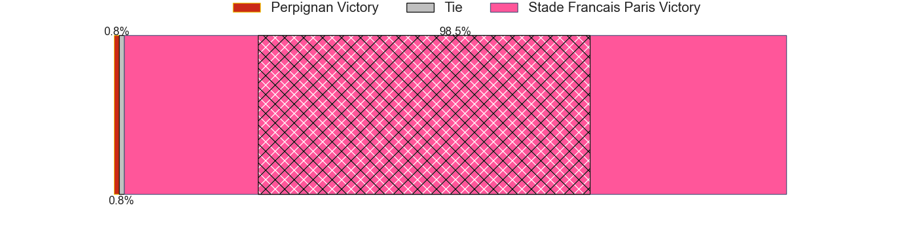
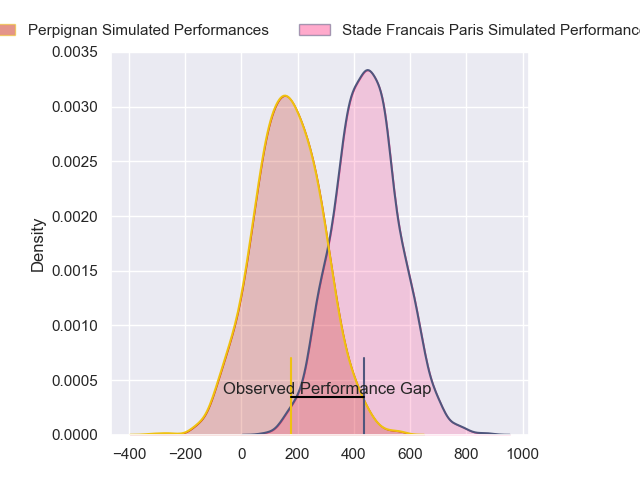
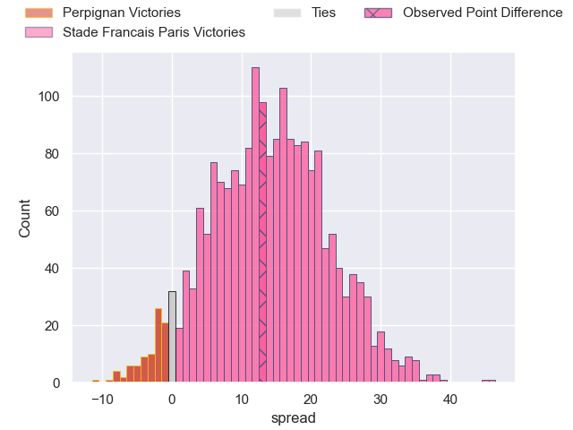
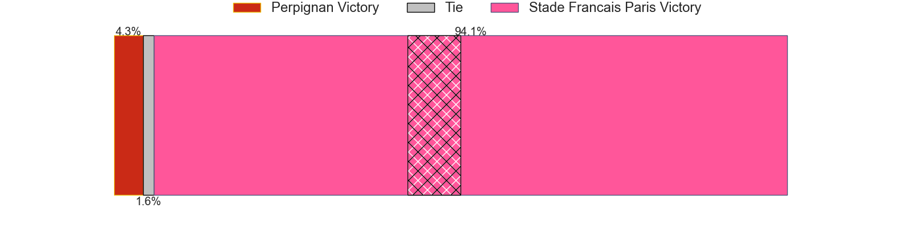

---  
layout: page  
title: Perpignan at Stade Francais Paris; 19-32  
date: 2024-02-17 18:00:00 -0500  
categories: "Top 14 Orange 2023" match review  
---
# Perpignan at Stade Francais Paris; 19-32

# Club Level Predictions

The first set of predictions treats a club as the smallest object, as the club develops its members, organizes a gameplan, and deploys its players as needed for each match. This club model has a prediction of 0.761, which translates to predicting Stade Francais Paris to win by 10.2.

Our Over/Under is 65.5 - and combined with the spread above, we have a predicted scoreline of 27 to 38

Each club has a rating and a rating deviation (similar to a Glicko rating), and expected performances can be generated. This allows for simulated matches and spreads like the ones below.
## Projected Performances - Club Model

## Projected Spreads - Club Model

## Projected Results - Club Model

# Player Level Predictions - Version 2

Treating teams instead as an entity made up of the currently active players, I have ratings for each player in an altogether different system. These can be combined to form team ratings once teamsheets are announced, weighting starters a bit higher than the reserves. After the match is played, players can be weighted by their minutes on the field, allowing for an accurate measure of the team's composition. With these compiled team ratings, we can make predictions, measure inaccuracy, and update the individual player ratings.
## Prediction without Player Minutes: Stade Francais Paris by 13.9

Stade Francais Paris by 5.8 on a neutral pitch

## Projected Performances - Player Model

## Projected Spreads - Player Model

## Projected Results - Player Model

|   Away Minutes | Away Player         |   Away Percentile |   Number |   Home Percentile | Home Player             |   Home Minutes |
|---------------:|:--------------------|------------------:|---------:|------------------:|:------------------------|---------------:|
|             49 | Xavier Chiocci      |             42.92 |        1 |             73.75 | Moses Alo-Emile         |             43 |
|             68 | Seilala Lam         |             88.93 |        2 |             96.86 | Mickael Ivaldi          |             56 |
|             68 | Nemo Roelofse       |             57.44 |        3 |             89.52 | Paul Alo-Emile          |             69 |
|             51 | Marvin Orie         |             91.13 |        4 |             73.39 | Pierre-Henri Azagoh     |             69 |
|             82 | Posolo Tuilagi      |             26.15 |        5 |             42.28 | Tanginoa Halaifonua     |             82 |
|             82 | Alan Brazo          |             73.97 |        6 |              5.4  | Mathieu Hirigoyen       |             69 |
|             82 | Patrick Sobela      |             93.23 |        7 |             78.94 | Romain Briatte          |             82 |
|              3 | So'otala Fa'aso'o   |             90.91 |        8 |             89.51 | Giovanni Habel-Kueffner |             69 |
|             54 | Sadek Deghmache     |             47.35 |        9 |             99.02 | Rory Kockott            |             75 |
|             82 | Tommaso Allan       |             81.38 |       10 |             85.75 | Zack Henry              |             82 |
|             82 | Mathieu Acebes      |             95.87 |       11 |             90.26 | Lester Etien            |             82 |
|             82 | Apisai Naqalevu     |             43.66 |       12 |             90.34 | Julien Delbouis         |             60 |
|             70 | Alivereti Duguivalu |             13.04 |       13 |             91.5  | Jeremy Ward             |             82 |
|             82 | Lucas Dubois        |             64.66 |       14 |             91.85 | Joe Marchant            |             82 |
|             82 | Louis Dupichot      |             69.66 |       15 |             57.7  | Kylan Hamdaoui          |             60 |
|             14 | Victor Montgaillard |            nan    |       16 |             21.96 | Lucas Peyresblanques    |             26 |
|             33 | Giorgi Tetrashvili  |            nan    |       17 |             51.16 | Clement Castets         |             39 |
|             58 | Lucas Velarte       |            nan    |       18 |             86.87 | JJ van der Mescht       |             26 |
|             31 | Mathieu Tanguy      |             57.6  |       19 |              6.24 | Ryan Chapuis            |             13 |
|             21 | Kelian Galletier    |            nan    |       20 |             18.47 | Jules Gimbert           |              7 |
|             28 | Matteo Rodor        |             10.69 |       21 |             54.95 | Pierre Boudehent        |             22 |
|             12 | Job Poulet          |            nan    |       22 |             76.09 | Leo Barre               |             22 |
|             14 | Akato Fakatika      |            nan    |       23 |             46.24 | Hugo Ndiaye             |             13 |

