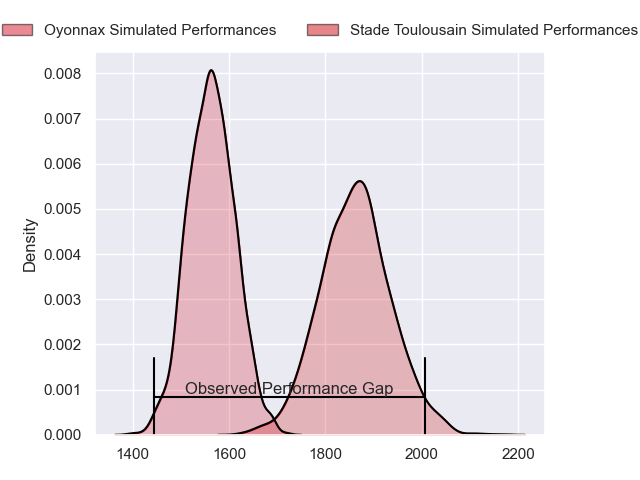
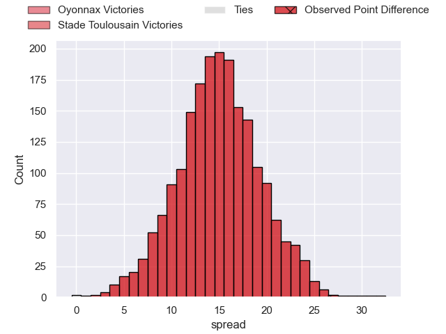
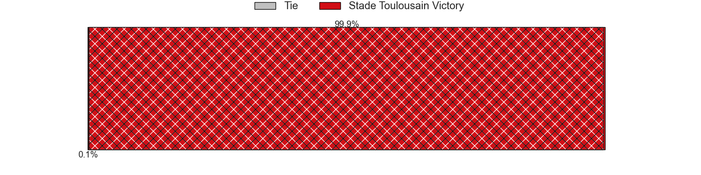
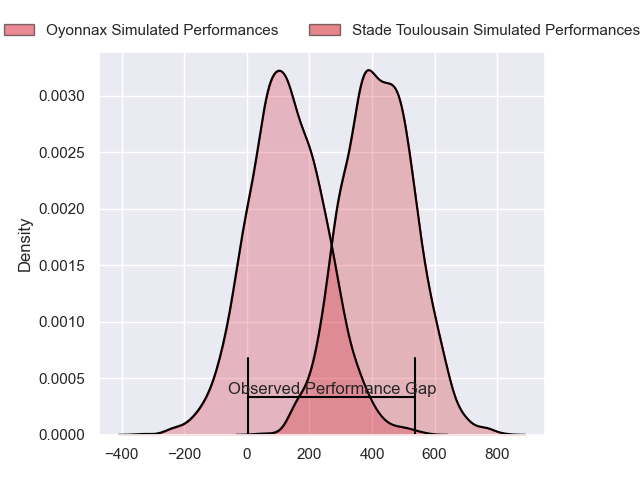
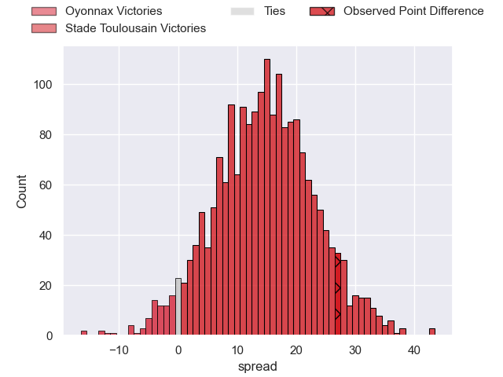
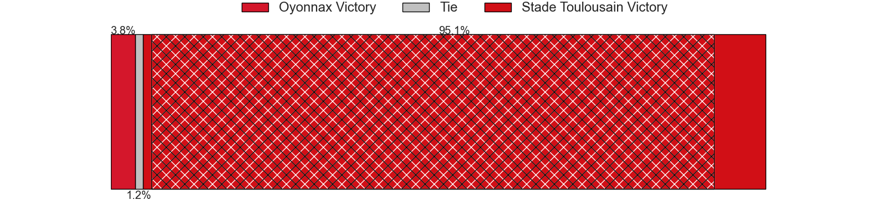

---  
layout: page  
title: Oyonnax at Stade Toulousain; 34-61  
date: 2024-02-17 18:00:00 -0500  
categories: "Top 14 Orange 2023" match review  
---
# Oyonnax at Stade Toulousain; 34-61

# Club Level Predictions

The first set of predictions treats a club as the smallest object, as the club develops its members, organizes a gameplan, and deploys its players as needed for each match. This club model has a prediction of 0.846, which translates to predicting Stade Toulousain to win by 14.9.

Our Over/Under is 70.5 - and combined with the spread above, we have a predicted scoreline of 28 to 43

Each club has a rating and a rating deviation (similar to a Glicko rating), and expected performances can be generated. This allows for simulated matches and spreads like the ones below.
## Projected Performances - Club Model

## Projected Spreads - Club Model

## Projected Results - Club Model

# Player Level Predictions - Version 2

Treating teams instead as an entity made up of the currently active players, I have ratings for each player in an altogether different system. These can be combined to form team ratings once teamsheets are announced, weighting starters a bit higher than the reserves. After the match is played, players can be weighted by their minutes on the field, allowing for an accurate measure of the team's composition. With these compiled team ratings, we can make predictions, measure inaccuracy, and update the individual player ratings.
## Prediction without Player Minutes: Stade Toulousain by 16.6

Stade Toulousain by 9.2 on a neutral pitch

## Projected Performances - Player Model

## Projected Spreads - Player Model

## Projected Results - Player Model

|   Away Minutes | Away Player          |   Away Percentile |   Number |   Home Percentile | Home Player          |   Home Minutes |
|---------------:|:---------------------|------------------:|---------:|------------------:|:---------------------|---------------:|
|             49 | Antoine Abraham      |             44.18 |        1 |             44.62 | Rodrigue Neti        |             45 |
|             56 | Teddy Durand         |             45.57 |        2 |             77.86 | Guillaume Cramont    |             60 |
|             49 | Thibault Berthaud    |             44.09 |        3 |             96.42 | Nepo Laulala         |             49 |
|             80 | Phoenix Battye       |             42.51 |        4 |             73.5  | Joshua Brennan       |             80 |
|             56 | Ewan Johnson         |             39.98 |        5 |             70.16 | Richie Arnold        |             49 |
|             56 | Wandrille Picault    |             30.26 |        6 |             68.89 | Leo Banos            |             80 |
|             80 | Hugo Hermet          |             36.08 |        7 |             70.79 | Alban Placines       |             55 |
|             75 | Loic Godener         |             12.35 |        8 |             50.58 | Theo Ntamack         |             66 |
|             60 | Charlie Cassang      |             82.51 |        9 |             56.97 | Paul Graou           |             80 |
|             69 | Jules Soulan         |             36.58 |       10 |             97.15 | Juan Cruz Mallia     |             60 |
|             80 | Enzo Reybier         |             39.31 |       11 |             98.2  | Matthis Lebel        |             80 |
|             76 | Lucas Mensa          |             76.37 |       12 |             56.93 | Pita Ahki            |             54 |
|             64 | Pedro Bettencourt    |             17.11 |       13 |             87.19 | Pierre-Louis Barassi |             80 |
|             80 | Souleymane Coulibaly |             39.31 |       14 |             71.11 | Setareki Bituniyata  |             69 |
|             71 | Maxime Salles        |             36.32 |       15 |             94.02 | Ange Capuozzo        |             80 |
|             29 | Manu Leiataua        |            nan    |       16 |            nan    | Paul Mallez          |             20 |
|             31 | Adrien Bordenave     |            nan    |       17 |             86.11 | David Ainu'u         |             35 |
|             24 | Victor Lebas         |              7.72 |       18 |            nan    | Clement Verge        |             31 |
|             24 | Filimo Taofifenua    |            nan    |       19 |             95.8  | Alexandre Roumat     |              0 |
|             20 | Ilan El Khattabi     |            nan    |       20 |            nan    | Mathis Castro        |             39 |
|             20 | Justin Bouraux       |             32.64 |       21 |              6.68 | Baptiste Germain     |             31 |
|             20 | Theo Millet          |             76.25 |       22 |             95.58 | Sofiane Guitoune     |             26 |
|             31 | Irakli Mirtskhulava  |            nan    |       23 |            nan    | Joel Merkler         |             31 |

