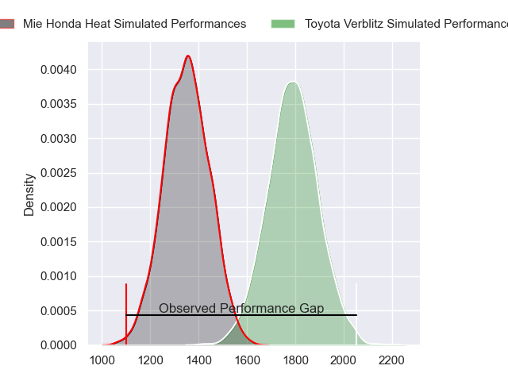
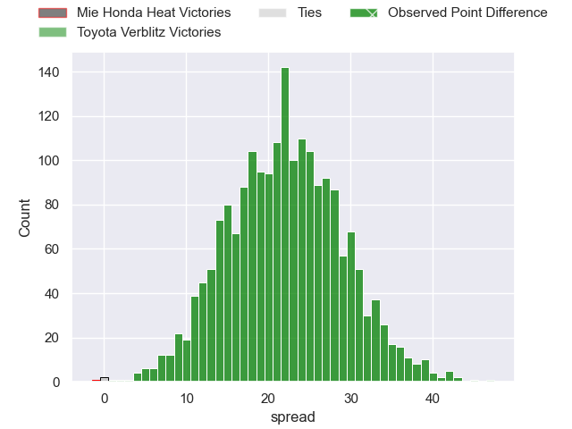
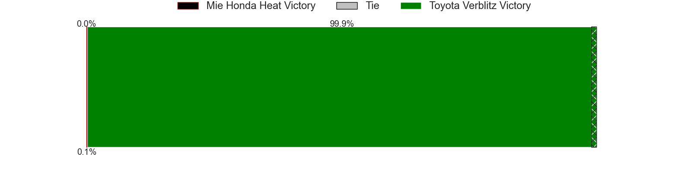
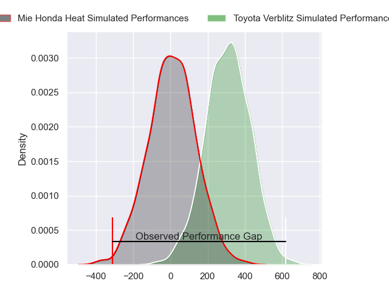
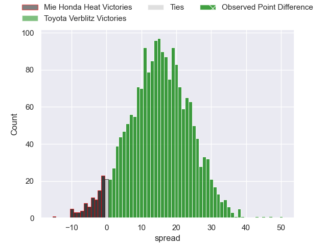
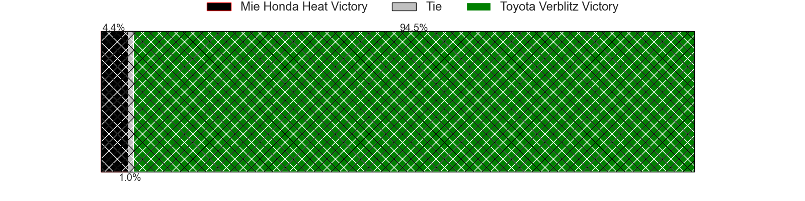

---  
layout: page  
title: Mie Honda Heat at Toyota Verblitz; 7-54  
date: 2024-02-17 18:00:00 -0500  
categories: "Japan Rugby League One 2023" match review  
---
# Mie Honda Heat at Toyota Verblitz; 7-54

# Club Level Predictions

The first set of predictions treats a club as the smallest object, as the club develops its members, organizes a gameplan, and deploys its players as needed for each match. This club model has a prediction of 0.917, which translates to predicting Toyota Verblitz to win by 21.8.

Our Over/Under is 64.5 - and combined with the spread above, we have a predicted scoreline of 22 to 43

Each club has a rating and a rating deviation (similar to a Glicko rating), and expected performances can be generated. This allows for simulated matches and spreads like the ones below.
## Projected Performances - Club Model

## Projected Spreads - Club Model

## Projected Results - Club Model

# Player Level Predictions - Version 2

Treating teams instead as an entity made up of the currently active players, I have ratings for each player in an altogether different system. These can be combined to form team ratings once teamsheets are announced, weighting starters a bit higher than the reserves. After the match is played, players can be weighted by their minutes on the field, allowing for an accurate measure of the team's composition. With these compiled team ratings, we can make predictions, measure inaccuracy, and update the individual player ratings.
## Prediction without Player Minutes: Toyota Verblitz by 17.6

Toyota Verblitz by 14.3 on a neutral pitch

## Projected Performances - Player Model

## Projected Spreads - Player Model

## Projected Results - Player Model

|   Away Minutes | Away Player         |   Away Percentile |   Number |   Home Percentile | Home Player          |   Home Minutes |
|---------------:|:--------------------|------------------:|---------:|------------------:|:---------------------|---------------:|
|             63 | Tatsuhiko Tsurukawa |              3.75 |        1 |             92.5  | Shogo Miura          |             61 |
|             80 | Lee Seung Hyok      |              6.97 |        2 |             96.33 | Yoshikatsu Hikosaka  |             61 |
|             51 | Taiki Yoshioka      |             14.64 |        3 |             57.32 | Yusuke Kizu          |             53 |
|             80 | Ryota Kobayashi     |              8.05 |        4 |             42.76 | Josh Dickson         |             51 |
|             80 | Franco Mostert      |             92.53 |        5 |             75.17 | Daichi Akiyama       |             80 |
|             63 | Waimana Kapa        |             17.73 |        6 |             14.17 | Will Tupou           |             67 |
|             42 | Ryo Furuta          |              2.94 |        7 |             74.19 | Kazuki Himeno        |             80 |
|             35 | Sosiceni Tokoqio    |             21.13 |        8 |             83.1  | Pieter-Steph du Toit |             80 |
|             51 | Kenta Yamaji        |             20.39 |        9 |             97.25 | Aaron Smith          |             62 |
|             63 | Gwangtee Oh         |             24.88 |       10 |             86.49 | Tiaan Falcon         |             70 |
|             51 | Dawid Kellerman     |             13    |       11 |             58.28 | Vatiliai Tuidraki    |             55 |
|             80 | Fraser Quirk        |              5.81 |       12 |             89.55 | Charlie Lawrence     |             80 |
|             80 | Clinton Knox        |              6.16 |       13 |              1.51 | Siosaia Fifita       |             80 |
|             80 | Haruhiko Uemura     |             21.8  |       14 |             85.74 | Taichi Takahashi     |             80 |
|             80 | Tom Banks           |             84.37 |       15 |             31.03 | Dick Wilson          |             80 |
|             45 | Kosuke Hattori      |            nan    |       16 |            nan    | Shunsuke Asaoka      |             27 |
|             38 | Yoji Akiyama        |            nan    |       17 |             89.43 | Isaiah Mapusua       |             29 |
|             29 | Matthys Basson      |            nan    |       18 |            nan    | Yuichiro Wada        |             25 |
|             29 | Shogo Nezuka        |             21.76 |       19 |            nan    | Ryusei Kato          |             19 |
|             29 | Kanta Watanabe      |             40.25 |       20 |            nan    | Gaku Shimizu         |             19 |
|             17 | Hiroaki Shirahama   |            nan    |       21 |             74.9  | Kenta Fukuda         |             18 |
|             17 | Mitch Hunt          |             68.96 |       22 |             62.53 | Ryusei Koike         |             13 |
|             17 | Hayato Akahira      |            nan    |       23 |             87    | Yuki Okada           |             10 |

