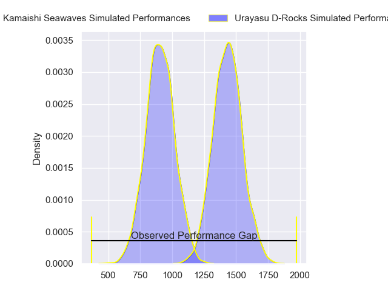
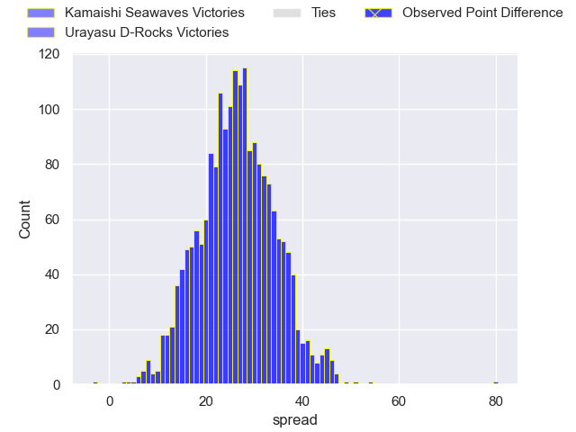
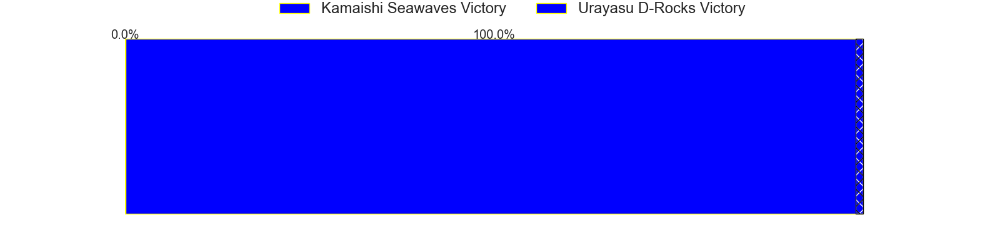
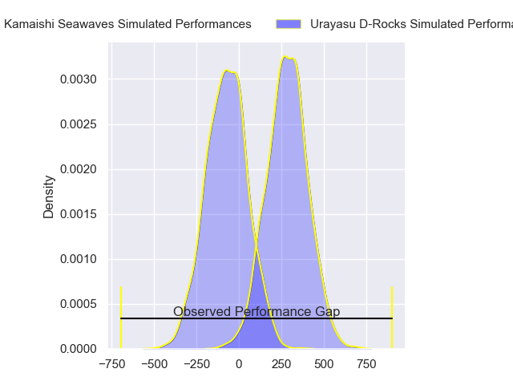
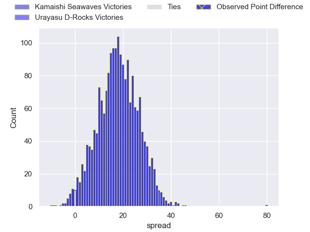
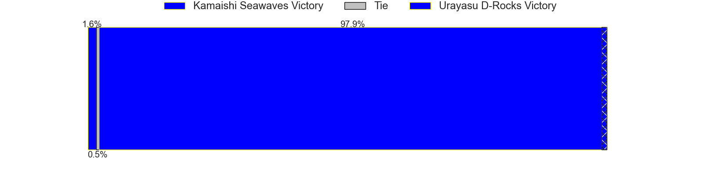

---  
layout: page  
title: Kamaishi Seawaves at Urayasu D-Rocks; 5-85  
date: 2024-02-17 18:00:00 -0500  
categories: "Japan Rugby League One D2 2023" match review  
---
# Kamaishi Seawaves at Urayasu D-Rocks; 5-85

# Club Level Predictions

The first set of predictions treats a club as the smallest object, as the club develops its members, organizes a gameplan, and deploys its players as needed for each match. This club model has a prediction of 0.946, which translates to predicting Urayasu D-Rocks to win by 26.3.

Our Over/Under is 74.5 - and combined with the spread above, we have a predicted scoreline of 24 to 51

Each club has a rating and a rating deviation (similar to a Glicko rating), and expected performances can be generated. This allows for simulated matches and spreads like the ones below.
## Projected Performances - Club Model

## Projected Spreads - Club Model

## Projected Results - Club Model

# Player Level Predictions - Version 2

Treating teams instead as an entity made up of the currently active players, I have ratings for each player in an altogether different system. These can be combined to form team ratings once teamsheets are announced, weighting starters a bit higher than the reserves. After the match is played, players can be weighted by their minutes on the field, allowing for an accurate measure of the team's composition. With these compiled team ratings, we can make predictions, measure inaccuracy, and update the individual player ratings.
## Prediction without Player Minutes: Urayasu D-Rocks by 18.1

Urayasu D-Rocks by 15.0 on a neutral pitch

## Projected Performances - Player Model

## Projected Spreads - Player Model

## Projected Results - Player Model

|   Away Minutes | Away Player        |   Away Percentile |   Number |   Home Percentile | Home Player          |   Home Minutes |
|---------------:|:-------------------|------------------:|---------:|------------------:|:---------------------|---------------:|
|             45 | Yusuke Yamada      |             30.56 |        1 |             26.52 | Kazuma Nishikawa     |             48 |
|             45 | Daiki Ito          |              4.8  |        2 |              8.86 | Franco Marais        |             80 |
|             60 | Taiki Noguchi      |             10.66 |        3 |             46.33 | Syuhei Takeuchi      |             48 |
|             58 | Dallas Tatana      |              6.34 |        4 |             18.32 | Levi Douglas         |             50 |
|             80 | Hamish Dalzell     |             16.01 |        5 |             91.47 | Shingo Nakashima     |             66 |
|             80 | Ben Nee Nee        |              8.47 |        6 |             56.08 | Shin Takeuchi        |             80 |
|             80 | Sam Henwood        |              4.13 |        7 |             88.25 | Brody MacAskill      |             58 |
|             30 | Seta Koroitamana   |             17.25 |        8 |             94.64 | Tyler Paul           |             80 |
|             62 | Takumi Tokairin    |             25.54 |        9 |             64.05 | Ren Iinuma           |             48 |
|             80 | Kazuki Ochi        |             27.08 |       10 |             54.63 | Yu Tamura            |             70 |
|             80 | Ryuji Abe          |             17.99 |       11 |             25.08 | Kai Ishii            |             80 |
|             80 | Mosese Tonga       |             14.78 |       12 |             96.16 | Samu Kerevi          |             80 |
|             80 | Osuka Lloyd Murata |              4.77 |       13 |             45.52 | Samisoni Ahokovi Tua |             65 |
|             48 | Syou Kataoka       |             22.22 |       14 |             66.03 | Siosifa Lisala       |             80 |
|             30 | Ryo Kikkawa        |             21.61 |       15 |             87.59 | Takuhei Yasuda       |             80 |
|             50 | Daisuke Musya      |              8.99 |       16 |             54.57 | Kazuki Ban           |             32 |
|             50 | Darius Thomas      |            nan    |       17 |            nan    | Taisei Konishi       |             32 |
|             35 | Shoichiro Inada    |             16.94 |       18 |             68.28 | Kim Ryom             |             32 |
|             35 | Yuki Go            |            nan    |       19 |             87.79 | Yuta Kojima          |             30 |
|             32 | Kohei Ishigaki     |             11.41 |       20 |             74.37 | Sekonaia Pole        |             22 |
|             22 | Ryunosuke Yamada   |              8.25 |       21 |             82.14 | Wimpie van der Walt  |             14 |
|             20 | Tomoyoshi Oikawa   |            nan    |       22 |             55.88 | Shane Gates          |             15 |
|             18 | Atsushi Minami     |             26.52 |       23 |             66.27 | Hayden Cripps        |             10 |

