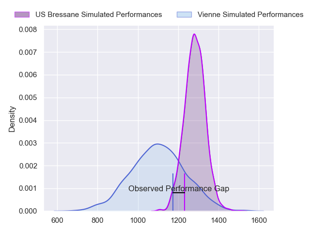
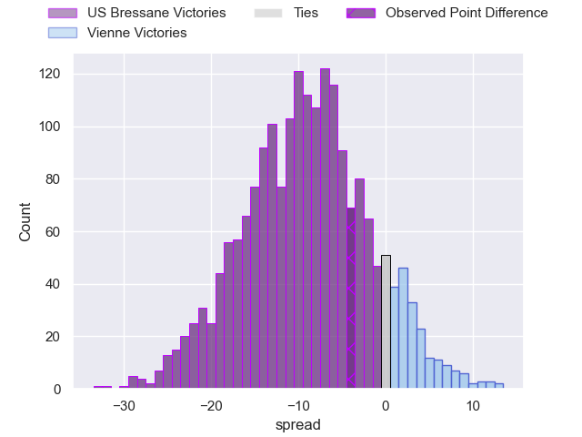
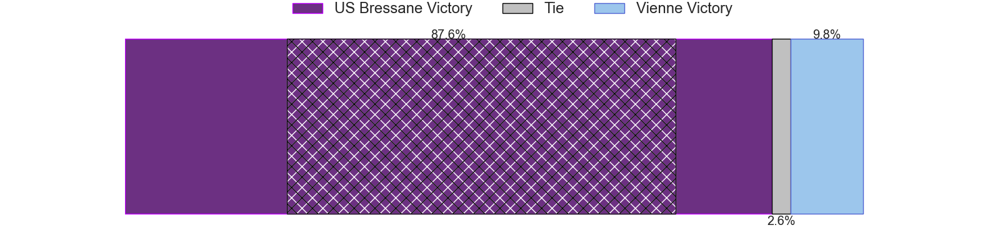
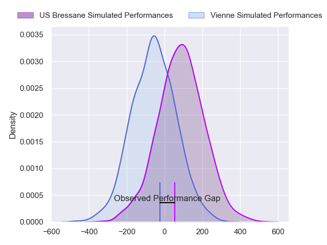
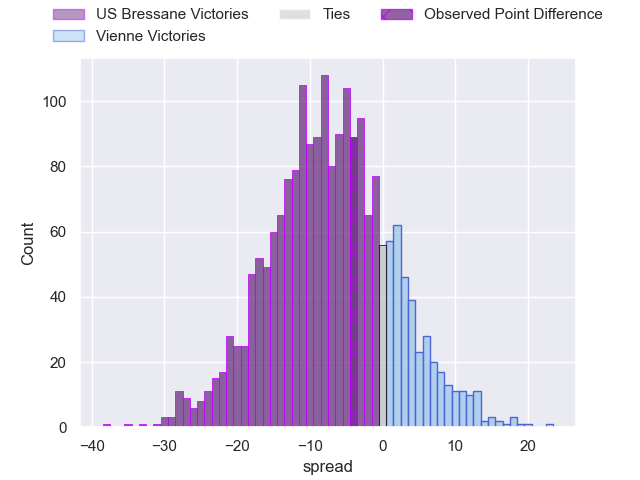
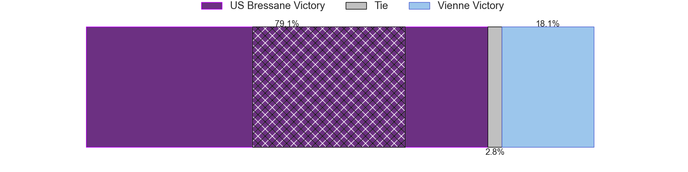

---  
layout: page  
title: US Bressane at Vienne; 23-19  
date: 2024-02-17 18:00:00 -0500  
categories: "Nationale 2023" match review  
---
# US Bressane at Vienne; 23-19

# Club Level Predictions

The first set of predictions treats a club as the smallest object, as the club develops its members, organizes a gameplan, and deploys its players as needed for each match. This club model has a prediction of 0.265, which translates to predicting US Bressane to win by 9.0.

Our Over/Under is 26.5 - and combined with the spread above, we have a predicted scoreline of 18 to 9

Each club has a rating and a rating deviation (similar to a Glicko rating), and expected performances can be generated. This allows for simulated matches and spreads like the ones below.
## Projected Performances - Club Model

## Projected Spreads - Club Model

## Projected Results - Club Model

# Player Level Predictions - Version 2

Treating teams instead as an entity made up of the currently active players, I have ratings for each player in an altogether different system. These can be combined to form team ratings once teamsheets are announced, weighting starters a bit higher than the reserves. After the match is played, players can be weighted by their minutes on the field, allowing for an accurate measure of the team's composition. With these compiled team ratings, we can make predictions, measure inaccuracy, and update the individual player ratings.
## Prediction without Player Minutes: US Bressane by 6.4

US Bressane by 8.7 on a neutral pitch

## Projected Performances - Player Model

## Projected Spreads - Player Model

## Projected Results - Player Model

|   Away Minutes | Away Player          |   Away Percentile |   Number |   Home Percentile | Home Player            |   Home Minutes |
|---------------:|:---------------------|------------------:|---------:|------------------:|:-----------------------|---------------:|
|             50 | Teo Bordenave        |             18.37 |        1 |              6.72 | Benjamin Robin         |             50 |
|             14 | Arnaud Feltrin       |             19.93 |        2 |              4.43 | Dimitri Gibierge       |             32 |
|             40 | Erich de Jager       |             63.71 |        3 |             21.59 | Guram Kavtidze         |             50 |
|             80 | Guillaume Marin      |             57.49 |        4 |             28.11 | Pierre Chapelle        |             80 |
|             24 | Josh Peters          |             13.36 |        5 |              9.91 | Ciaran O'Flynn         |             60 |
|             61 | Nail Ait Naceur      |             50.79 |        6 |              2.65 | Léon Peyrat            |             80 |
|             80 | Lucas Lyons          |             84.13 |        7 |              2.43 | Charles Massot         |             80 |
|             40 | Joseph Penitito      |             65.03 |        8 |             13.52 | Théo Minodier          |             80 |
|             40 | Nicolas Faure        |              6.09 |        9 |              9.04 | Enzo Ravanello         |             54 |
|             61 | Thibault Olender     |             75.53 |       10 |              4.28 | Julien Hervouet        |             80 |
|             80 | Élie De Fleurian     |             36.19 |       11 |             30.37 | Hippolyte Massa        |             60 |
|             80 | Benjamin Doy         |             54.48 |       12 |             29.8  | Anzize Said Omar       |             26 |
|             80 | Maile Mamao          |             27.12 |       13 |              7.92 | Matthias Giovale       |             80 |
|             80 | Kavekini Tabu        |             31.22 |       14 |             67.3  | Mathieu Bonnet-Gonnnet |             80 |
|             80 | Christian Lacombe    |              6.18 |       15 |             10.8  | Brandon Bellavia       |             63 |
|             66 | Clement Jullien      |             85.61 |       16 |             11.99 | Axel Benjamin          |             48 |
|             56 | Thomas Déliance      |             67.28 |       17 |              3.7  | Bastien Colliat        |             54 |
|             40 | Atonio Ulutuipalelei |             15.86 |       18 |             24.73 | Loïc Reynaud           |             30 |
|             40 | Loic Baradel         |             67.62 |       19 |             41.58 | Corentin Durand        |             30 |
|             40 | Jeremy Valencot      |             55.4  |       20 |             38.51 | Malory Piet            |             26 |
|             30 | Quentin Drancourt    |             26.61 |       21 |             48.96 | Victor Comptat         |             20 |
|             19 | Fred Zeilinga        |             41.09 |       22 |             59.15 | Steven Giroud          |             20 |
|             19 | Grégoire Demangel    |            nan    |       23 |              7.13 | Tom Richard            |             17 |

