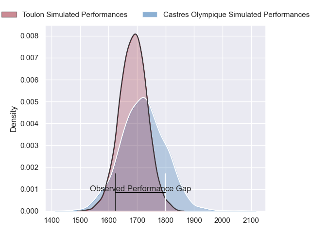
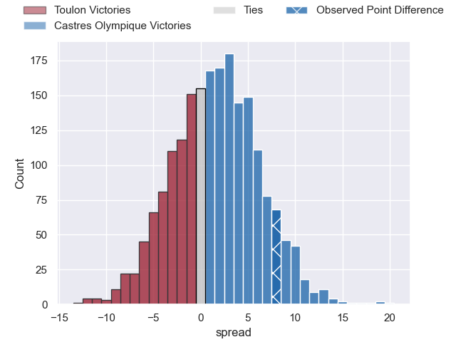
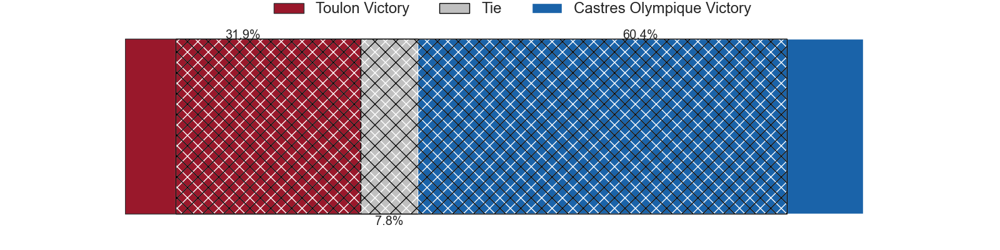
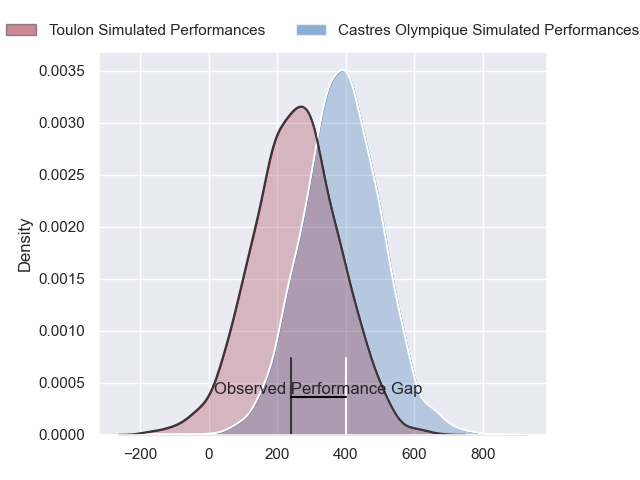
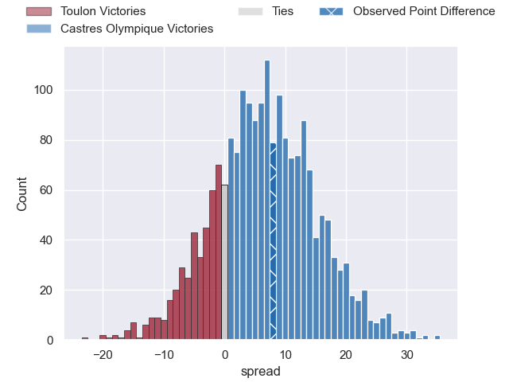
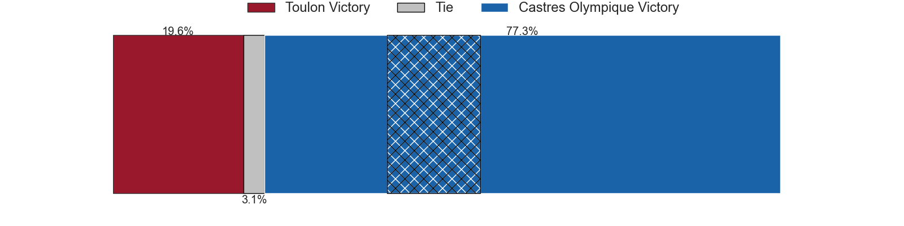

---  
layout: page  
title: Toulon at Castres Olympique; 17-25  
date: 2024-02-18 18:00:00 -0500  
categories: "Top 14 Orange 2023" match review  
---
# Toulon at Castres Olympique; 17-25

# Club Level Predictions

The first set of predictions treats a club as the smallest object, as the club develops its members, organizes a gameplan, and deploys its players as needed for each match. This club model has a prediction of 0.55, which translates to predicting Castres Olympique to win by 1.8.

Our Over/Under is 36.5 - and combined with the spread above, we have a predicted scoreline of 17 to 19

Each club has a rating and a rating deviation (similar to a Glicko rating), and expected performances can be generated. This allows for simulated matches and spreads like the ones below.
## Projected Performances - Club Model

## Projected Spreads - Club Model

## Projected Results - Club Model

# Player Level Predictions - Version 2

Treating teams instead as an entity made up of the currently active players, I have ratings for each player in an altogether different system. These can be combined to form team ratings once teamsheets are announced, weighting starters a bit higher than the reserves. After the match is played, players can be weighted by their minutes on the field, allowing for an accurate measure of the team's composition. With these compiled team ratings, we can make predictions, measure inaccuracy, and update the individual player ratings.
## Prediction without Player Minutes: Castres Olympique by 6.5

Toulon by 1.4 on a neutral pitch

## Projected Performances - Player Model

## Projected Spreads - Player Model

## Projected Results - Player Model

|   Away Minutes | Away Player            |   Away Percentile |   Number |   Home Percentile | Home Player           |   Home Minutes |
|---------------:|:-----------------------|------------------:|---------:|------------------:|:----------------------|---------------:|
|             57 | Dany Priso             |             85.6  |        1 |             67.98 | Lois Guerois-Galisson |             57 |
|             67 | Teddy Baubigny         |             33.46 |        2 |             67.46 | Pierre Colonna        |             52 |
|             57 | Kieran Brookes         |             10.38 |        3 |             83.01 | Levan Chilachava      |             57 |
|             63 | David Ribbans          |             77.27 |        4 |             95.29 | Leone Nakarawa        |             80 |
|             45 | Adrien Warion          |             47.42 |        5 |             84.85 | Tom Staniforth        |             67 |
|             63 | Cornell du Preez       |             76.88 |        6 |             53.23 | Mathieu Babillot      |             57 |
|             80 | Esteban Abadie         |             37.01 |        7 |             61.19 | Baptiste Cope         |             62 |
|             80 | Selevasio Tolofua      |             78.79 |        8 |             93.64 | Tyler Ardron          |             80 |
|             67 | Ben White              |             71.65 |        9 |             76.38 | Santiago Arata        |             67 |
|             54 | Dan Biggar             |             96.9  |       10 |             76.19 | Louis Le Brun         |             80 |
|             80 | Seta Tuicuvu           |             58.26 |       11 |             86.65 | Filipo Nakosi         |             57 |
|             80 | Mathieu Smaili         |             17.56 |       12 |             90.47 | Adrea Cocagi          |             80 |
|             80 | Leicester Fainga'anuku |             85    |       13 |             66.98 | Vilimoni Botitu       |             80 |
|             80 | Jiuta Wainiqolo        |             84.22 |       14 |             88.14 | Nathanael Hulleu      |             80 |
|             80 | Marius Domon           |             41.34 |       15 |             73.67 | Pierre Popelin        |             80 |
|             13 | Jack Singleton         |             91.36 |       16 |             53.12 | Loris Zarantonello    |             28 |
|             23 | Bruce Devaux           |             11.99 |       17 |             86.23 | Antoine Tichit        |             23 |
|             17 | Brian Alainu'uese      |             73.25 |       18 |             67.05 | Florent Vanverberghe  |             13 |
|             35 | Matthias Halagahu      |             34.1  |       19 |             55.24 | Abraham Papali'i      |             20 |
|             17 | Jules Coulon           |             43.48 |       20 |             86.11 | Baptiste Delaporte    |             21 |
|             13 | Vasil Lobzhanidze      |             10.04 |       21 |             28.15 | Jeremy Fernandez      |             13 |
|             26 | Jeremy Sinzelle        |            nan    |       22 |             75.74 | Josaia Raisuqe        |             23 |
|             23 | Emerick Setiano        |             91.77 |       23 |             63.69 | Henry Thomas          |             23 |

