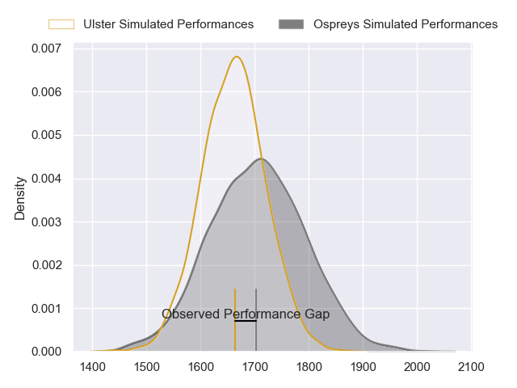
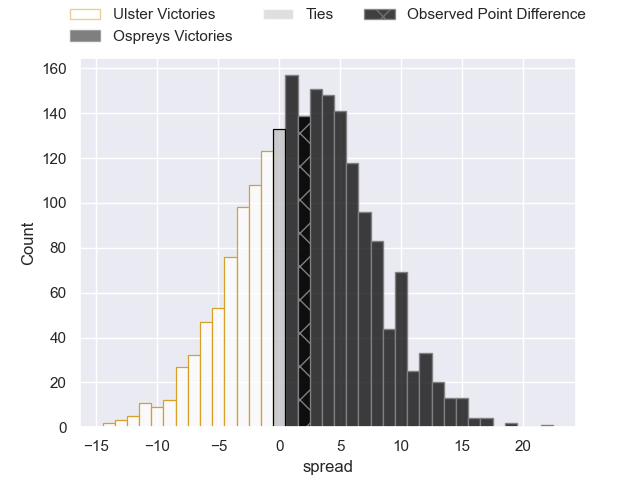
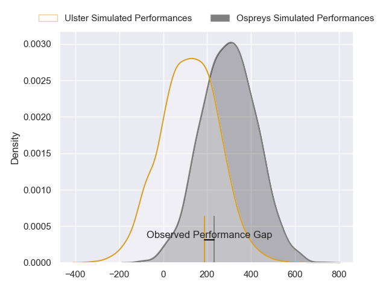
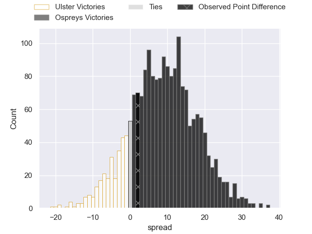

---  
layout: page  
title: Ulster at Ospreys; 17-19  
date: 2024-02-18 18:00:00 -0500  
categories: "United Rugby Championship 2023" match review  
---
# Ulster at Ospreys; 17-19

# Club Level Predictions

The first set of predictions treats a club as the smallest object, as the club develops its members, organizes a gameplan, and deploys its players as needed for each match. This club model has a prediction of 0.564, which translates to predicting Ospreys to win by 2.3.

Our Over/Under is 43.5 - and combined with the spread above, we have a predicted scoreline of 21 to 23

Each club has a rating and a rating deviation (similar to a Glicko rating), and expected performances can be generated. This allows for simulated matches and spreads like the ones below.
## Projected Performances - Club Model

## Projected Spreads - Club Model

## Projected Results - Club Model

# Player Level Predictions - Version 2

Treating teams instead as an entity made up of the currently active players, I have ratings for each player in an altogether different system. These can be combined to form team ratings once teamsheets are announced, weighting starters a bit higher than the reserves. After the match is played, players can be weighted by their minutes on the field, allowing for an accurate measure of the team's composition. With these compiled team ratings, we can make predictions, measure inaccuracy, and update the individual player ratings.
## Prediction without Player Minutes: Ospreys by 8.5

Ospreys by 2.8 on a neutral pitch

## Projected Performances - Player Model

## Projected Spreads - Player Model

## Projected Results - Player Model

|   Away Minutes | Away Player        |   Away Percentile |   Number |   Home Percentile | Home Player            |   Home Minutes |
|---------------:|:-------------------|------------------:|---------:|------------------:|:-----------------------|---------------:|
|             53 | Andrew Warwick     |             29.93 |        1 |             50.45 | Nicky Smith            |             67 |
|             49 | John Andrew        |             34.13 |        2 |             59.96 | Sam Parry              |             67 |
|             26 | Marty Moore        |             87.81 |        3 |             37.9  | Tom Botha              |             60 |
|             80 | Harry Sheridan     |             56.22 |        4 |             38.94 | James Ratti            |             80 |
|             30 | Iain Henderson     |             88.82 |        5 |             40.09 | Victor Sekekete        |             70 |
|             80 | David McCann       |             66.24 |        6 |             33.44 | Harri Deaves           |             80 |
|             71 | Marcus Rea         |             93.02 |        7 |             98.2  | Justin Tipuric         |             80 |
|             80 | Nick Timoney       |             56.41 |        8 |             37.3  | Morgan Morse           |             67 |
|             60 | Nathan Doak        |             16.9  |        9 |             38.11 | Reuben Morgan-Williams |             80 |
|             80 | Jake Flannery      |             48.46 |       10 |             33.49 | Dan Edwards            |             80 |
|             80 | Jacob Stockdale    |             49.63 |       11 |             36.72 | Keelan Giles           |             80 |
|             60 | Jude Postlethwaite |             47.61 |       12 |             80.91 | Keiran Williams        |             80 |
|             80 | James Hume         |             13.62 |       13 |             35.16 | Evardi Boshoff         |             80 |
|             80 | Ethan McIlroy      |             50.79 |       14 |             37.78 | Matt Protheroe         |             67 |
|             80 | Will Addison       |             59.77 |       15 |             33.33 | Jack Walsh             |             80 |
|             31 | Tom Stewart        |              1.11 |       16 |            nan    | Lewis Lloyd            |             13 |
|             27 | Steven Kitshoff    |             91.85 |       17 |            nan    | Rhys Henry             |             13 |
|             54 | Scott Wilson       |            nan    |       18 |            nan    | Ben Warren             |             20 |
|             50 | Cormac Izuchukwu   |            nan    |       19 |            nan    | Lewis Jones            |             13 |
|              9 | Matty Rea          |             37.67 |       20 |            nan    | Will Hickey            |             10 |
|             20 | Dave Shanahan      |            nan    |       21 |            nan    | Cam Jones              |              0 |
|             20 | Luke Marshall      |             88.71 |       22 |            nan    | Alex Cuthbert          |             13 |
|              0 | Robert Baloucoune  |              4.13 |       23 |            nan    | Tom Florence           |              0 |

