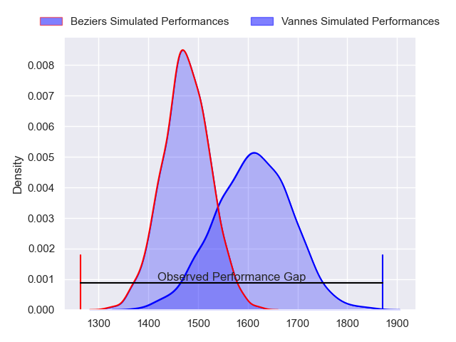
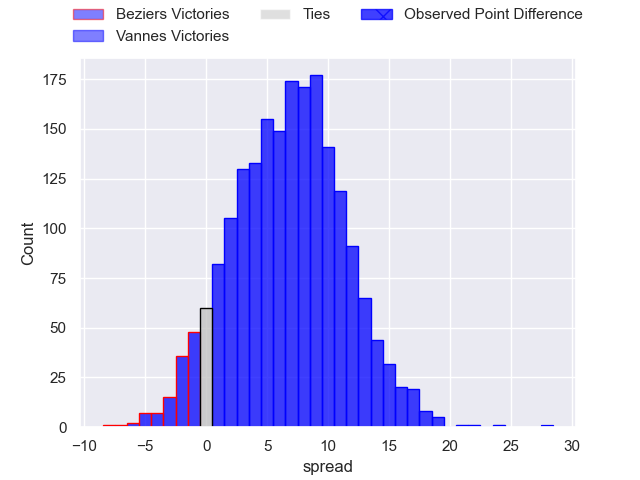
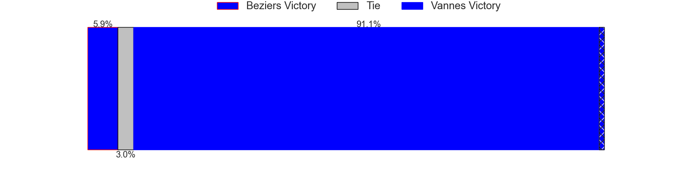
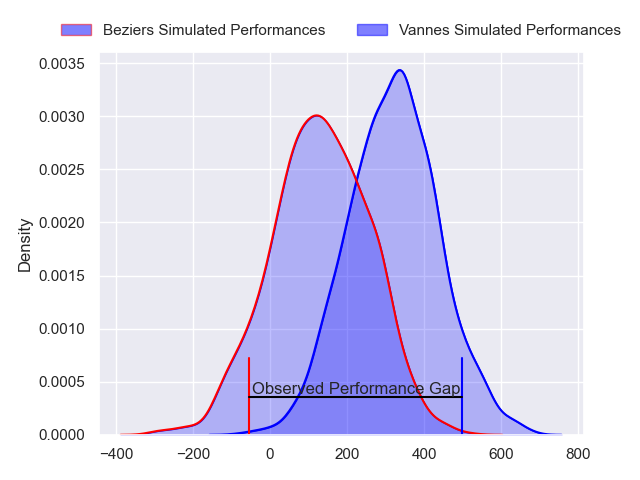
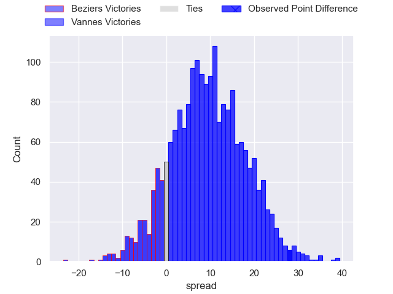
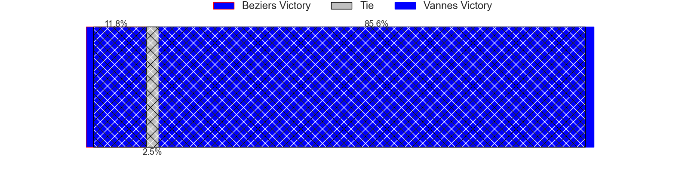

---  
layout: page  
title: Beziers at Vannes; 17-45  
date: 2024-02-22 18:00:00 -0500  
categories: "Pro D2 2023" match review  
---
# Beziers at Vannes; 17-45

# Club Level Predictions

The first set of predictions treats a club as the smallest object, as the club develops its members, organizes a gameplan, and deploys its players as needed for each match. This club model has a prediction of 0.681, which translates to predicting Vannes to win by 6.7.

Our Over/Under is 49.5 - and combined with the spread above, we have a predicted scoreline of 21 to 28

Each club has a rating and a rating deviation (similar to a Glicko rating), and expected performances can be generated. This allows for simulated matches and spreads like the ones below.
## Projected Performances - Club Model

## Projected Spreads - Club Model

## Projected Results - Club Model

# Player Level Predictions - Version 2

Treating teams instead as an entity made up of the currently active players, I have ratings for each player in an altogether different system. These can be combined to form team ratings once teamsheets are announced, weighting starters a bit higher than the reserves. After the match is played, players can be weighted by their minutes on the field, allowing for an accurate measure of the team's composition. With these compiled team ratings, we can make predictions, measure inaccuracy, and update the individual player ratings.
## Prediction without Player Minutes: Vannes by 9.3

Vannes by 5.4 on a neutral pitch

## Projected Performances - Player Model

## Projected Spreads - Player Model

## Projected Results - Player Model

|   Away Minutes | Away Player             |   Away Percentile |   Number |   Home Percentile | Home Player           |   Home Minutes |
|---------------:|:------------------------|------------------:|---------:|------------------:|:----------------------|---------------:|
|             63 | Giorgi Akhaladze        |             43.37 |        1 |             85.04 | Andy Bordelai         |             51 |
|             58 | Jose Luis Gonzalez      |             83.21 |        2 |             89.67 | Pat Leafa             |             57 |
|             56 | Luka Tchelidze          |             62.9  |        3 |             92.38 | Paga Tafili           |             57 |
|             80 | Clément Bitz            |             69.12 |        4 |             69.47 | Anton Bresler         |             70 |
|             80 | Pierre Gayraud          |             14.29 |        5 |             85.02 | Darren O'Shea         |             51 |
|             80 | Pierrick Gunther        |              0.63 |        6 |             20.74 | Karl Chateau          |             51 |
|             63 | Gillian Benoy           |              9.31 |        7 |             98.73 | Francisco Gorrissen   |             80 |
|             53 | Joaquim Selma           |             31.93 |        8 |             62.7  | Sione Kalamafoni      |             80 |
|             80 | Jean Victor Goillot     |             21.41 |        9 |             92.73 | Michael Ruru          |             80 |
|             63 | Tim Nanai-Williams      |             92.4  |       10 |             95.49 | Maxime Lafage         |             80 |
|             80 | Nicolas Plazy           |             78.94 |       11 |             70.26 | Romaric Camou         |             60 |
|             37 | Watisoni Votu           |             89.41 |       12 |             16.18 | Alex Arrate           |             70 |
|             80 | Paul Recor              |             59.72 |       13 |             87.78 | Sacha Valleau         |             80 |
|             80 | Paul Alquier            |             18.94 |       14 |             54.71 | Enzo Benmegal         |             80 |
|             80 | Victor Dreuille         |             22.76 |       15 |             65.52 | Paul Surano           |             80 |
|             43 | Maxime Vacquier         |            nan    |       16 |             38.71 | Charles-Henri Berguet |             29 |
|             24 | Yannick Arroyo          |             74.73 |       17 |             12.44 | Eric Marks            |             29 |
|             27 | Thomas Canaleta         |            nan    |       18 |             91.84 | Joe Edwards           |             29 |
|             22 | Yanis Boulassel         |             48.71 |       19 |             55.54 | Théo Beziat           |             23 |
|             17 | Clément Samper          |            nan    |       20 |             75.81 | Jérémy Boyadjis       |             23 |
|             17 | Harry Glynn             |            nan    |       21 |              7.36 | Massimo Ortolan       |             20 |
|             17 | Petero Taviraki Mailulu |            nan    |       22 |            nan    | Timothé Mezou         |             10 |
|            nan | nan                     |            nan    |       23 |             55.21 | Jules Le Bail         |             10 |

