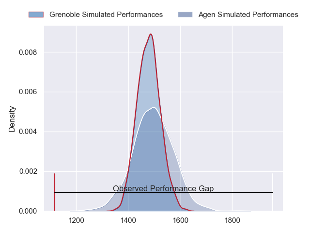
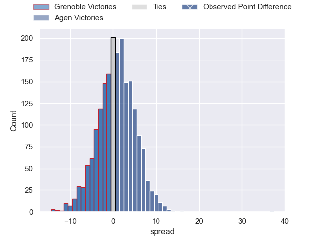
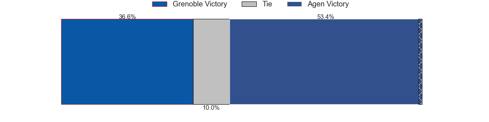
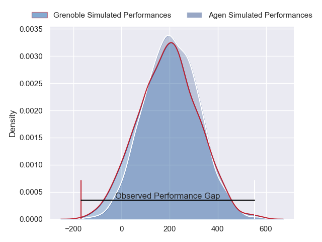
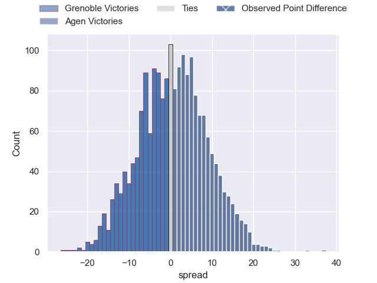

---  
layout: page  
title: Grenoble at Agen; 3-40  
date: 2024-02-23 18:00:00 -0500  
categories: "Pro D2 2023" match review  
---
# Grenoble at Agen; 3-40

# Club Level Predictions

The first set of predictions treats a club as the smallest object, as the club develops its members, organizes a gameplan, and deploys its players as needed for each match. This club model has a prediction of 0.522, which translates to predicting Agen to win by 0.8.

Our Over/Under is 47.5 - and combined with the spread above, we have a predicted scoreline of 24 to 24

Each club has a rating and a rating deviation (similar to a Glicko rating), and expected performances can be generated. This allows for simulated matches and spreads like the ones below.
## Projected Performances - Club Model

## Projected Spreads - Club Model

## Projected Results - Club Model

# Player Level Predictions - Version 2

Treating teams instead as an entity made up of the currently active players, I have ratings for each player in an altogether different system. These can be combined to form team ratings once teamsheets are announced, weighting starters a bit higher than the reserves. After the match is played, players can be weighted by their minutes on the field, allowing for an accurate measure of the team's composition. With these compiled team ratings, we can make predictions, measure inaccuracy, and update the individual player ratings.
## Prediction without Player Minutes: Agen by 1.3

Grenoble by 6.7 on a neutral pitch

## Projected Performances - Player Model

## Projected Spreads - Player Model

## Projected Results - Player Model

|   Away Minutes | Away Player                 |   Away Percentile |   Number |   Home Percentile | Home Player        |   Home Minutes |
|---------------:|:----------------------------|------------------:|---------:|------------------:|:-------------------|---------------:|
|             52 | Luka Goginava               |             51.54 |        1 |             27.59 | Florent Guion      |             48 |
|             57 | Mathis Sarragallet          |             25.28 |        2 |             59.06 | Clement Martinez   |             57 |
|             48 | Vincent Vial                |             37.39 |        3 |             56.62 | Beau Farrance      |             48 |
|             52 | Thomas Lainault             |             36.35 |        4 |              8.12 | Evan Olmstead      |             80 |
|             80 | Georgi Javakhia             |             68.12 |        5 |             90.12 | William Demotte    |             60 |
|             80 | Jose Madeira                |             87.58 |        6 |             67.28 | Matthieu Bonnet    |             80 |
|             66 | Steeve Blanc-Mappaz         |             60.26 |        7 |             87.04 | Arnaud Duputs      |             80 |
|             80 | Thibaut Martel              |             37.32 |        8 |             33.33 | Fotu Lokotui       |             57 |
|             60 | Barnabe Couilloud           |              4.79 |        9 |             13.57 | Sonatane Takulua   |             60 |
|             60 | Romain Barthelemy           |             42.51 |       10 |             76.09 | Thomas Vincent     |             60 |
|             80 | Karim Qadiri                |             47.16 |       11 |             62.49 | Iban Etcheverry    |             80 |
|             80 | Terrence Hepetema           |             45.94 |       12 |             76.33 | Clement Garrigues  |             80 |
|             80 | Romain Trouilloud           |             49.23 |       13 |             69.38 | Theo Belan         |             57 |
|             47 | Atunaisa Taulanga Vaka Manu |             15.11 |       14 |             72.99 | Tevita Railevu     |             80 |
|             80 | Julien Farnoux              |             94.02 |       15 |             90.67 | Mathieu Lamoulie   |             80 |
|             33 | Geoffrey Cros               |             44.26 |       16 |             69.24 | Hans Lombard-Buret |             32 |
|             32 | Irakli Aptsiauri            |             68.87 |       17 |             73.5  | Alex Burin         |             32 |
|             28 | Eli Eglaine                 |             13.16 |       18 |             23.4  | Pierre Jouvin      |             23 |
|             28 | Pierce Phillips             |             50.47 |       19 |             28.08 | Julien Lebian      |             23 |
|             23 | Lilian Rossi                |             46.23 |       20 |             26.55 | Theo Idjellidaine  |             20 |
|             20 | Felipe Ezcurra              |             96.41 |       21 |             40.94 | Corentin Vernet    |             20 |
|             20 | Max Clement                 |             38.89 |       22 |             37.68 | Ben Volavola       |             20 |
|             14 | Diego Pinheiro Ruiz         |            nan    |       23 |             93.68 | Henry Purdy        |             23 |

