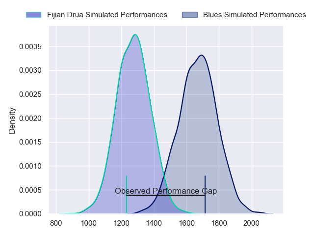
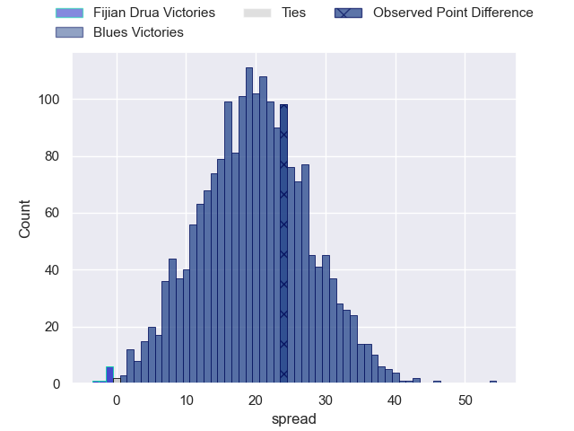
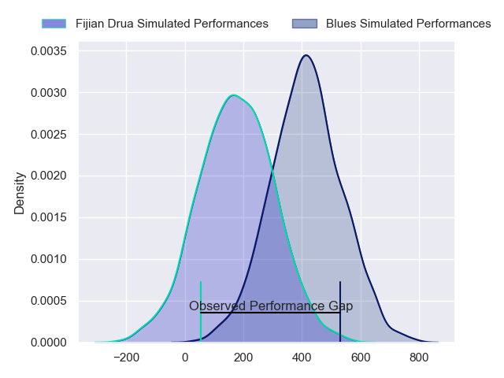
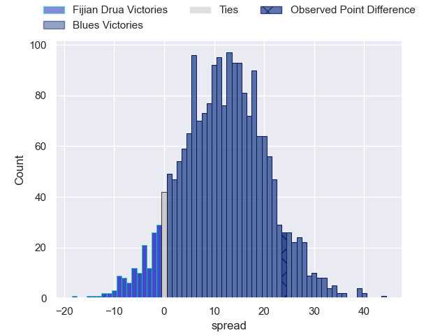
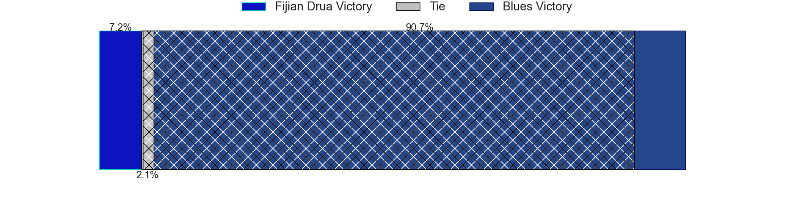

---  
layout: page  
title: Fijian Drua at Blues; 10-34  
date: 2024-02-23 18:00:00 -0500  
categories: "Super Rugby Pacific 2024" match review  
---
# Fijian Drua at Blues; 10-34

# Club Level Predictions

The first set of predictions treats a club as the smallest object, as the club develops its members, organizes a gameplan, and deploys its players as needed for each match. This club model has a prediction of 0.899, which translates to predicting Blues to win by 20.0.

Our Over/Under is 64.5 - and combined with the spread above, we have a predicted scoreline of 22 to 43

Each club has a rating and a rating deviation (similar to a Glicko rating), and expected performances can be generated. This allows for simulated matches and spreads like the ones below.
## Projected Performances - Club Model

## Projected Spreads - Club Model

## Projected Results - Club Model

# Player Level Predictions - Version 2

Treating teams instead as an entity made up of the currently active players, I have ratings for each player in an altogether different system. These can be combined to form team ratings once teamsheets are announced, weighting starters a bit higher than the reserves. After the match is played, players can be weighted by their minutes on the field, allowing for an accurate measure of the team's composition. With these compiled team ratings, we can make predictions, measure inaccuracy, and update the individual player ratings.
## Prediction without Player Minutes: Blues by 14.2

Blues by 9.8 on a neutral pitch

## Projected Performances - Player Model

## Projected Spreads - Player Model

## Projected Results - Player Model

|   Away Minutes | Away Player             |   Away Percentile |   Number |   Home Percentile | Home Player        |   Home Minutes |
|---------------:|:------------------------|------------------:|---------:|------------------:|:-------------------|---------------:|
|             51 | Livai Natave            |             37.93 |        1 |             49.82 | Josh Fusitu'a      |             50 |
|             72 | Tevita Ikanivere        |             84.72 |        2 |             90.75 | Kurt Eklund        |             48 |
|             52 | Mesake Doge             |             21.32 |        3 |             95.92 | Angus Ta'avao      |             48 |
|             80 | Isoa Nasilasila         |             75.06 |        4 |             73.18 | Josh Beehre        |             56 |
|             62 | Ratu Rotuisolia         |             32.71 |        5 |             34.24 | Sam Darry          |             80 |
|             80 | Etonia Waqa             |             49.78 |        6 |             55.51 | Anton Segner       |             57 |
|             80 | Elia Canakaivata        |             54.75 |        7 |             98.6  | Dalton Papalii     |             75 |
|             69 | Meli Derenalagi         |             32.16 |        8 |             89.44 | Hoskins Sotutu     |             80 |
|             57 | Frank Lomani            |             48.7  |        9 |             70.46 | Finlay Christie    |             56 |
|             80 | Isaiah Armstrong-Ravula |             34.3  |       10 |             95.89 | Stephen Perofeta   |             80 |
|             80 | Selestino Ravutaumada   |             79.53 |       11 |             24.54 | Caleb Clarke       |             80 |
|             80 | Apisalome Vota          |             45.23 |       12 |             90.58 | Harry Plummer      |             80 |
|             69 | Iosefo Masi             |             69.96 |       13 |             74.32 | Rieko Ioane        |             69 |
|             80 | Epeli Momo              |             43.94 |       14 |             56.38 | Mark Tele'a        |             80 |
|             51 | Isikeli Rabitu          |             38.76 |       15 |             80.86 | Zarn Sullivan      |             80 |
|              8 | Mesu Dolokoto           |            nan    |       16 |             70.19 | Ricky Riccitelli   |             32 |
|             29 | Emosi Tuqiri            |             60.16 |       17 |             28.04 | Jordan Lay         |             30 |
|             28 | Jone Koroiduadua        |             38.29 |       18 |             62.89 | Marcel Renata      |             32 |
|             18 | Mesake Vocevoce         |             49.18 |       19 |             94.59 | Laghlan McWhannell |             24 |
|             11 | Vilive Miramira         |             65.01 |       20 |             48.81 | Adrian Choat       |             23 |
|             23 | Peni Matawalu           |             56.89 |       21 |             76.05 | Sam Nock           |             24 |
|             11 | Kemu Valetini           |            nan    |       22 |             58.54 | AJ Lam             |             11 |
|             29 | Tuidraki Samusamuvodre  |             20.9  |       23 |             48.56 | Cole Forbes        |              5 |

