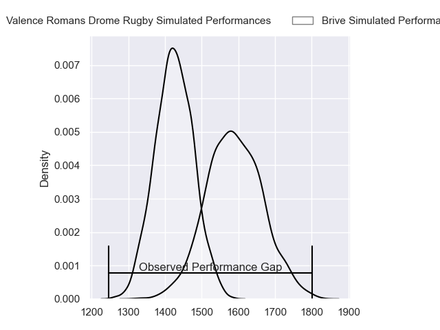
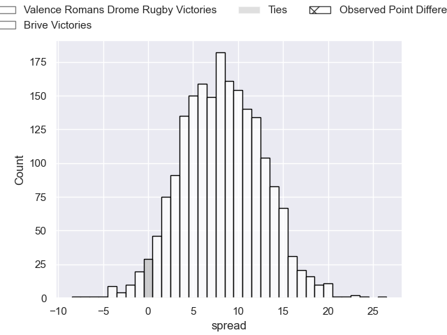
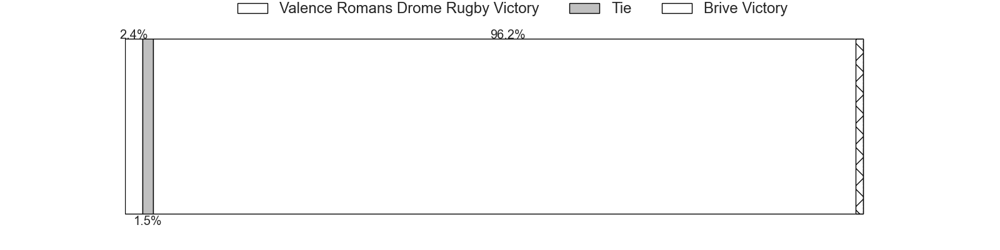
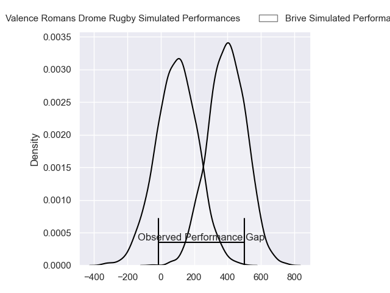
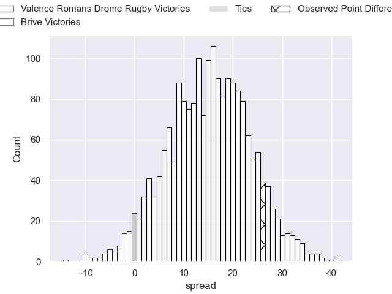
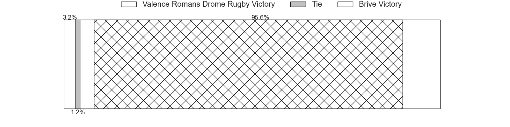

---  
layout: page  
title: Valence Romans Drome Rugby at Brive; 3-29  
date: 2024-02-23 18:00:00 -0500  
categories: "Pro D2 2023" match review  
---
# Valence Romans Drome Rugby at Brive; 3-29

# Club Level Predictions

The first set of predictions treats a club as the smallest object, as the club develops its members, organizes a gameplan, and deploys its players as needed for each match. This club model has a prediction of 0.717, which translates to predicting Brive to win by 8.2.

Our Over/Under is 37.5 - and combined with the spread above, we have a predicted scoreline of 15 to 23

Each club has a rating and a rating deviation (similar to a Glicko rating), and expected performances can be generated. This allows for simulated matches and spreads like the ones below.
## Projected Performances - Club Model

## Projected Spreads - Club Model

## Projected Results - Club Model

# Player Level Predictions - Version 2

Treating teams instead as an entity made up of the currently active players, I have ratings for each player in an altogether different system. These can be combined to form team ratings once teamsheets are announced, weighting starters a bit higher than the reserves. After the match is played, players can be weighted by their minutes on the field, allowing for an accurate measure of the team's composition. With these compiled team ratings, we can make predictions, measure inaccuracy, and update the individual player ratings.
## Prediction without Player Minutes: Brive by 15.5

Brive by 7.8 on a neutral pitch

## Projected Performances - Player Model

## Projected Spreads - Player Model

## Projected Results - Player Model

|   Away Minutes | Away Player           |   Away Percentile |   Number |   Home Percentile | Home Player               |   Home Minutes |
|---------------:|:----------------------|------------------:|---------:|------------------:|:--------------------------|---------------:|
|             80 | Julien Royer          |              6.54 |        1 |             73.57 | Hugo Reilhes              |             50 |
|             58 | Cyril Deligny         |              2.77 |        2 |             36.35 | Benjamin Boudou           |             50 |
|             39 | Mathis Roume          |             34.32 |        3 |             67.47 | Vakh Abdaladze            |             50 |
|             58 | Darrell Dyer          |             85.6  |        4 |             72.7  | Retief Marais             |             50 |
|             58 | Florian Goumat        |             69.7  |        5 |             71.89 | Tevita Ratuva             |             50 |
|             80 | Éloi Massot           |              2.86 |        6 |             92.38 | Ross Moriarty             |             50 |
|             80 | Charles Brayer        |             51.32 |        7 |             57.35 | Sasha Gue                 |             80 |
|             80 | Sven Bernat Girlando  |             75.52 |        8 |             64.8  | Rahboni Warren-Vosayaco   |             50 |
|             51 | Léopold Dupas         |             50.88 |        9 |             34.58 | Leo Carbonneau            |             80 |
|             60 | Joris Moura           |             80.29 |       10 |             22.09 | Tom Raffy                 |             80 |
|             80 | Gauthier Minguillon   |             55.98 |       11 |             64.87 | Mathis Ferté              |             80 |
|             80 | Isaac Te Tamaki       |              7.8  |       12 |             90.8  | Sam Johnson               |             80 |
|             80 | Esteban Tercq         |             38.3  |       13 |             36.79 | Paula Walisolio           |             56 |
|             58 | Jonathan Quinnez      |             60.63 |       14 |             78.52 | Arthur Bonneval           |             80 |
|             47 | Charles Bouldoire     |             89.66 |       15 |             88.28 | Stuart Olding             |             80 |
|             41 | Chris Talakai         |             23.3  |       16 |             68.19 | Wesley Tapueluelu         |             30 |
|             29 | Matéo Lajous          |            nan    |       17 |             79.15 | Issam Hamel               |             30 |
|             22 | Etienne Narmand       |            nan    |       18 |            nan    | Teun Karst                |             30 |
|             22 | Yassine Maamry        |             50.81 |       19 |             34.56 | Julien Delannoy           |             30 |
|             22 | Loan Real             |             32.06 |       20 |            nan    | Loan Lavergne             |             30 |
|             20 | Clément Doucet        |             31.59 |       21 |             91.32 | Said Hireche              |             30 |
|             22 | Noe Perret-Tourlonias |             38.1  |       22 |             16.49 | Francisco Coria Marchetti |             30 |
|             33 | Esteban Chouteau      |            nan    |       23 |             60.07 | Guillaume Galletier       |             24 |

