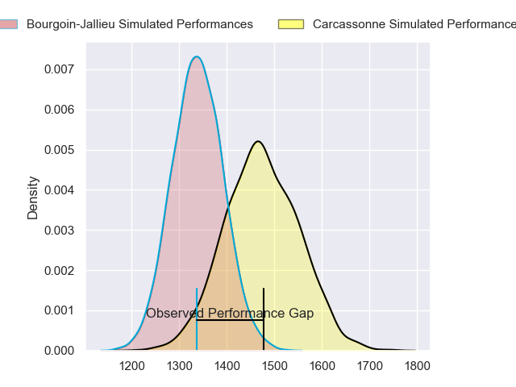
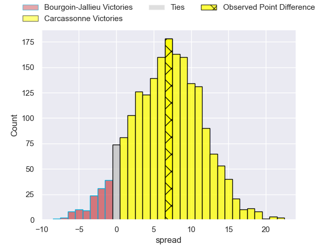
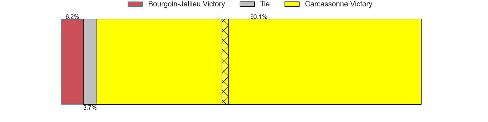
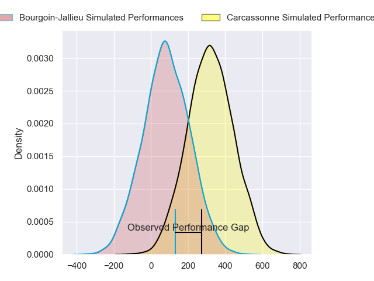
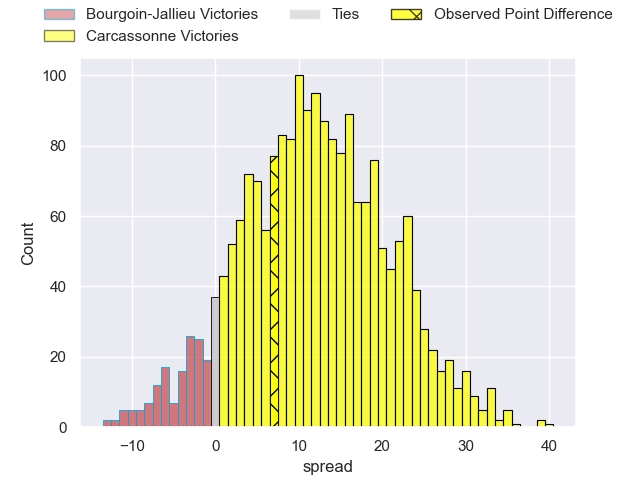
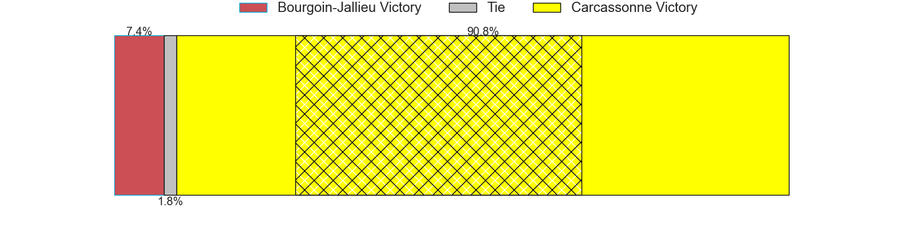

---  
layout: page  
title: Bourgoin-Jallieu at Carcassonne; 15-22  
date: 2024-02-23 18:00:00 -0500  
categories: "Nationale 2023" match review  
---
# Bourgoin-Jallieu at Carcassonne; 15-22

# Club Level Predictions

The first set of predictions treats a club as the smallest object, as the club develops its members, organizes a gameplan, and deploys its players as needed for each match. This club model has a prediction of 0.681, which translates to predicting Carcassonne to win by 6.7.

Our Over/Under is 42.5 - and combined with the spread above, we have a predicted scoreline of 18 to 24

Each club has a rating and a rating deviation (similar to a Glicko rating), and expected performances can be generated. This allows for simulated matches and spreads like the ones below.
## Projected Performances - Club Model

## Projected Spreads - Club Model

## Projected Results - Club Model

# Player Level Predictions - Version 2

Treating teams instead as an entity made up of the currently active players, I have ratings for each player in an altogether different system. These can be combined to form team ratings once teamsheets are announced, weighting starters a bit higher than the reserves. After the match is played, players can be weighted by their minutes on the field, allowing for an accurate measure of the team's composition. With these compiled team ratings, we can make predictions, measure inaccuracy, and update the individual player ratings.
## Prediction without Player Minutes: Carcassonne by 12.5

Carcassonne by 6.6 on a neutral pitch

## Projected Performances - Player Model

## Projected Spreads - Player Model

## Projected Results - Player Model

|   Away Minutes | Away Player              |   Away Percentile |   Number |   Home Percentile | Home Player       |   Home Minutes |
|---------------:|:-------------------------|------------------:|---------:|------------------:|:------------------|---------------:|
|             57 | Romain Favaretto         |             58.53 |        1 |             91.65 | Andrei Ursache    |             65 |
|             62 | Killian Tripier          |             73.58 |        2 |             49.25 | Raphael Carbou    |             80 |
|             46 | Maxime Calliet           |             22.05 |        3 |             70.51 | Nikoloz Narmania  |             65 |
|             59 | Robin Gascou             |             64.82 |        4 |             18.47 | Romain Manchia    |             80 |
|             80 | Jonathan Kpoku           |             74.82 |        5 |             27.29 | Clément Fontaine  |             55 |
|             80 | Kevin Chaudouard         |             54.86 |        6 |             81.86 | Gary Graham       |             80 |
|             77 | Theophile Cotte          |             68.47 |        7 |             66.2  | Etienne Herjean   |             80 |
|             65 | Poutasi Luafutu          |             38.26 |        8 |             59.15 | Shaun Adendorff   |              5 |
|             65 | Martin Doan              |             65.27 |        9 |             18.16 | Gaetan Pichon     |             80 |
|             51 | Nicolas Vuillemin        |             86.71 |       10 |             29.95 | Damien Añon       |             80 |
|             80 | Adrien Pontarollo        |             17.9  |       11 |             75.88 | Clement Egiziano  |             80 |
|             80 | Aviata Silago            |             29.71 |       12 |             44.64 | Tutuila Vaea      |             80 |
|             80 | Christopher Bosch        |             38.52 |       13 |             55.59 | Mathys Barka      |             80 |
|             80 | Makalea Foliaki          |             65.7  |       14 |             78.89 | Léo Darrelatour   |             80 |
|             80 | Paul-Hugo Champ          |             63.45 |       15 |             27.27 | Enahemo Artaud    |             80 |
|             23 | Zhorzhi (Jorji) Saldadze |             17.06 |       16 |             45.28 | Florent Lorenzon  |             15 |
|             18 | Mohamed Khribache        |             23.58 |       17 |             76.77 | Fabien Lorenzon   |             15 |
|             34 | Oktay Yilmaz             |             55.9  |       18 |             11.53 | Marius Iftimiciuc |             25 |
|             21 | Kemueli Lavetanakoroi    |             77.93 |       19 |             60.33 | Romain Guyot      |             75 |
|             15 | Aitor Hourcade           |             11.56 |       20 |            nan    | nan               |            nan |
|              3 | Matteo Broeders          |            nan    |       21 |            nan    | nan               |            nan |
|             15 | Tomas Munilla lo Duca    |             84.03 |       22 |            nan    | nan               |            nan |
|             29 | Isaiah Leota             |             74.2  |       23 |            nan    | nan               |            nan |

