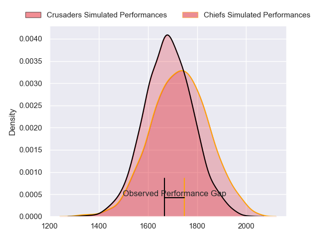
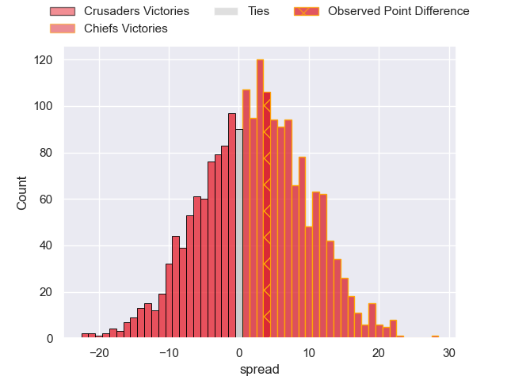
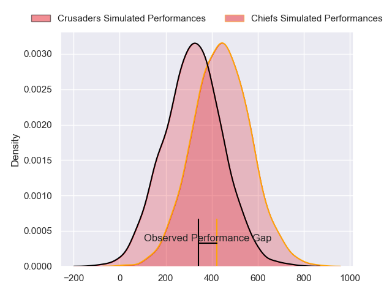
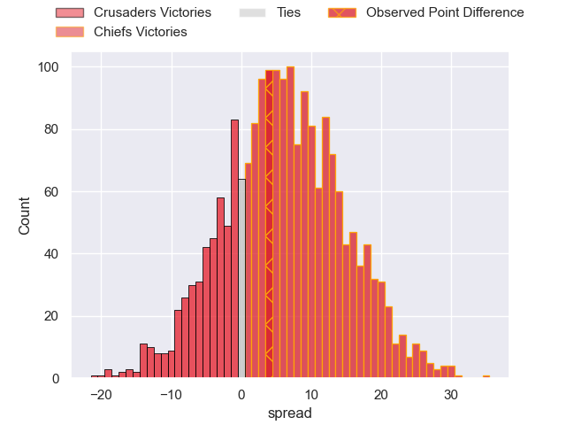

---  
layout: page  
title: Crusaders at Chiefs; 29-33  
date: 2024-02-23 18:00:00 -0500  
categories: "Super Rugby Pacific 2024" match review  
---
# Crusaders at Chiefs; 29-33

# Club Level Predictions

The first set of predictions treats a club as the smallest object, as the club develops its members, organizes a gameplan, and deploys its players as needed for each match. This club model has a prediction of 0.568, which translates to predicting Chiefs to win by 2.5.

Our Over/Under is 53.5 - and combined with the spread above, we have a predicted scoreline of 25 to 28

Each club has a rating and a rating deviation (similar to a Glicko rating), and expected performances can be generated. This allows for simulated matches and spreads like the ones below.
## Projected Performances - Club Model

## Projected Spreads - Club Model

## Projected Results - Club Model

# Player Level Predictions - Version 2

Treating teams instead as an entity made up of the currently active players, I have ratings for each player in an altogether different system. These can be combined to form team ratings once teamsheets are announced, weighting starters a bit higher than the reserves. After the match is played, players can be weighted by their minutes on the field, allowing for an accurate measure of the team's composition. With these compiled team ratings, we can make predictions, measure inaccuracy, and update the individual player ratings.
## Prediction without Player Minutes: Chiefs by 7.2

Chiefs by 2.7 on a neutral pitch

## Projected Performances - Player Model

## Projected Spreads - Player Model

## Projected Results - Player Model

|   Away Minutes | Away Player          |   Away Percentile |   Number |   Home Percentile | Home Player          |   Home Minutes |
|---------------:|:---------------------|------------------:|---------:|------------------:|:---------------------|---------------:|
|             78 | George Bower         |             22.81 |        1 |             98.03 | Aidan Ross           |             49 |
|             80 | George Bell          |             49.45 |        2 |             72.24 | Bradley Slater       |             51 |
|             10 | Tamaiti Williams     |             82.83 |        3 |             18.16 | Reuben O'Neill       |             55 |
|             80 | Scott Barrett        |             97.24 |        4 |             94.72 | Naitoa Ah Kuoi       |             67 |
|             49 | Quinten Strange      |             90.13 |        5 |             82.2  | Tupou Vaa'i          |             80 |
|             53 | Dom Gardiner         |             75.82 |        6 |             90.46 | Samipeni Finau       |             80 |
|             80 | Tom Christie         |             86.74 |        7 |             27.04 | Kaylum Boshier       |             76 |
|             80 | Cullen Grace         |             81.12 |        8 |             86.48 | Luke Jacobson        |             80 |
|             53 | Mitchell Drummond    |             93.31 |        9 |             44.29 | Xavier Roe           |             67 |
|             53 | Rivez Reihana        |             33.57 |       10 |             96.67 | Damian McKenzie      |             43 |
|             80 | Macca Springer       |             63.45 |       11 |             16.95 | Etene Nanai-Seturo   |             80 |
|             80 | Dallas McLeod        |             58.84 |       12 |             39.42 | Quinn Tupaea         |             72 |
|             61 | Levi Aumua           |             82.56 |       13 |             86.16 | Anton Lienert-Brown  |             75 |
|             80 | Sevu Reece           |             91.42 |       14 |             81.78 | Liam Coombes-Fabling |             80 |
|             80 | Chay Fihaki          |             46.42 |       15 |             89.61 | Shaun Stevenson      |             80 |
|              0 | Quentin MacDonald    |             95.77 |       16 |             92.28 | Samisoni Taukei'aho  |             29 |
|             18 | Joe Moody            |             78.26 |       17 |             62.79 | Ollie Norris         |             31 |
|             54 | Owen Franks          |             80.41 |       18 |             82.38 | George Dyer          |             25 |
|             31 | Jamie Hannah         |            nan    |       19 |            nan    | Jimmy Tupou          |             13 |
|             27 | Christian Lio-Willie |             39.86 |       20 |             44.76 | Simon Parker         |              4 |
|             27 | Noah Hotham          |             71.26 |       21 |             71.46 | Cortez Ratima        |             18 |
|             27 | Taha Kemara          |             29.05 |       22 |             56.19 | Josh Ioane           |             37 |
|             19 | Ryan Crotty          |            nan    |       23 |             73.49 | Daniel Rona          |              8 |

