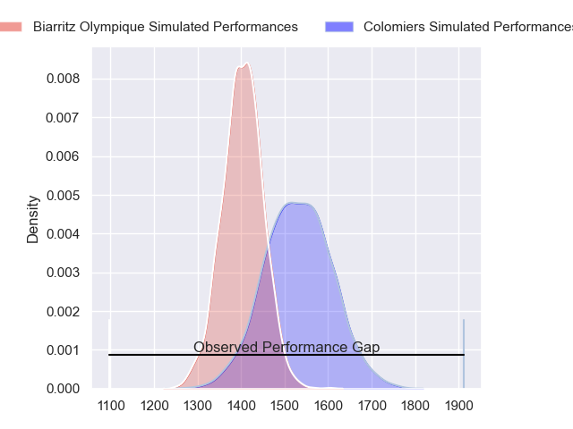
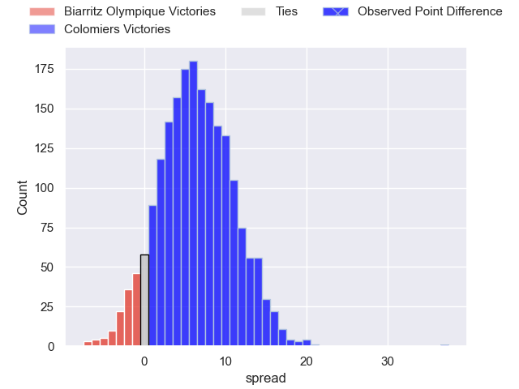
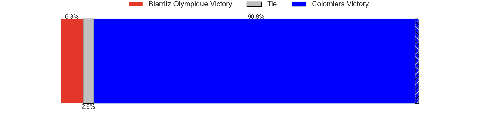
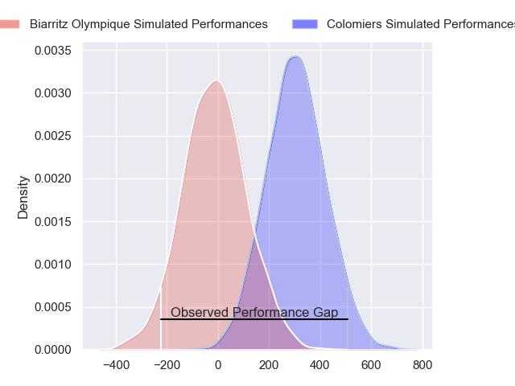
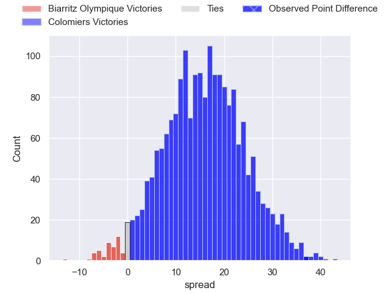
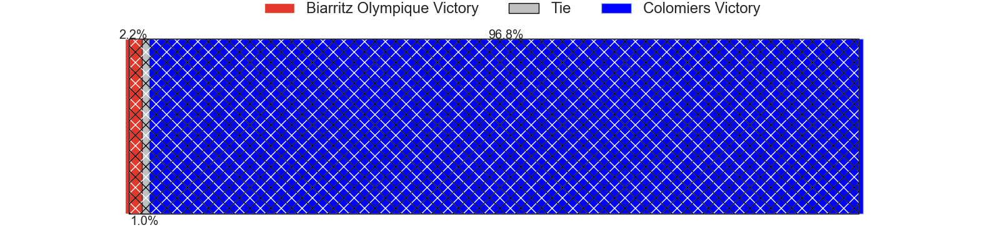

---  
layout: page  
title: Biarritz Olympique at Colomiers; 14-51  
date: 2024-02-23 18:00:00 -0500  
categories: "Pro D2 2023" match review  
---
# Biarritz Olympique at Colomiers; 14-51

# Club Level Predictions

The first set of predictions treats a club as the smallest object, as the club develops its members, organizes a gameplan, and deploys its players as needed for each match. This club model has a prediction of 0.676, which translates to predicting Colomiers to win by 6.4.

Our Over/Under is 44.5 - and combined with the spread above, we have a predicted scoreline of 19 to 25

Each club has a rating and a rating deviation (similar to a Glicko rating), and expected performances can be generated. This allows for simulated matches and spreads like the ones below.
## Projected Performances - Club Model

## Projected Spreads - Club Model

## Projected Results - Club Model

# Player Level Predictions - Version 2

Treating teams instead as an entity made up of the currently active players, I have ratings for each player in an altogether different system. These can be combined to form team ratings once teamsheets are announced, weighting starters a bit higher than the reserves. After the match is played, players can be weighted by their minutes on the field, allowing for an accurate measure of the team's composition. With these compiled team ratings, we can make predictions, measure inaccuracy, and update the individual player ratings.
## Prediction without Player Minutes: Colomiers by 14.8

Colomiers by 7.0 on a neutral pitch

## Projected Performances - Player Model

## Projected Spreads - Player Model

## Projected Results - Player Model

|   Away Minutes | Away Player              |   Away Percentile |   Number |   Home Percentile | Home Player        |   Home Minutes |
|---------------:|:-------------------------|------------------:|---------:|------------------:|:-------------------|---------------:|
|             59 | Kevin Tougne             |             20.6  |        1 |             76.86 | Hugo Djehi         |             50 |
|             41 | Bastien Soury            |             69.06 |        2 |             30.38 | Thomas Larrieu     |             54 |
|             41 | Lasha Tabidze            |             62.52 |        3 |             67.7  | Hugo Pirlet        |             50 |
|             80 | Adrian Motoc             |              2.94 |        4 |             81.18 | Maxime Granouillet |             69 |
|             47 | Pieter Jansen van Vuuren |             38.82 |        5 |             58    | Janse Roux         |             40 |
|             61 | Nafi Ma'afu              |             60.71 |        6 |             44.28 | Anthony Coletta    |             80 |
|             80 | Tornike Jalagonia        |             21.49 |        7 |             92.33 | Aldric Lescure     |             54 |
|             80 | Temo Matiu               |             32.63 |        8 |             44.38 | Jeremy Bechu       |             80 |
|             47 | Imanol Biscay            |             47.11 |        9 |             64.07 | Ugo Seguela        |             61 |
|             80 | Chris Hilsenbeck         |              2.42 |       10 |              1.45 | Brett Herron       |             80 |
|             80 | Baptiste Fariscot        |             57.66 |       11 |             97.11 | Rodrigo Marta      |             80 |
|             41 | Yann David               |             81.27 |       12 |             51.47 | Paul Pimienta      |             60 |
|             80 | Vincent Martin           |             14.84 |       13 |             16.61 | Martin Dulon       |             80 |
|             80 | Steeve Barry             |             27.55 |       14 |             86.71 | Vincent Pinto      |             80 |
|             80 | Gervais Cordin           |             46.09 |       15 |             50.96 | Thomas Girard      |             80 |
|             39 | Luteru Tolai             |             34.91 |       16 |             59.06 | Jean Thomas        |             40 |
|             39 | Francois Vergnaud        |              6.01 |       17 |             75.86 | Guillaume Tartas   |             30 |
|             39 | Alfie Petch              |              5.35 |       18 |             85.03 | Michael Simutoga   |             30 |
|             33 | Tiaan Jacobs             |             49.65 |       19 |             27.36 | Andrew Ready       |             26 |
|             33 | Pierre Pages             |             22.95 |       20 |             71.13 | Romain Bezian      |             26 |
|             21 | Zakaria El Fakir         |             24.41 |       21 |             66.31 | Dorian Laborde     |             20 |
|             19 | Ekain Imaz Agirre        |             23    |       22 |             60.48 | Mathis Galthié     |             19 |
|            nan | nan                      |            nan    |       23 |             47.88 | Louis Descoux      |             11 |

