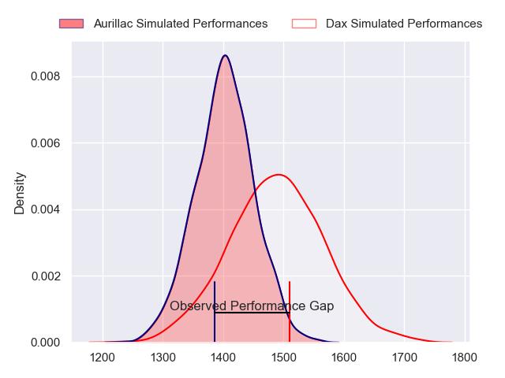
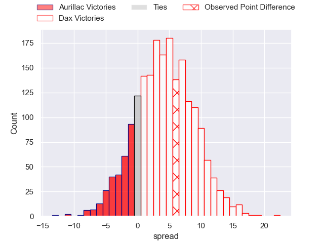
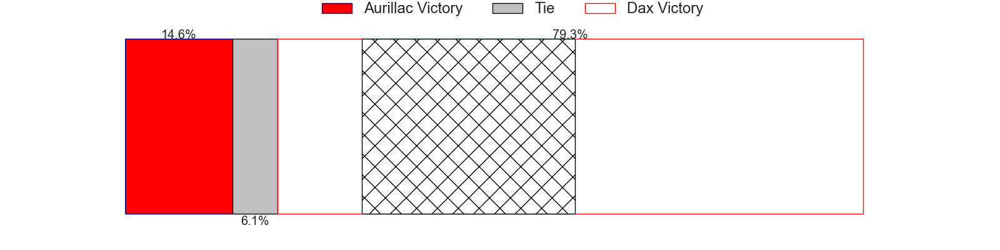
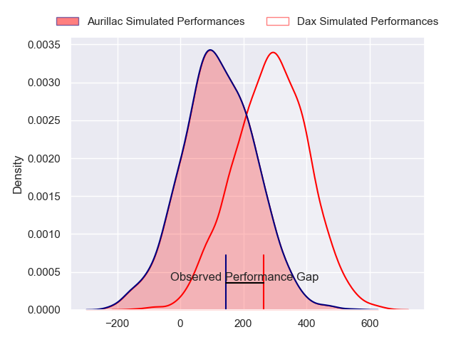
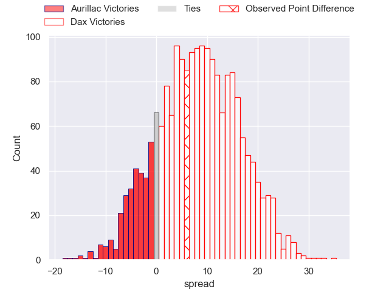
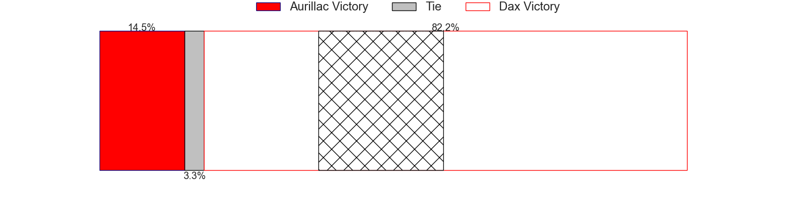

---  
layout: page  
title: Aurillac at Dax; 13-19  
date: 2024-02-23 18:00:00 -0500  
categories: "Pro D2 2023" match review  
---
# Aurillac at Dax; 13-19

# Club Level Predictions

The first set of predictions treats a club as the smallest object, as the club develops its members, organizes a gameplan, and deploys its players as needed for each match. This club model has a prediction of 0.623, which translates to predicting Dax to win by 4.4.

Our Over/Under is 43.5 - and combined with the spread above, we have a predicted scoreline of 19 to 24

Each club has a rating and a rating deviation (similar to a Glicko rating), and expected performances can be generated. This allows for simulated matches and spreads like the ones below.
## Projected Performances - Club Model

## Projected Spreads - Club Model

## Projected Results - Club Model

# Player Level Predictions - Version 2

Treating teams instead as an entity made up of the currently active players, I have ratings for each player in an altogether different system. These can be combined to form team ratings once teamsheets are announced, weighting starters a bit higher than the reserves. After the match is played, players can be weighted by their minutes on the field, allowing for an accurate measure of the team's composition. With these compiled team ratings, we can make predictions, measure inaccuracy, and update the individual player ratings.
## Prediction without Player Minutes: Dax by 9.5

Dax by 2.2 on a neutral pitch

## Projected Performances - Player Model

## Projected Spreads - Player Model

## Projected Results - Player Model

|   Away Minutes | Away Player         |   Away Percentile |   Number |   Home Percentile | Home Player          |   Home Minutes |
|---------------:|:--------------------|------------------:|---------:|------------------:|:---------------------|---------------:|
|             41 | Robert Rodgers      |             12.81 |        1 |             71.42 | Louis Mary           |             53 |
|             69 | Luka Nioradze       |             17.53 |        2 |             69.93 | Iban Hiriart-Urruty  |             53 |
|             41 | Tim Daniel-Meissen  |             28.67 |        3 |             10.48 | Diogo Hasse Ferreira |             53 |
|             50 | Eoghan Masterson    |             82.49 |        4 |             49.88 | Josh Furno           |             80 |
|             80 | Cam Dodson          |             80.18 |        5 |              7.95 | Jean-Baptiste Singer |             65 |
|             58 | Heath Backhouse     |             82.12 |        6 |             63.17 | Arnaud Aletti        |             80 |
|             55 | Didier Tison        |             47.94 |        7 |             75.13 | Paul Arnaud Ausset   |             28 |
|             80 | Beka Shvangiradze   |             57.58 |        8 |             86.95 | Genesis Mamea Lemalu |             80 |
|             41 | David Delarue       |             27.11 |        9 |             72.69 | Sylvère Reteau       |             67 |
|             80 | Antoine Aucagne     |             40.86 |       10 |             54.87 | Romuald Séguy        |             67 |
|             80 | AJ Coertzen         |             74.29 |       11 |             62.86 | Guillaume Bouche     |             67 |
|             80 | Ofa Manuofetoa      |             72.53 |       12 |             80.79 | Alex McHenry         |             80 |
|             61 | Hugo Bastard        |             50.06 |       13 |             15.37 | Benjamin Puntous     |             80 |
|             80 | Juun Pieters        |             67.72 |       14 |             88.04 | Hugo Fourquet        |             80 |
|             80 | Marc Palmier        |             19.08 |       15 |              9.2  | Maxime Oltmann       |             80 |
|             39 | Irakli Mtchedlidze  |             53.41 |       16 |             27.09 | Ratu Nacika          |             52 |
|             39 | Mikheil Alania      |             37.52 |       17 |             48.57 | Asa Faitotoa         |             27 |
|             39 | Thomas Cretu        |             39.25 |       18 |             16.05 | Louis Barrere        |             27 |
|             30 | Martial Rolland     |             54.38 |       19 |             22.67 | David Lolohea        |             27 |
|             25 | Hugo Huurman        |             72.91 |       20 |             67.86 | Étienne Loiret       |             15 |
|             19 | Christa Powell      |             12.81 |       21 |             63.42 | Hugo Cerisier        |             13 |
|             22 | Aleksandre Burduli  |            nan    |       22 |             78.39 | Paul Ravier          |             13 |
|             11 | Jean-Jacques Gymael |             12.9  |       23 |             56.32 | Théo Duprat          |             13 |

