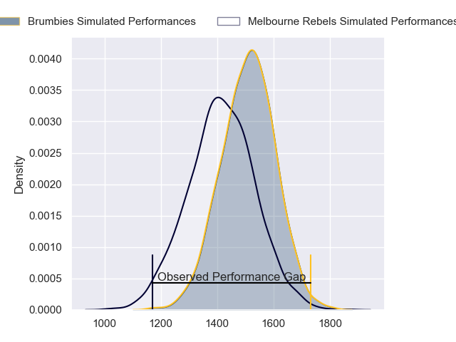
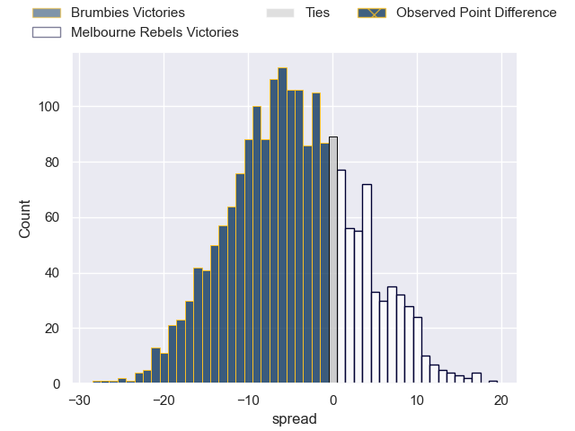
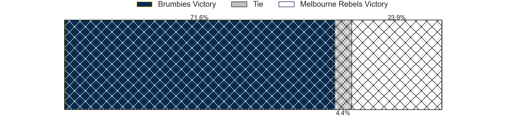
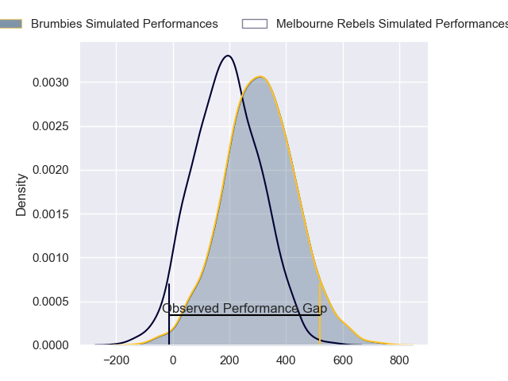
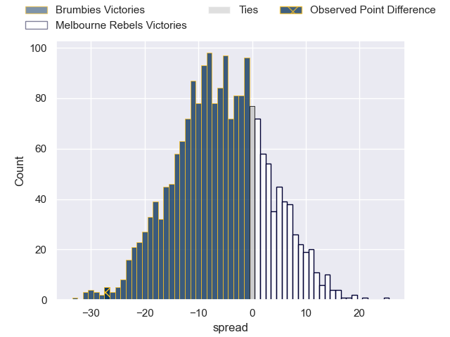
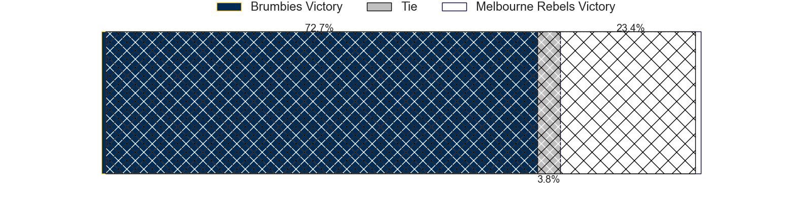

---  
layout: page  
title: Brumbies at Melbourne Rebels; 30-3  
date: 2024-02-23 18:00:00 -0500  
categories: "Super Rugby Pacific 2024" match review  
---
# Brumbies at Melbourne Rebels; 30-3

# Club Level Predictions

The first set of predictions treats a club as the smallest object, as the club develops its members, organizes a gameplan, and deploys its players as needed for each match. This club model has a prediction of 0.364, which translates to predicting Brumbies to win by 5.1.

Our Over/Under is 48.5 - and combined with the spread above, we have a predicted scoreline of 27 to 22

Each club has a rating and a rating deviation (similar to a Glicko rating), and expected performances can be generated. This allows for simulated matches and spreads like the ones below.
## Projected Performances - Club Model

## Projected Spreads - Club Model

## Projected Results - Club Model

# Player Level Predictions - Version 2

Treating teams instead as an entity made up of the currently active players, I have ratings for each player in an altogether different system. These can be combined to form team ratings once teamsheets are announced, weighting starters a bit higher than the reserves. After the match is played, players can be weighted by their minutes on the field, allowing for an accurate measure of the team's composition. With these compiled team ratings, we can make predictions, measure inaccuracy, and update the individual player ratings.
## Prediction without Player Minutes: Brumbies by 5.7

Brumbies by 9.3 on a neutral pitch

## Projected Performances - Player Model

## Projected Spreads - Player Model

## Projected Results - Player Model

|   Away Minutes | Away Player      |   Away Percentile |   Number |   Home Percentile | Home Player          |   Home Minutes |
|---------------:|:-----------------|------------------:|---------:|------------------:|:---------------------|---------------:|
|             57 | James Slipper    |             93.38 |        1 |             65.65 | Matt Gibbon          |             45 |
|             52 | Lachlan Lonergan |             13.05 |        2 |             26.84 | Jordan Uelese        |             45 |
|             50 | Rhys Van Nek     |             64.22 |        3 |             17.71 | Sam Talakai          |             45 |
|             80 | Nick Frost       |             59.82 |        4 |             29.85 | Josh Canham          |             45 |
|             80 | Tom Hooper       |             72.79 |        5 |              4.48 | Lukhan Salakaia-Loto |             80 |
|             69 | Rob Valetini     |             97.77 |        6 |             10.71 | Josh Kemeny          |             80 |
|             52 | Luke Reimer      |             66.81 |        7 |             31.6  | Brad Wilkin          |             56 |
|             72 | Charlie Cale     |             43.12 |        8 |             14.69 | Rob Leota            |             80 |
|             72 | Ryan Lonergan    |             80.51 |        9 |             40.55 | Jack Maunder         |             50 |
|             75 | Noah Lolesio     |             82.38 |       10 |             34.29 | Carter Gordon        |             80 |
|             80 | Corey Toole      |             44.6  |       11 |             21.93 | Glen Vaihu           |             80 |
|             80 | Ollie Sapsford   |             85.35 |       12 |             31.51 | David Feliuai        |             73 |
|             64 | Len Ikitau       |             85.58 |       13 |             80.12 | Filipo Daugunu       |             80 |
|             80 | Andy Muirhead    |             95.23 |       14 |             22.25 | Lachie Anderson      |             61 |
|             80 | Tom Wright       |             67.44 |       15 |             72.52 | Andrew Kellaway      |             80 |
|             28 | Billy Pollard    |             52.94 |       16 |             47.98 | Alex Mafi            |             35 |
|             23 | Blake Schoupp    |             40.88 |       17 |            nan    | Isaac Aedo Kailea    |             35 |
|             30 | Sefo Kautai      |             27.37 |       18 |             97.58 | Taniela Tupou        |             35 |
|             28 | Cadeyrn Neville  |             98.28 |       19 |             63.15 | Tuaina Taii Tualima  |             35 |
|             19 | Jahrome Brown    |             85.79 |       20 |             27.97 | Vaiolini Ekuasi      |             24 |
|              8 | Klayton Thorn    |            nan    |       21 |            nan    | James Tuttle         |             30 |
|              5 | Declan Meredith  |            nan    |       22 |             15.95 | Jake Strachan        |             19 |
|             16 | Tamati Tua       |             45.58 |       23 |             57.91 | Nick Jooste          |              7 |

