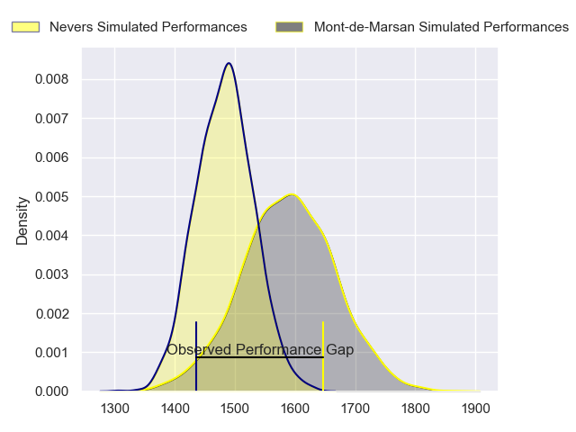
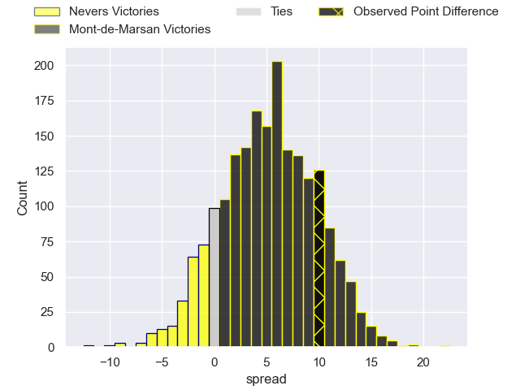
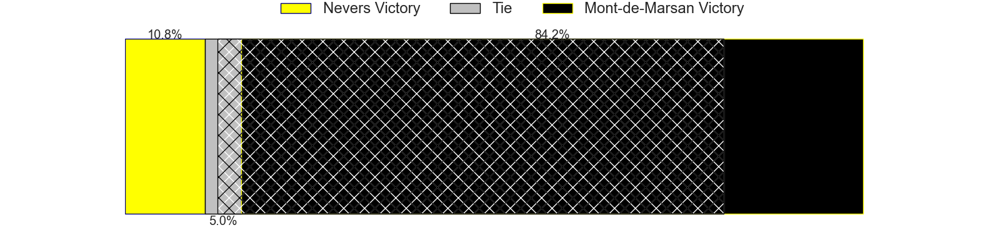
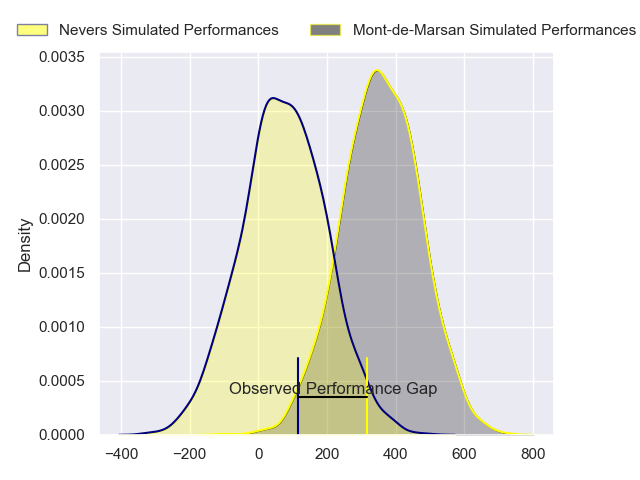
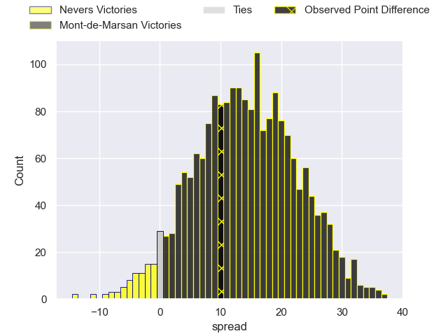
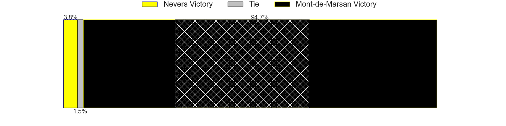

---  
layout: page  
title: Nevers at Mont-de-Marsan; 17-27  
date: 2024-02-23 18:00:00 -0500  
categories: "Pro D2 2023" match review  
---
# Nevers at Mont-de-Marsan; 17-27

# Club Level Predictions

The first set of predictions treats a club as the smallest object, as the club develops its members, organizes a gameplan, and deploys its players as needed for each match. This club model has a prediction of 0.644, which translates to predicting Mont-de-Marsan to win by 5.2.

Our Over/Under is 49.5 - and combined with the spread above, we have a predicted scoreline of 22 to 27

Each club has a rating and a rating deviation (similar to a Glicko rating), and expected performances can be generated. This allows for simulated matches and spreads like the ones below.
## Projected Performances - Club Model

## Projected Spreads - Club Model

## Projected Results - Club Model

# Player Level Predictions - Version 2

Treating teams instead as an entity made up of the currently active players, I have ratings for each player in an altogether different system. These can be combined to form team ratings once teamsheets are announced, weighting starters a bit higher than the reserves. After the match is played, players can be weighted by their minutes on the field, allowing for an accurate measure of the team's composition. With these compiled team ratings, we can make predictions, measure inaccuracy, and update the individual player ratings.
## Prediction without Player Minutes: Mont-de-Marsan by 13.8

Mont-de-Marsan by 6.0 on a neutral pitch

## Projected Performances - Player Model

## Projected Spreads - Player Model

## Projected Results - Player Model

|   Away Minutes | Away Player              |   Away Percentile |   Number |   Home Percentile | Home Player               |   Home Minutes |
|---------------:|:-------------------------|------------------:|---------:|------------------:|:--------------------------|---------------:|
|             52 | Jordan Seneca            |             36.03 |        1 |             58.26 | Dino Casadei              |             56 |
|             59 | Jonathan Maiau           |             15.47 |        2 |             57.74 | Florian Dufour            |             59 |
|             48 | Cleopas Kundiona         |             40.83 |        3 |             64.07 | Mattéo Lalanne            |             63 |
|             80 | Christiaan van der Merwe |              8.35 |        4 |             76.46 | Nicolas Garrault          |             80 |
|             56 | Chris Gabriel            |             56.35 |        5 |             28.71 | Myles Edwards             |             19 |
|             53 | Luka Plataret            |             79.81 |        6 |             64.15 | Aurélien Lisena           |             80 |
|             80 | Julien Kazubek           |             84.88 |        7 |             74.41 | Veresa Tuqovu Ramototabua |             80 |
|             53 | Steven David             |             62.21 |        8 |             39.67 | Mike Faleafa              |             48 |
|             80 | Hugo Bouyssou            |             12.18 |        9 |             54.29 | Christophe Loustalot      |             34 |
|             56 | Shaun Reynolds           |             39.37 |       10 |             91.06 | Willie du Plessis         |             80 |
|             80 | Johan Georg Wasserman    |             47.59 |       11 |             76.63 | Pierre Sayerse            |             80 |
|             80 | Rudy Derrieux            |             87.51 |       12 |             79.86 | Jules Even                |             66 |
|             75 | Arthur Mathiron          |             52.73 |       13 |             91.28 | Nacani Wakaya             |             80 |
|             80 | Christian Ambadiang      |             62.59 |       14 |             80.49 | Eroni Sau                 |             80 |
|             80 | Dylan Jaminet            |             67.94 |       15 |             55.26 | Théo Cortes               |             80 |
|             32 | Aselo Ikahehegi          |            nan    |       16 |             79.29 | Romain Durand             |             61 |
|             28 | Tornike Mataradze        |             57.17 |       17 |             66.67 | Raphaël Robic             |             32 |
|             27 | Kevin Noah               |             35.06 |       18 |             54.49 | Kevin Viallard            |             46 |
|             24 | Lado Chachanidze         |             48.35 |       19 |             16.15 | Jean-Luc Innocente        |             24 |
|             24 | Yohan Le Bourhis         |             72.95 |       20 |             70.69 | Mathis Bats               |             17 |
|             27 | Hugues Bastide           |             89.85 |       21 |             58.49 | Samuel Lagrange           |             21 |
|             21 | Quentin Beaudaux         |             42.45 |       22 |             19.08 | Simon Desaubies           |             14 |
|              5 | Arthurs Barbier          |             74.65 |       23 |            nan    | nan                       |            nan |

