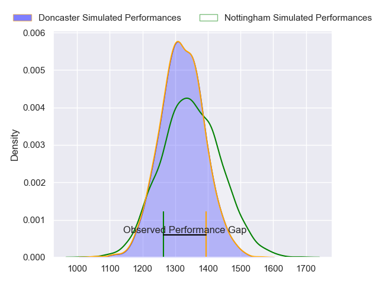
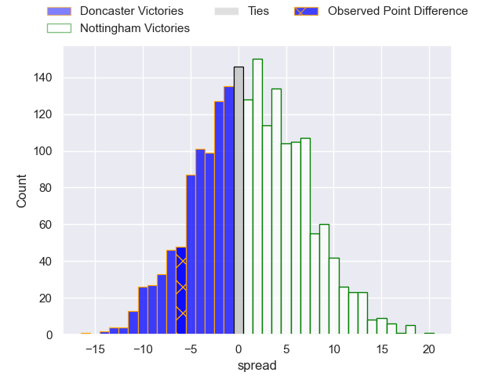
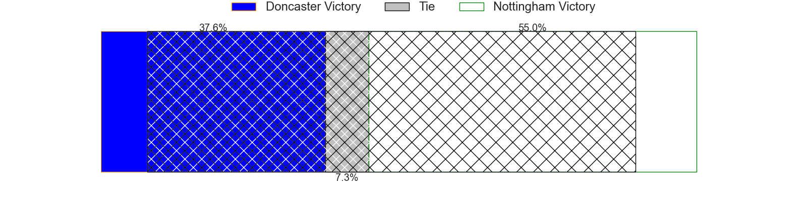
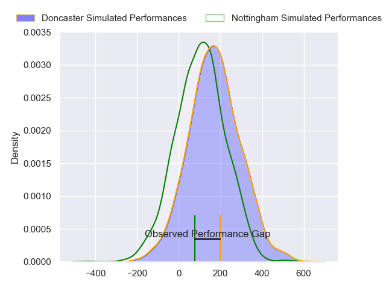
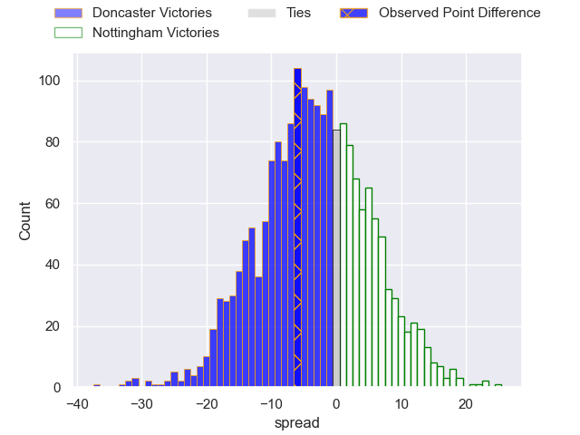

---  
layout: page  
title: Doncaster at Nottingham; 20-14  
date: 2024-02-23 18:00:00 -0500  
categories: "RFU Championship 2023" match review  
---
# Doncaster at Nottingham; 20-14

# Club Level Predictions

The first set of predictions treats a club as the smallest object, as the club develops its members, organizes a gameplan, and deploys its players as needed for each match. This club model has a prediction of 0.541, which translates to predicting Nottingham to win by 1.5.

Our Over/Under is 49.5 - and combined with the spread above, we have a predicted scoreline of 24 to 25

Each club has a rating and a rating deviation (similar to a Glicko rating), and expected performances can be generated. This allows for simulated matches and spreads like the ones below.
## Projected Performances - Club Model

## Projected Spreads - Club Model

## Projected Results - Club Model

# Player Level Predictions - Version 2

Treating teams instead as an entity made up of the currently active players, I have ratings for each player in an altogether different system. These can be combined to form team ratings once teamsheets are announced, weighting starters a bit higher than the reserves. After the match is played, players can be weighted by their minutes on the field, allowing for an accurate measure of the team's composition. With these compiled team ratings, we can make predictions, measure inaccuracy, and update the individual player ratings.
## Prediction without Player Minutes: Doncaster by 3.9

Doncaster by 7.3 on a neutral pitch

## Projected Performances - Player Model

## Projected Spreads - Player Model

## Projected Results - Player Model

|   Away Minutes | Away Player              |   Away Percentile |   Number |   Home Percentile | Home Player               |   Home Minutes |
|---------------:|:-------------------------|------------------:|---------:|------------------:|:--------------------------|---------------:|
|             71 | Conor Davidson           |             73.17 |        1 |             63.33 | Archie Van der Flier      |             48 |
|             52 | George Roberts           |             37.68 |        2 |             72.98 | Antonio TJ Harris         |             48 |
|             54 | Corrie Barrett           |             33.36 |        3 |             43.65 | Beltus Nonleh             |             48 |
|             52 | Evan Mintern             |             85.99 |        4 |              2.99 | Sebastien Ferreira        |             48 |
|             80 | Harry Wilson             |             24.45 |        5 |             48.91 | Come Clayver Joussain     |             80 |
|             80 | Fyn Brown                |             30.97 |        6 |             62.04 | Kayde Sylvester           |             80 |
|             61 | Rhys Tait                |             50.37 |        7 |             69.99 | Nathan Tweedy             |             61 |
|             65 | Jack Digby               |             60.61 |        8 |             57.11 | Richard Clift             |             58 |
|             80 | Alex Dolly               |             83.07 |        9 |             23.23 | Micheal Stronge           |             64 |
|             80 | Billy McBryde            |             85    |       10 |             52.14 | Matthew Arden             |             80 |
|             80 | Westleigh Alleyne Holden |             59.75 |       11 |             59.85 | Harry Graham              |             80 |
|             80 | Sam Bedlow               |             78.02 |       12 |             14.88 | Javiah Pohe               |             61 |
|             58 | Connor Edwards           |             11.51 |       13 |              2.79 | Jack Stapley              |             80 |
|             80 | Jack Metcalf             |             19.07 |       14 |             29.45 | David Williams            |             80 |
|             80 | Russell Bennett          |             88.91 |       15 |             42.03 | Jordan Olowofela          |             80 |
|             28 | Tom Doughty              |             17.65 |       16 |             67.53 | Xavier Valentine          |             32 |
|             28 | Ben Murphy               |             62.67 |       17 |             50.52 | Thomas Manz               |             32 |
|             26 | Lewis Thiede             |             98.21 |       18 |             49.64 | Kai Owen                  |             32 |
|             22 | George Simpson           |             28.92 |       19 |             81.07 | Harry Clayton             |             32 |
|             19 | Archie Smeaton           |             55.46 |       20 |             47.4  | Sam Green                 |             22 |
|             15 | Charlie Beckett          |             70.38 |       21 |             54.19 | Iosefa Danny Wayne Fiaola |             19 |
|              9 | Harrison Courtney        |             68.69 |       22 |             53.84 | Joe Woodward              |             19 |
|            nan | nan                      |            nan    |       23 |             27.56 | Will Yarnell              |             16 |

