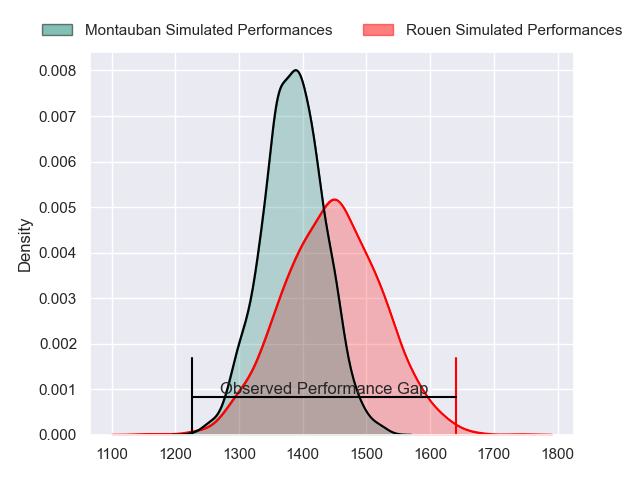
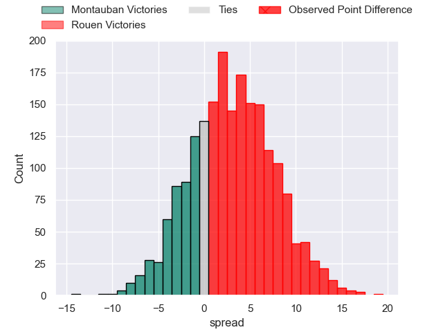
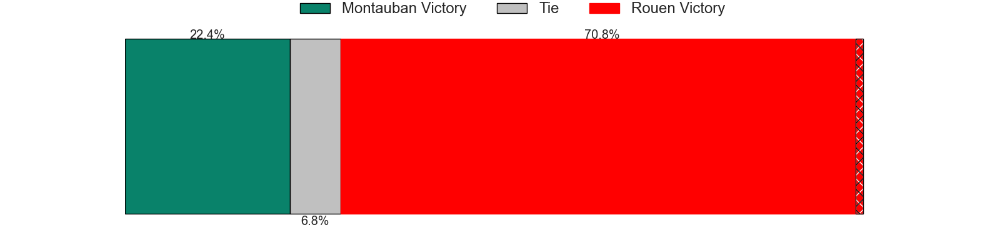
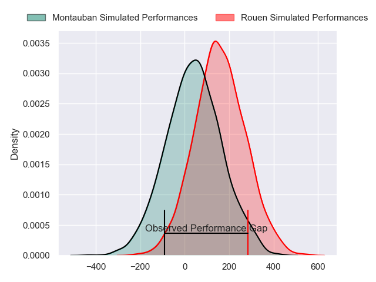
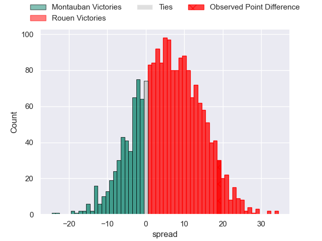
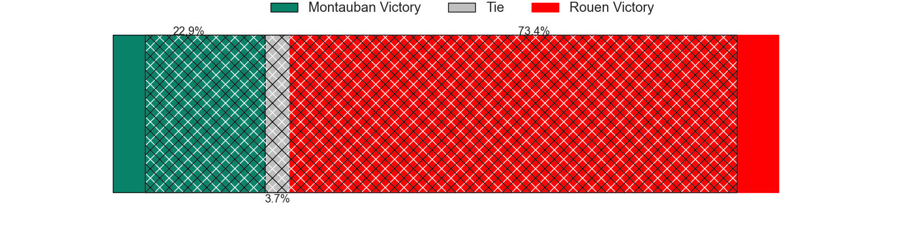

---  
layout: page  
title: Montauban at Rouen; 10-29  
date: 2024-02-23 18:00:00 -0500  
categories: "Pro D2 2023" match review  
---
# Montauban at Rouen; 10-29

# Club Level Predictions

The first set of predictions treats a club as the smallest object, as the club develops its members, organizes a gameplan, and deploys its players as needed for each match. This club model has a prediction of 0.58, which translates to predicting Rouen to win by 2.8.

Our Over/Under is 43.5 - and combined with the spread above, we have a predicted scoreline of 20 to 23

Each club has a rating and a rating deviation (similar to a Glicko rating), and expected performances can be generated. This allows for simulated matches and spreads like the ones below.
## Projected Performances - Club Model

## Projected Spreads - Club Model

## Projected Results - Club Model

# Player Level Predictions - Version 2

Treating teams instead as an entity made up of the currently active players, I have ratings for each player in an altogether different system. These can be combined to form team ratings once teamsheets are announced, weighting starters a bit higher than the reserves. After the match is played, players can be weighted by their minutes on the field, allowing for an accurate measure of the team's composition. With these compiled team ratings, we can make predictions, measure inaccuracy, and update the individual player ratings.
## Prediction without Player Minutes: Rouen by 6.8

Rouen by 3.7 on a neutral pitch

## Projected Performances - Player Model

## Projected Spreads - Player Model

## Projected Results - Player Model

|   Away Minutes | Away Player             |   Away Percentile |   Number |   Home Percentile | Home Player        |   Home Minutes |
|---------------:|:------------------------|------------------:|---------:|------------------:|:-------------------|---------------:|
|             51 | Malino Vanai            |              0.99 |        1 |             62.99 | Antoine Fournier   |             51 |
|             56 | Badri Alkhazashvili     |             16.61 |        2 |             39.3  | Efi Ma'afu         |             71 |
|             51 | Tietie Tuimauga         |             55.56 |        3 |             64.16 | Soso Bekoshvili    |             56 |
|             80 | Tjuee Uanivi            |              6.91 |        4 |             19.59 | John-Charles Astle |             56 |
|             59 | Lewis Bean              |             27.53 |        5 |             22    | Will Witty         |             80 |
|             59 | Karl Wilkins            |             14.07 |        6 |             78.84 | Tienie Burger      |             80 |
|             80 | Taumua Lui Sanft Naeata |             12.7  |        7 |             20.53 | Samuel Maximin     |             80 |
|             52 | Frédéric Quercy         |              4.2  |        8 |             30.3  | Abdelkarim Fofana  |             51 |
|             72 | Shaun Venter            |              4.91 |        9 |             44.99 | Florent Campeggia  |             64 |
|             80 | Jérôme Bosviel          |             81.47 |       10 |             79.1  | Franck Pourteau    |             80 |
|             80 | Yvan Reilhac            |             47.09 |       11 |             82.01 | Benito Masilevu    |             58 |
|             80 | Maxime Mathy            |             12.69 |       12 |             20.49 | JT Jackson         |             80 |
|             80 | Simon Renda             |             61.82 |       13 |             59.84 | Pablo Patilla      |             80 |
|             80 | Semesa Rokoduguni       |             88.68 |       14 |             89.31 | Kevin Bly          |             80 |
|             59 | Simeon Soenen           |             32.87 |       15 |             68.28 | Baptiste Mouchous  |             62 |
|             29 | Thomas Bue              |             34.5  |       16 |             10.57 | Elias El Ansari    |             29 |
|             29 | Mirian Burduli          |              6.45 |       17 |             82.33 | Julien Ruaud       |             29 |
|             28 | Otar Giorgadze          |             64.66 |       18 |             18.28 | Cody Thomas        |             24 |
|             24 | Ru-Hann Greyling        |             23.25 |       19 |             65.78 | Toby Salmon        |             24 |
|             21 | Raphael Sanchez         |              9.42 |       20 |              8.73 | Alex Luatua        |             22 |
|             21 | Quentin Witt            |             25.08 |       21 |             86.44 | Pete Lydon         |             18 |
|             21 | Kevin Gimeno            |              6.45 |       22 |             74.46 | Maxime Sidobre     |             16 |
|              8 | Alexis Bernadet         |             65.82 |       23 |             19.74 | Lucas Malbert      |              9 |

