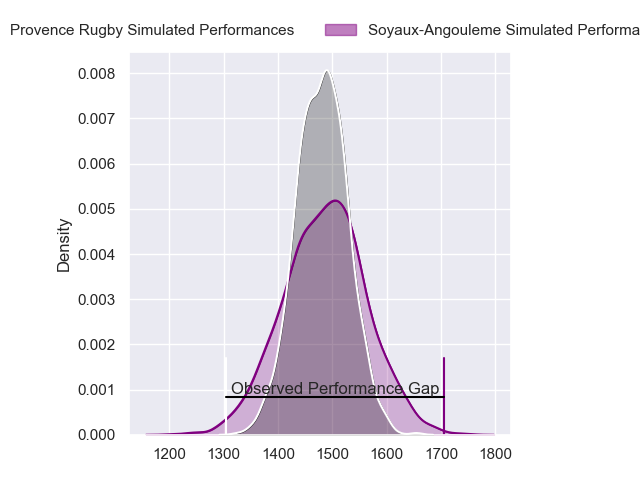
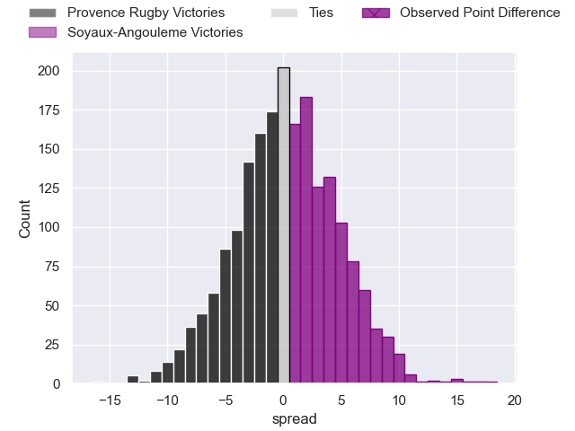
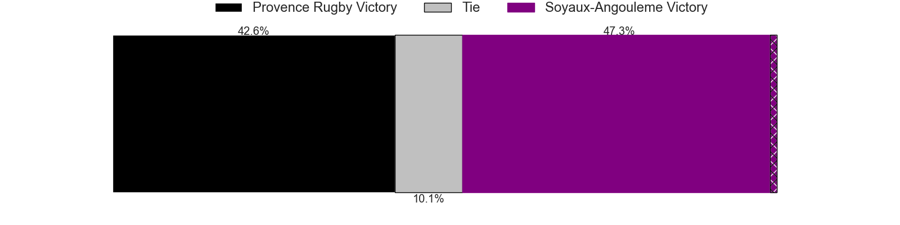
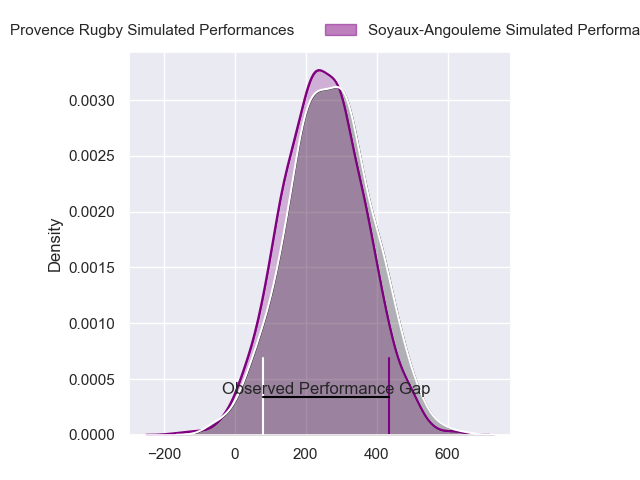
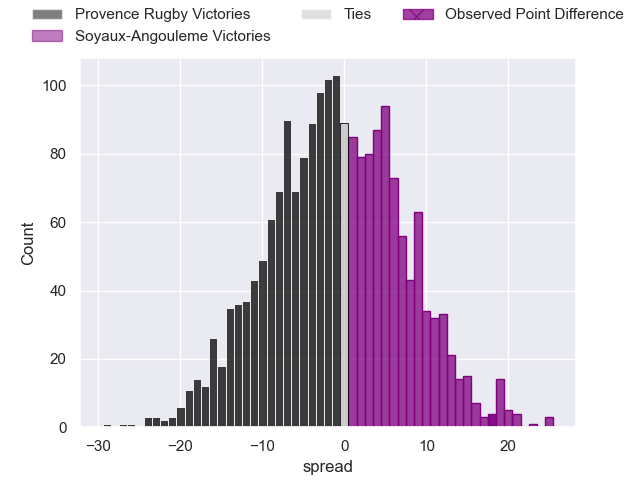
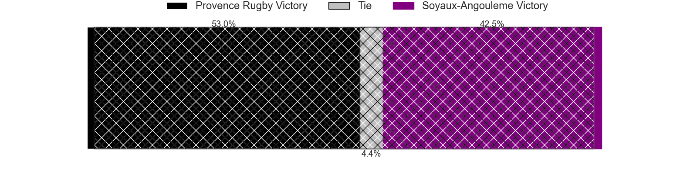

---  
layout: page  
title: Provence Rugby at Soyaux-Angouleme; 15-33  
date: 2024-02-23 18:00:00 -0500  
categories: "Pro D2 2023" match review  
---
# Provence Rugby at Soyaux-Angouleme; 15-33

# Club Level Predictions

The first set of predictions treats a club as the smallest object, as the club develops its members, organizes a gameplan, and deploys its players as needed for each match. This club model has a prediction of 0.506, which translates to predicting Soyaux-Angouleme to win by 0.2.

Our Over/Under is 36.5 - and combined with the spread above, we have a predicted scoreline of 18 to 18

Each club has a rating and a rating deviation (similar to a Glicko rating), and expected performances can be generated. This allows for simulated matches and spreads like the ones below.
## Projected Performances - Club Model

## Projected Spreads - Club Model

## Projected Results - Club Model

# Player Level Predictions - Version 2

Treating teams instead as an entity made up of the currently active players, I have ratings for each player in an altogether different system. These can be combined to form team ratings once teamsheets are announced, weighting starters a bit higher than the reserves. After the match is played, players can be weighted by their minutes on the field, allowing for an accurate measure of the team's composition. With these compiled team ratings, we can make predictions, measure inaccuracy, and update the individual player ratings.
## Prediction without Player Minutes: Provence Rugby by 2.5

Provence Rugby by 6.5 on a neutral pitch

## Projected Performances - Player Model

## Projected Spreads - Player Model

## Projected Results - Player Model

|   Away Minutes | Away Player           |   Away Percentile |   Number |   Home Percentile | Home Player            |   Home Minutes |
|---------------:|:----------------------|------------------:|---------:|------------------:|:-----------------------|---------------:|
|             32 | Nicolas Toth          |             31.9  |        1 |             95.52 | Sami Zouhair           |             56 |
|             32 | Lucas Martin          |             87.45 |        2 |             51.85 | Patxi Bidart           |             34 |
|             32 | Tomas Francis         |             99.01 |        3 |             10.93 | Yassine Boutemane      |             56 |
|             44 | Jérôme Dufour         |             74.08 |        4 |             69.35 | William Greatbanks     |             56 |
|             80 | Clément Chartier      |             44.93 |        5 |             87.44 | Sikeli Nabou           |             80 |
|             80 | Guillaume Piazzoli    |             58.1  |        6 |             81.16 | Germain Burgaud        |             74 |
|             44 | Nicolas Mousties      |             30.37 |        7 |             81.9  | Nicolas Martins        |             80 |
|             80 | Teimana Harrison      |             72.26 |        8 |             42.19 | Maxence Lemardelet     |             80 |
|             44 | Simon Tarel           |             31.24 |        9 |             37.13 | Alexis Levron          |             47 |
|             80 | Enzo Selponi          |             77.2  |       10 |             76.96 | Ben Botica             |             72 |
|             59 | Sione Tui             |             76.3  |       11 |             63.07 | Pierre Lafitte         |             80 |
|             80 | Louis Marrou          |             82.19 |       12 |             28.29 | Mathis Lafon           |             65 |
|             80 | Eto Bainivalu         |             27.01 |       13 |             84.17 | Ledua Mau              |             80 |
|             59 | Léo Drouet            |             36.83 |       14 |             55.13 | Eoghan Barrett         |             80 |
|             80 | Adrien Lapegue-Lafaye |              8.51 |       15 |             63.91 | Jules Dubecq           |             80 |
|             48 | Federico Wegrzyn      |             72.85 |       16 |             64.58 | Rayne Barka            |             46 |
|             48 | Eliott Yemsi          |            nan    |       17 |             51.47 | Manu Saubusse          |             33 |
|             48 | Loick Jammes          |              3.87 |       18 |             60.48 | Luca Tabarot           |             24 |
|             36 | Malohi Suta           |             35.2  |       19 |             21.59 | Saba Pesvianidze       |             24 |
|             36 | Bilel Taieb           |             87.3  |       20 |             19.27 | Seydou Diakité         |             24 |
|             36 | Joris Cazenave        |             69.55 |       21 |             80.68 | Akuila Joeli Tabualevu |             15 |
|             21 | Johnny McPhillips     |             66.03 |       22 |             34.2  | Jacob Botica           |              8 |
|             21 | Adrian Sanday         |             60.88 |       23 |            nan    | Irakli Tskhadadze      |              6 |

