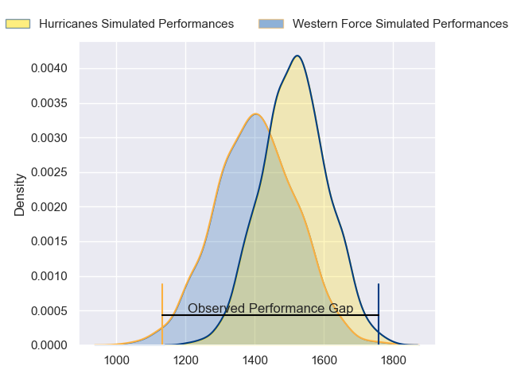
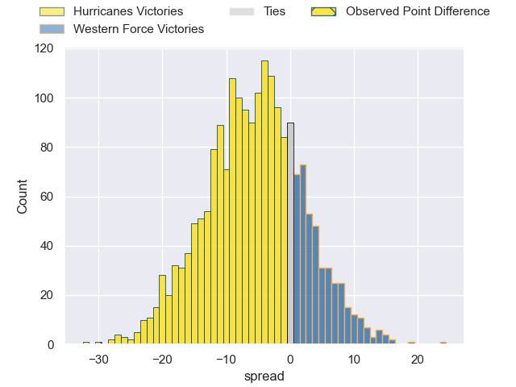
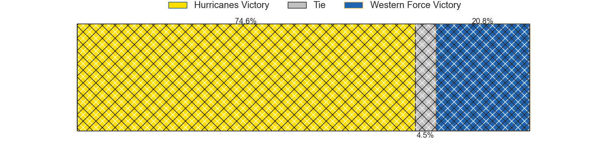
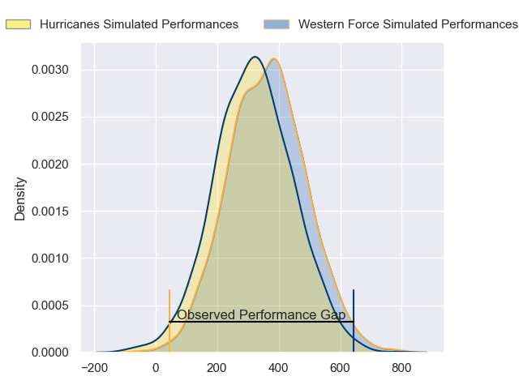
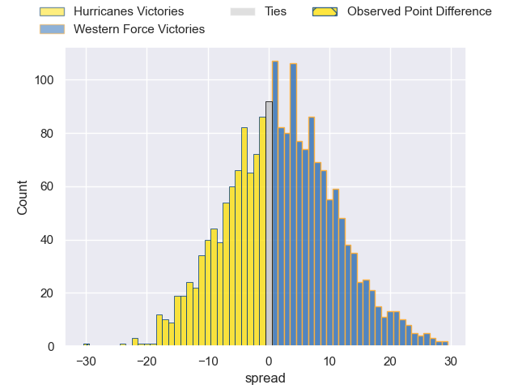

---  
layout: page  
title: Hurricanes at Western Force; 44-14  
date: 2024-02-23 18:00:00 -0500  
categories: "Super Rugby Pacific 2024" match review  
---
# Hurricanes at Western Force; 44-14

# Club Level Predictions

The first set of predictions treats a club as the smallest object, as the club develops its members, organizes a gameplan, and deploys its players as needed for each match. This club model has a prediction of 0.353, which translates to predicting Hurricanes to win by 5.5.

Our Over/Under is 58.5 - and combined with the spread above, we have a predicted scoreline of 32 to 27

Each club has a rating and a rating deviation (similar to a Glicko rating), and expected performances can be generated. This allows for simulated matches and spreads like the ones below.
## Projected Performances - Club Model

## Projected Spreads - Club Model

## Projected Results - Club Model

# Player Level Predictions - Version 2

Treating teams instead as an entity made up of the currently active players, I have ratings for each player in an altogether different system. These can be combined to form team ratings once teamsheets are announced, weighting starters a bit higher than the reserves. After the match is played, players can be weighted by their minutes on the field, allowing for an accurate measure of the team's composition. With these compiled team ratings, we can make predictions, measure inaccuracy, and update the individual player ratings.
## Prediction without Player Minutes: Western Force by 2.8

Hurricanes by 1.1 on a neutral pitch

## Projected Performances - Player Model

## Projected Spreads - Player Model

## Projected Results - Player Model

|   Away Minutes | Away Player          |   Away Percentile |   Number |   Home Percentile | Home Player           |   Home Minutes |
|---------------:|:---------------------|------------------:|---------:|------------------:|:----------------------|---------------:|
|             59 | Xavier Numia         |             94.53 |        1 |             23.12 | Marley Pearce         |             63 |
|             63 | Asafo Aumua          |             94.46 |        2 |             61.99 | Tom Horton            |             59 |
|             40 | Pasilio Tosi         |             49.91 |        3 |              9.95 | Santiago Medrano      |             63 |
|             80 | Caleb Delany         |             79.15 |        4 |             94.82 | Tom Franklin          |             56 |
|             80 | Isaia Walker-Leawere |             95.16 |        5 |             65.32 | Izack Rodda           |             80 |
|             26 | Devan Flanders       |             83.49 |        6 |              1.8  | Michael Wells         |             78 |
|             63 | Du'Plessis Kirifi    |             91.43 |        7 |             21.38 | Carlo Tizzano         |             80 |
|             80 | Peter Lakai          |             85.78 |        8 |             68.3  | Will Harris           |             68 |
|             50 | Jordi Viljoen        |             34.77 |        9 |             99.8  | Nic White             |             52 |
|             80 | Brett Cameron        |             10.93 |       10 |             63.18 | Ben Donaldson         |             80 |
|             80 | Kini Naholo          |             95.13 |       11 |             83.17 | Chase Tiatia          |             75 |
|             73 | Jordie Barrett       |             96.04 |       12 |             86.03 | Hamish Stewart        |             80 |
|             80 | Billy Proctor        |             88.13 |       13 |             45.75 | Sam Spink             |             80 |
|             80 | Joshua Moorby        |             74.81 |       14 |             61.48 | Harry Potter          |             80 |
|             69 | Ruben Love           |             89.89 |       15 |             14.94 | Max Burey             |             80 |
|             17 | James O'Reilly       |             27.68 |       16 |             94.28 | Ben Funnell           |             21 |
|             21 | Pouri Rakete-Stones  |             87.54 |       17 |             41.22 | Charlie Hancock       |             17 |
|             40 | Tyrel Lomax          |             91.76 |       18 |            nan    | Tiaan Tauakipulu      |             17 |
|             54 | Brayden Iose         |              1.63 |       19 |              6.03 | Ollie Callan          |             12 |
|             17 | Justin Sangster      |             72.12 |       20 |             13.86 | Tim Anstee            |             24 |
|             30 | Cam Roigard          |             43.42 |       21 |            nan    | Titi Nofoagatotoa     |              2 |
|              7 | Riley Higgins        |             85.61 |       22 |             67.58 | Issak Fines-Leleiwasa |             28 |
|             11 | Salesi Rayasi        |             86.14 |       23 |            nan    | George Poolman        |              5 |

