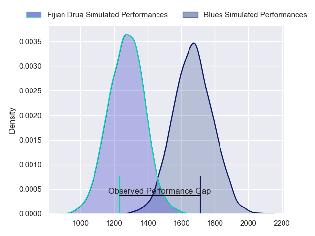
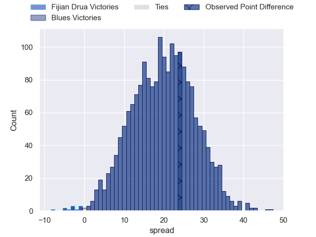
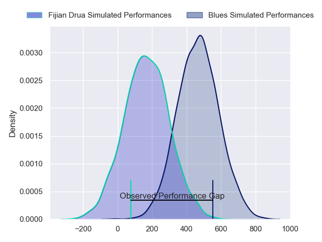
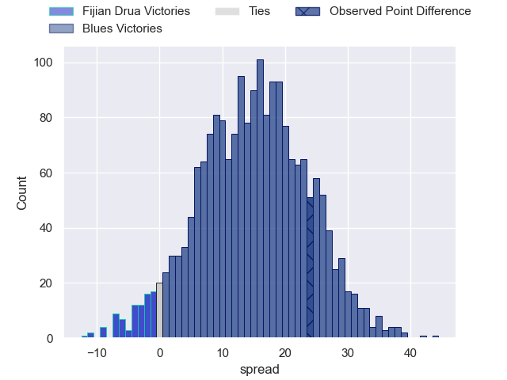

---  
layout: page  
title: Fijian Drua at Blues; 10-34  
date: 2024-02-24 18:00:00 -0500  
categories: "Super Rugby Pacific 2024" match review  
---
# Fijian Drua at Blues; 10-34

# Club Level Predictions

The first set of predictions treats a club as the smallest object, as the club develops its members, organizes a gameplan, and deploys its players as needed for each match. This club model has a prediction of 0.899, which translates to predicting Blues to win by 20.0.

Our Over/Under is 60.5 - and combined with the spread above, we have a predicted scoreline of 20 to 40

Each club has a rating and a rating deviation (similar to a Glicko rating), and expected performances can be generated. This allows for simulated matches and spreads like the ones below.
## Projected Performances - Club Model

## Projected Spreads - Club Model

## Projected Results - Club Model

# Player Level Predictions - Version 2

Treating teams instead as an entity made up of the currently active players, I have ratings for each player in an altogether different system. These can be combined to form team ratings once teamsheets are announced, weighting starters a bit higher than the reserves. After the match is played, players can be weighted by their minutes on the field, allowing for an accurate measure of the team's composition. With these compiled team ratings, we can make predictions, measure inaccuracy, and update the individual player ratings.
## Prediction without Player Minutes: Blues by 16.4

Blues by 12.0 on a neutral pitch

## Projected Performances - Player Model

## Projected Spreads - Player Model

## Projected Results - Player Model

|   Away Minutes | Away Player            |   Away Percentile |   Number |   Home Percentile | Home Player        |   Home Minutes |
|---------------:|:-----------------------|------------------:|---------:|------------------:|:-------------------|---------------:|
|             51 | Livai Natave           |             34.23 |        1 |             64.34 | Josh Fusitua       |             50 |
|             72 | Tevita Ikanivere       |             84.13 |        2 |             90.77 | Kurt Eklund        |             48 |
|             52 | Mesake Doge            |             18.73 |        3 |             95.7  | Angus Ta'avao      |             48 |
|             80 | Isoa Nasilasila        |             76.27 |        4 |             30.18 | Sam Darry          |             56 |
|             62 | Ratu Rotuisolia        |             34.1  |        5 |             74.65 | Josh Beehre        |             80 |
|             80 | Etonia Waqa            |             36.72 |        6 |             54.81 | Anton Segner       |             57 |
|             80 | Elia Canakaivata       |             53.02 |        7 |             98.31 | Dalton Papalii     |             75 |
|             69 | Ratu Meli Derenalagi   |             78.32 |        8 |             87.65 | Hoskins Sotutu     |             80 |
|             57 | Frank Lomani           |             46.95 |        9 |             70.92 | Finlay Christie    |             56 |
|             80 | Isaiah Ravula          |             14.73 |       10 |             95.25 | Stephen Perofeta   |             80 |
|             80 | Selestino Ravutaumada  |             78.1  |       11 |             18.52 | Caleb Clarke       |             80 |
|             80 | Apisalome Vota         |             44.94 |       12 |             89.99 | Harry Plummer      |             80 |
|             69 | Iosefo Masi            |             68.68 |       13 |             73.57 | Rieko Ioane        |             69 |
|             80 | Epeli Momo             |             11.85 |       14 |             95.98 | Mark Telea         |             80 |
|             51 | Isikeli Rabitu         |             37.93 |       15 |             79.54 | Zarn Sullivan      |             80 |
|              8 | Mesu Dolokoto          |            nan    |       16 |             27.78 | Jordan Lay         |             30 |
|             29 | Emosi Tuqiri           |             61.02 |       17 |             62.55 | Ricky Riccitelli   |             32 |
|             28 | Jone Koroiduadua       |             37.81 |       18 |             63.26 | Marcel Renata      |             32 |
|             18 | Mesake Vocevoce        |            nan    |       19 |             92.97 | Laghlan McWhannell |             24 |
|             11 | Vilive Miramira        |             65.08 |       20 |             49.31 | Adrian Choat       |             23 |
|             23 | Peni Matawalu          |             58.35 |       21 |             50.57 | Cole Forbes        |              5 |
|             11 | Kemu Valentini         |             56.29 |       22 |             76.23 | Sam Nock           |             24 |
|             29 | Tuidraki Samusamuvodre |             21.16 |       23 |             62.01 | AJ Lam             |             11 |

