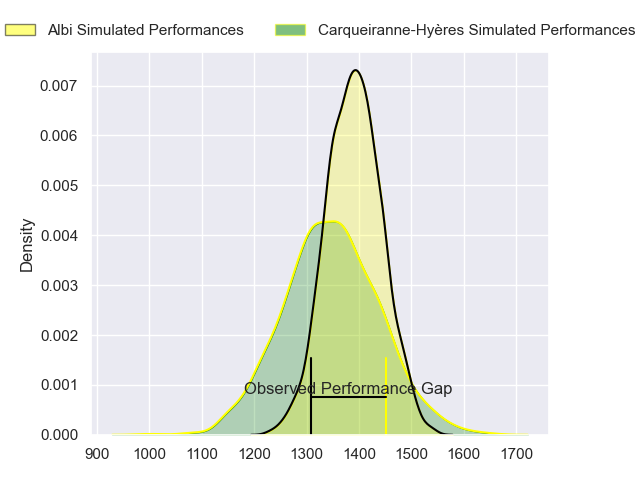
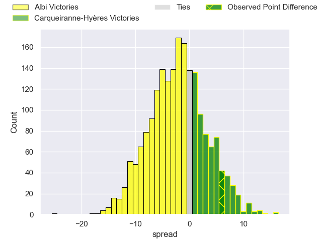
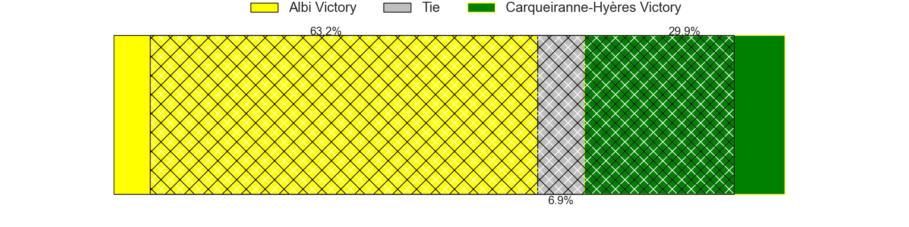
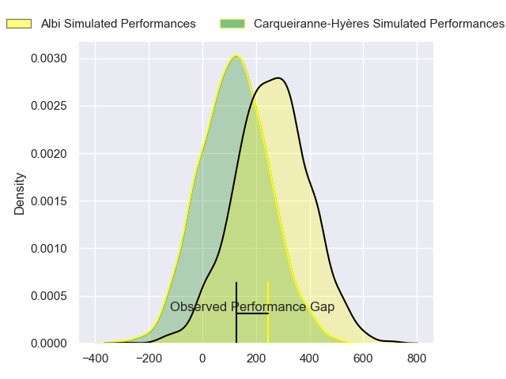
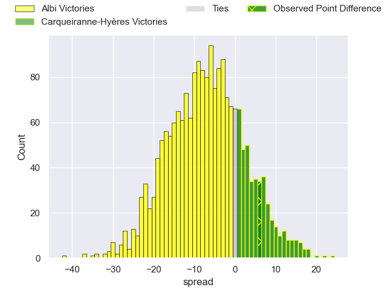
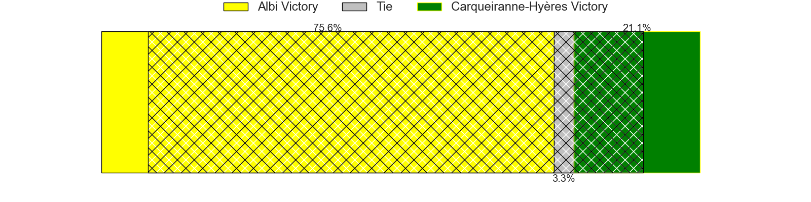

---  
layout: page  
title: Albi at Carqueiranne-Hyeres; 20-26  
date: 2024-02-24 18:00:00 -0500  
categories: "Nationale 2023" match review  
---
# Albi at Carqueiranne-Hyeres; 20-26

# Club Level Predictions

The first set of predictions treats a club as the smallest object, as the club develops its members, organizes a gameplan, and deploys its players as needed for each match. This club model has a prediction of 0.436, which translates to predicting Albi to win by 2.3.

Our Over/Under is 44.5 - and combined with the spread above, we have a predicted scoreline of 24 to 21

Each club has a rating and a rating deviation (similar to a Glicko rating), and expected performances can be generated. This allows for simulated matches and spreads like the ones below.
## Projected Performances - Club Model

## Projected Spreads - Club Model

## Projected Results - Club Model

# Player Level Predictions - Version 2

Treating teams instead as an entity made up of the currently active players, I have ratings for each player in an altogether different system. These can be combined to form team ratings once teamsheets are announced, weighting starters a bit higher than the reserves. After the match is played, players can be weighted by their minutes on the field, allowing for an accurate measure of the team's composition. With these compiled team ratings, we can make predictions, measure inaccuracy, and update the individual player ratings.
## Prediction without Player Minutes: Albi by 6.9

Albi by 9.4 on a neutral pitch

## Projected Performances - Player Model

## Projected Spreads - Player Model

## Projected Results - Player Model

|   Away Minutes | Away Player         |   Away Percentile |   Number |   Home Percentile | Home Player      |   Home Minutes |
|---------------:|:--------------------|------------------:|---------:|------------------:|:-----------------|---------------:|
|             80 | Antoine Soave       |             86.49 |        1 |             75.67 | Sti Sithole      |             80 |
|             80 | Reinach Venter      |             10.11 |        2 |             21.14 | Yan Tabarot      |             80 |
|             80 | Dimitri Tchapnga    |             83.99 |        3 |             14.49 | Miguel Mathieu   |             80 |
|             80 | Yanis Horvath       |             59.01 |        4 |             51.78 | Adam Peters      |             80 |
|             80 | Dion Evrard Oulai   |             17.68 |        5 |             38.23 | Nathan Gendre    |             80 |
|             80 | Simon Meka          |             89.08 |        6 |             31.5  | Nicolas Baquer   |             80 |
|             80 | Lucas Guillaume     |             40.93 |        7 |             60.87 | Joachim Beaumont |             80 |
|             80 | Camille Jarreau     |             64.8  |        8 |             95.8  | Andre Gorin      |             80 |
|             80 | Théo Vidal          |             94.88 |        9 |             40.16 | Rémi Dubié       |             80 |
|             80 | Benjamin Pehau      |             76.9  |       10 |             49.05 | Juan Kotze       |             80 |
|             80 | Kamilieni Raivono   |             38.67 |       11 |             36.55 | Paul Gadea       |             80 |
|             80 | Jarrod Poi          |             24.19 |       12 |             86.05 | Romain Leveque   |             80 |
|             80 | Baptiste Couchinave |             89.65 |       13 |             32.21 | Dylan Sage       |             80 |
|             80 | Charly Trussardi    |             48.31 |       14 |             69.28 | Josselyn Bouchon |             80 |
|             80 | Enzo Marzocca       |             74.36 |       15 |             67.21 | Ionel Melinte    |             80 |

