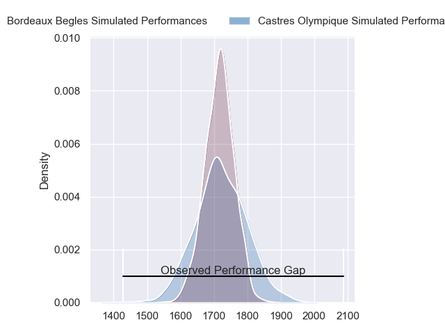
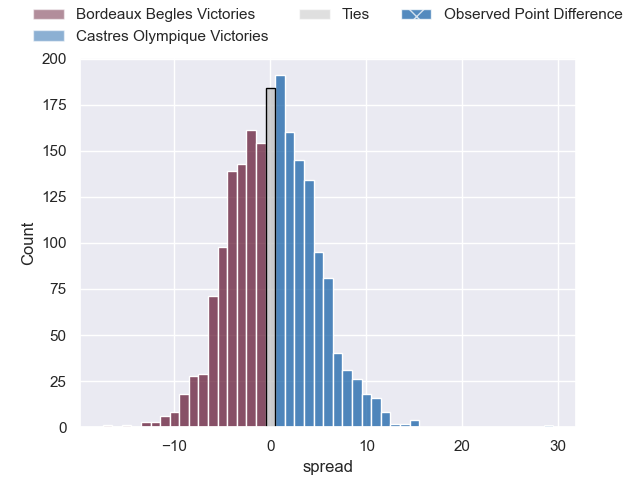
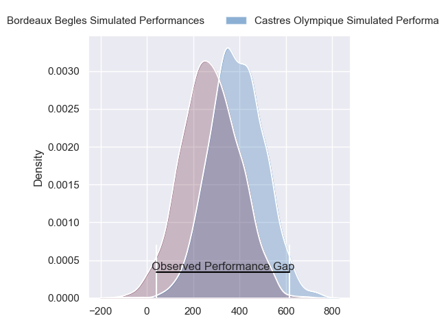
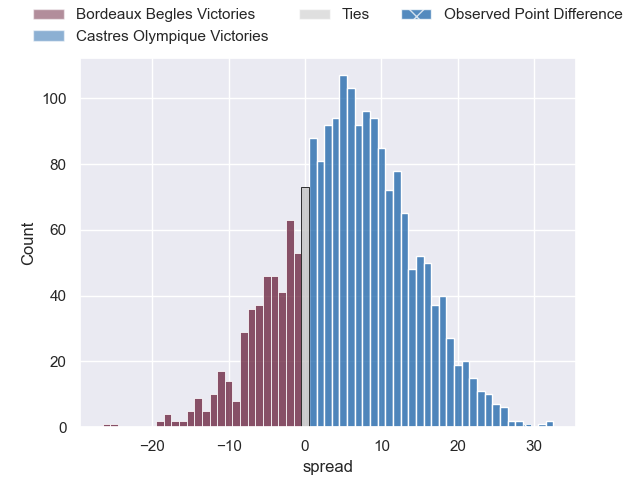
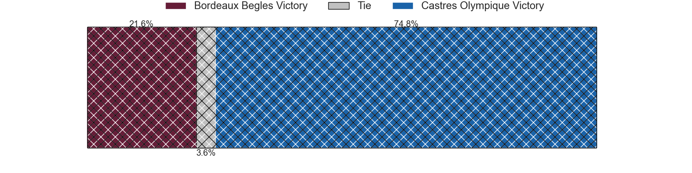

---  
layout: page  
title: Bordeaux Begles at Castres Olympique; 12-41  
date: 2024-02-24 18:00:00 -0500  
categories: "Top 14 Orange 2023" match review  
---
# Bordeaux Begles at Castres Olympique; 12-41

# Club Level Predictions

The first set of predictions treats a club as the smallest object, as the club develops its members, organizes a gameplan, and deploys its players as needed for each match. This club model has a prediction of 0.51, which translates to predicting Castres Olympique to win by 0.3.

Our Over/Under is 42.5 - and combined with the spread above, we have a predicted scoreline of 21 to 21

Each club has a rating and a rating deviation (similar to a Glicko rating), and expected performances can be generated. This allows for simulated matches and spreads like the ones below.
## Projected Performances - Club Model

## Projected Spreads - Club Model

## Projected Results - Club Model

# Player Level Predictions - Version 2

Treating teams instead as an entity made up of the currently active players, I have ratings for each player in an altogether different system. These can be combined to form team ratings once teamsheets are announced, weighting starters a bit higher than the reserves. After the match is played, players can be weighted by their minutes on the field, allowing for an accurate measure of the team's composition. With these compiled team ratings, we can make predictions, measure inaccuracy, and update the individual player ratings.
## Prediction without Player Minutes: Castres Olympique by 7.8

Bordeaux Begles by 0.1 on a neutral pitch

## Projected Performances - Player Model

## Projected Spreads - Player Model

## Projected Results - Player Model

|   Away Minutes | Away Player               |   Away Percentile |   Number |   Home Percentile | Home Player                |   Home Minutes |
|---------------:|:--------------------------|------------------:|---------:|------------------:|:---------------------------|---------------:|
|             52 | Jefferson Poirot          |             69.18 |        1 |             72.58 | Lois Guerois-Galisson      |             51 |
|             55 | Romain Laterrade          |              8.49 |        2 |             56.83 | Loris Zarantonello         |             79 |
|             27 | Zaccharie Affane          |             39.52 |        3 |             84.14 | Levan Chilachava           |             51 |
|             29 | Guido Petti               |             89.75 |        4 |             95.74 | Leone Nakarawa             |             58 |
|             80 | Kane Douglas              |             77.53 |        5 |             85.71 | Tom Staniforth             |             80 |
|             80 | Bastien Vergnes Taillefer |             71.53 |        6 |             86.77 | Baptiste Delaporte         |             80 |
|             52 | Mahamadou Diaby           |             78.31 |        7 |             94.18 | Tyler Ardron               |             80 |
|             52 | Pete Samu                 |             84.38 |        8 |             55.48 | Abraham Papali'i           |             51 |
|             41 | Theo Nanette              |              2.75 |        9 |             77.8  | Santiago Arata             |             58 |
|             54 | Mateo Garcia              |             29.69 |       10 |             77.43 | Louis Le Brun              |             80 |
|             80 | Pablo Uberti              |             19.58 |       11 |             89.63 | Nathanael Hulleu           |             80 |
|             80 | Nicolas Depoortere        |             81.49 |       12 |             97.21 | Jack Goodhue               |             67 |
|             80 | Zack Holmes               |             78.7  |       13 |             33.76 | Adrien Seguret             |             80 |
|             80 | Mael Moustin              |             22.65 |       14 |             94.81 | Geoffrey Palis             |             44 |
|             80 | Romain Buros              |             96.55 |       15 |             74.94 | Pierre Popelin             |             80 |
|             53 | Toma Taufa                |             70.34 |       16 |             75.45 | Josaia Raisuqe             |             36 |
|             51 | Alexandre Ricard          |             61.18 |       17 |             49.1  | Nick Champion de Crespigny |             29 |
|             39 | Paul Abadie               |              2.95 |       18 |             85.93 | Antoine Tichit             |             29 |
|             28 | Antoine Miquel            |             73.86 |       19 |             64.52 | Henry Thomas               |             29 |
|             28 | Tevita Tatafu             |             84.62 |       20 |              6.11 | Gauthier Maravat           |             22 |
|             28 | Ben Tameifuna             |             97.94 |       21 |             28.49 | Jeremy Fernandez           |             22 |
|             26 | Tani Vili                 |             49.24 |       22 |             91.39 | Adrea Cocagi               |             13 |
|             25 | Clement Maynadier         |             93.17 |       23 |            nan    | Stefan Buruiana            |              1 |

