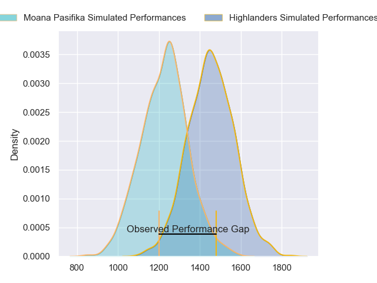
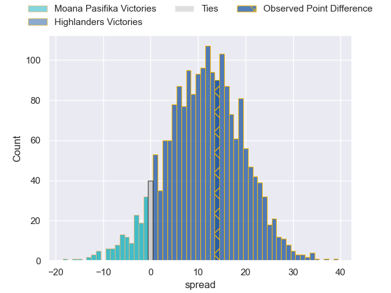
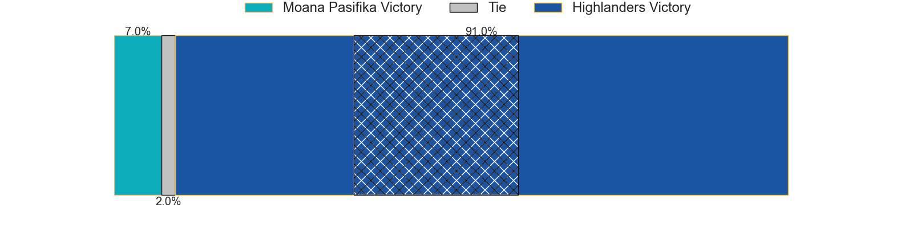
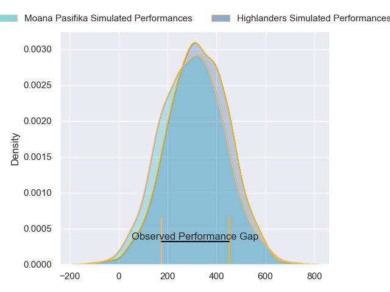
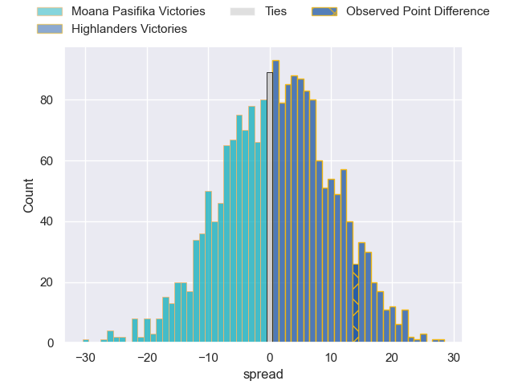

---  
layout: page  
title: Moana Pasifika at Highlanders; 21-35  
date: 2024-02-24 18:00:00 -0500  
categories: "Super Rugby Pacific 2024" match review  
---
# Moana Pasifika at Highlanders; 21-35

# Club Level Predictions

The first set of predictions treats a club as the smallest object, as the club develops its members, organizes a gameplan, and deploys its players as needed for each match. This club model has a prediction of 0.775, which translates to predicting Highlanders to win by 11.4.

Our Over/Under is 65.5 - and combined with the spread above, we have a predicted scoreline of 27 to 39

Each club has a rating and a rating deviation (similar to a Glicko rating), and expected performances can be generated. This allows for simulated matches and spreads like the ones below.
## Projected Performances - Club Model

## Projected Spreads - Club Model

## Projected Results - Club Model

# Player Level Predictions - Version 2

Treating teams instead as an entity made up of the currently active players, I have ratings for each player in an altogether different system. These can be combined to form team ratings once teamsheets are announced, weighting starters a bit higher than the reserves. After the match is played, players can be weighted by their minutes on the field, allowing for an accurate measure of the team's composition. With these compiled team ratings, we can make predictions, measure inaccuracy, and update the individual player ratings.
## Prediction without Player Minutes: Highlanders by 2.8

Moana Pasifika by 1.8 on a neutral pitch

## Projected Performances - Player Model

## Projected Spreads - Player Model

## Projected Results - Player Model

|   Away Minutes | Away Player       |   Away Percentile |   Number |   Home Percentile | Home Player                   |   Home Minutes |
|---------------:|:------------------|------------------:|---------:|------------------:|:------------------------------|---------------:|
|             55 | James Lay         |             35.75 |        1 |             20.97 | Dan Lienert-Brown             |             63 |
|             55 | Sama Malolo       |             76.01 |        2 |             37.64 | Henry Bell                    |             63 |
|             55 | Sione Mafileo     |             81.18 |        3 |             32.44 | Saula Mau                     |             48 |
|             62 | Tom Savage        |             95.39 |        4 |             72.81 | Fabian Holland                |             80 |
|             80 | Sam Slade         |              9.79 |        5 |             97.58 | Pari Pari Parkinson           |             68 |
|             75 | Miracle Faiilagi  |             67.2  |        6 |             24.02 | Sean Withy                    |             80 |
|             23 | Alamanda Motuga   |             52.06 |        7 |             76.19 | Billy Harmon                  |             80 |
|             80 | Lotu Inisi        |             40.56 |        8 |              9.32 | Hugh Renton                   |             62 |
|             62 | Ere Enari         |              5.11 |        9 |             67.98 | Folau Fakatava                |             79 |
|             80 | William Havili    |             54.39 |       10 |             98.34 | Rhys Patchell                 |             75 |
|             80 | Viliami Fine      |              3.92 |       11 |             83.39 | Jona Nareki                   |             80 |
|             80 | Julian Savea      |             99.3  |       12 |             46.33 | Sam Gilbert                   |             80 |
|             80 | Pepesana Patafilo |             85.91 |       13 |             18.74 | Tanielu Teleʻa                |             63 |
|             80 | Nigel Ah Wong     |             88.57 |       14 |             40.11 | Timoci Tavatavanawai          |             80 |
|             62 | Danny Toala       |             25.06 |       15 |             97.47 | Jacob Ratumaitavuki-Kneepkens |             80 |
|             25 | Abraham Pole      |             60.84 |       16 |             95.43 | Ayden Johnstone               |             17 |
|             25 | Samiuela Moli     |             20.42 |       17 |             39.7  | Jermaine Ainsley              |             32 |
|             25 | Donald Brighouse  |            nan    |       18 |             54.98 | Jack Taylor                   |             17 |
|             18 | Allan Craig       |             52.88 |       19 |             47.09 | Nikora Broughton              |             18 |
|             57 | Jacob Norris      |             93.47 |       20 |            nan    | Oliver Haig                   |             12 |
|              5 | Anzelo Tuitavuki  |             25.19 |       21 |             54.03 | Nathan Hastie                 |              1 |
|             18 | Aisea Halo        |            nan    |       22 |             53.68 | Cameron Millar                |              5 |
|             18 | D'Angelo Leuila   |             34.23 |       23 |             86.98 | Jonah Lowe                    |             17 |

