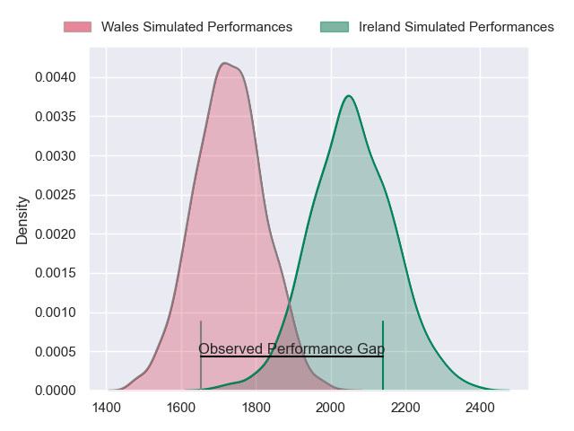
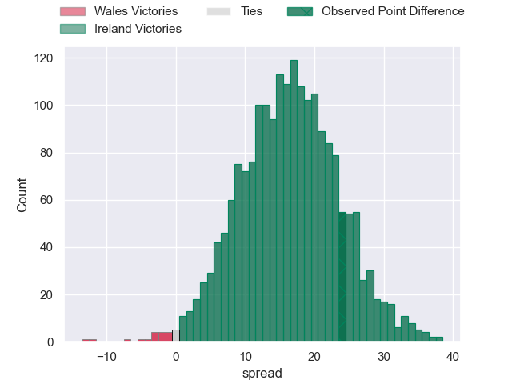
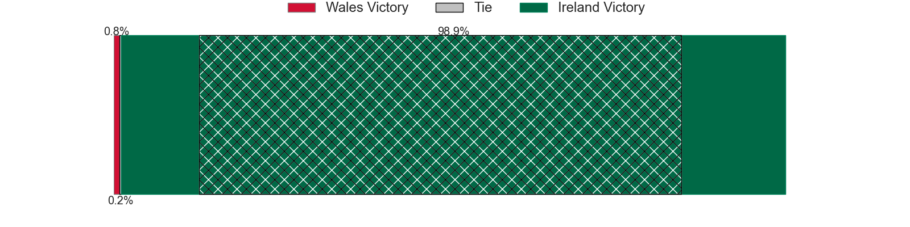
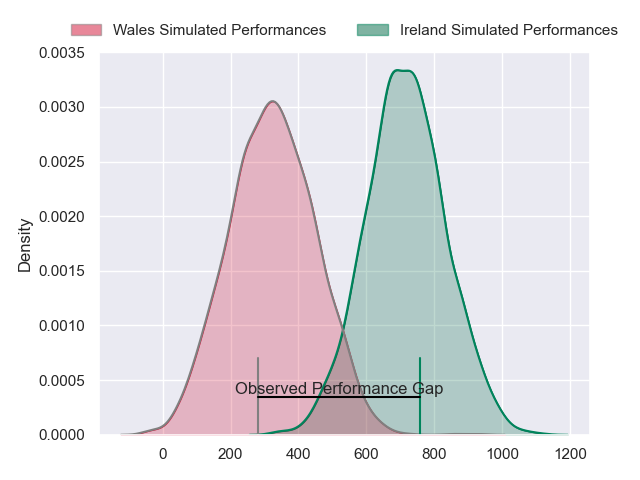
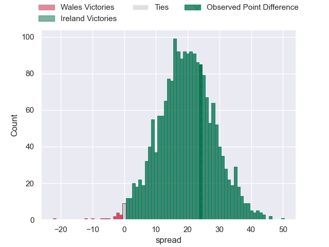
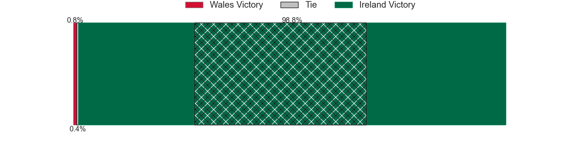

---  
layout: page  
title: Wales at Ireland; 7-31  
date: 2024-02-24 18:00:00 -0500  
categories: "Six Nations Championship 2024" match review  
---
# Wales at Ireland; 7-31

# Club Level Predictions

The first set of predictions treats a club as the smallest object, as the club develops its members, organizes a gameplan, and deploys its players as needed for each match. This club model has a prediction of 0.86, which translates to predicting Ireland to win by 16.4.

Our Over/Under is 45.5 - and combined with the spread above, we have a predicted scoreline of 15 to 31

Each club has a rating and a rating deviation (similar to a Glicko rating), and expected performances can be generated. This allows for simulated matches and spreads like the ones below.
## Projected Performances - Club Model

## Projected Spreads - Club Model

## Projected Results - Club Model

# Player Level Predictions - Version 2

Treating teams instead as an entity made up of the currently active players, I have ratings for each player in an altogether different system. These can be combined to form team ratings once teamsheets are announced, weighting starters a bit higher than the reserves. After the match is played, players can be weighted by their minutes on the field, allowing for an accurate measure of the team's composition. With these compiled team ratings, we can make predictions, measure inaccuracy, and update the individual player ratings.
## Prediction without Player Minutes: Ireland by 23.8

Ireland by 20.1 on a neutral pitch

## Projected Performances - Player Model

## Projected Spreads - Player Model

## Projected Results - Player Model

|   Away Minutes | Away Player       |   Away Percentile |   Number |   Home Percentile | Home Player         |   Home Minutes |
|---------------:|:------------------|------------------:|---------:|------------------:|:--------------------|---------------:|
|             75 | Gareth Thomas     |             64.61 |        1 |             96.01 | Andrew Porter       |             73 |
|             60 | Elliot Dee        |             90.38 |        2 |             83.58 | Dan Sheehan         |             55 |
|             51 | Keiron Assiratti  |             28.77 |        3 |             98.82 | Tadhg Furlong       |             55 |
|             83 | Dafydd Jenkins    |             93.53 |        4 |             87.88 | Joe McCarthy        |             55 |
|             55 | Adam Beard        |             94.12 |        5 |             99.53 | Tadhg Beirne        |             83 |
|             55 | Alex Mann         |             11.99 |        6 |             98.92 | Peter O'Mahony      |             55 |
|             83 | Tommy Reffell     |             92.22 |        7 |             99.35 | Josh van der Flier  |             51 |
|             83 | Aaron Wainwright  |             85.92 |        8 |             97.89 | Caelan Doris        |             83 |
|             67 | Tomos Williams    |             85.43 |        9 |             98    | Jamison Gibson-Park |             71 |
|             80 | Sam Costelow      |             44.93 |       10 |             64.25 | Jack Crowley        |             83 |
|             83 | Rio Dyer          |             32.26 |       11 |            100    | James Lowe          |             83 |
|             83 | Nick Tompkins     |             98.35 |       12 |             99.76 | Bundee Aki          |             83 |
|             83 | George North      |             99.41 |       13 |             94.94 | Robbie Henshaw      |             83 |
|             57 | Josh Adams        |             70.63 |       14 |             92.6  | Calvin Nash         |             67 |
|             76 | Cameron Winnett   |             59.09 |       15 |             68.42 | Ciaran Frawley      |             83 |
|             23 | Ryan Elias        |             91.7  |       16 |             91.32 | Ronan Kelleher      |             28 |
|              8 | Corey Domachowski |             76.13 |       17 |             92.92 | Cian Healy          |             10 |
|             32 | Dillon Lewis      |             96.73 |       18 |             89.47 | Oli Jager           |             28 |
|             28 | Will Rowlands     |             22.71 |       19 |             96.59 | James Ryan          |             28 |
|             28 | Mackenzie Martin  |             28.4  |       20 |             89.2  | Ryan Baird          |             28 |
|             16 | Kieran Hardy      |             70.06 |       21 |             98.12 | Jack Conan          |             32 |
|             10 | Ioan Lloyd        |              8.94 |       22 |             97.8  | Conor Murray        |             12 |
|             26 | Mason Grady       |             71.17 |       23 |             62.9  | Stuart McCloskey    |             16 |

