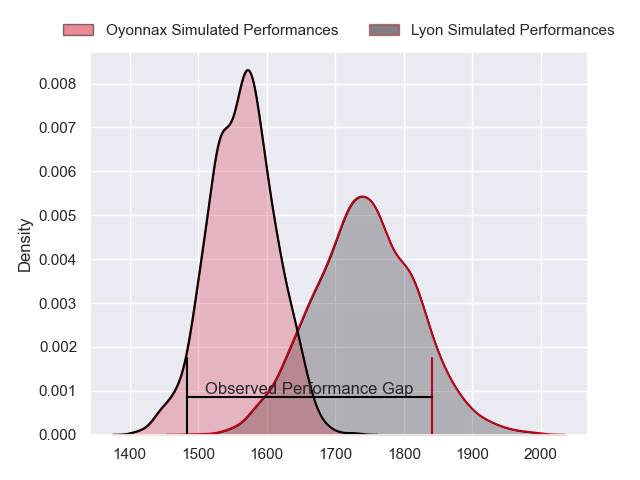
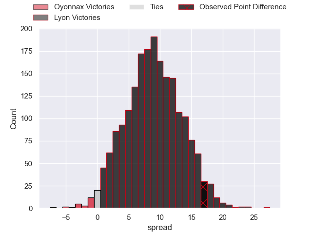
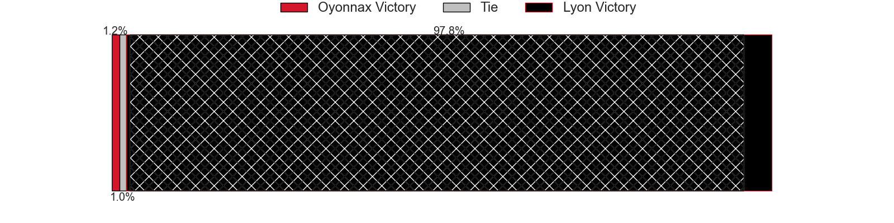
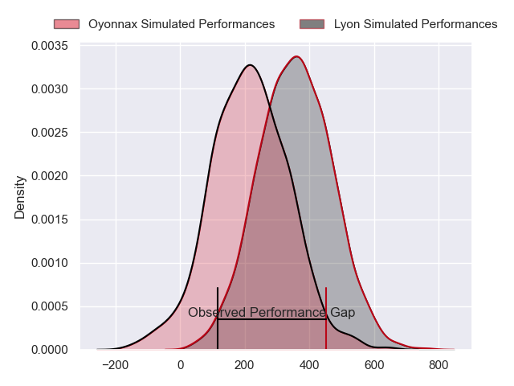
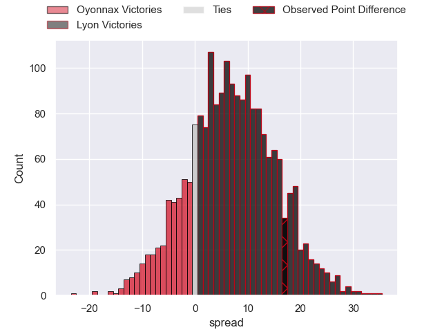
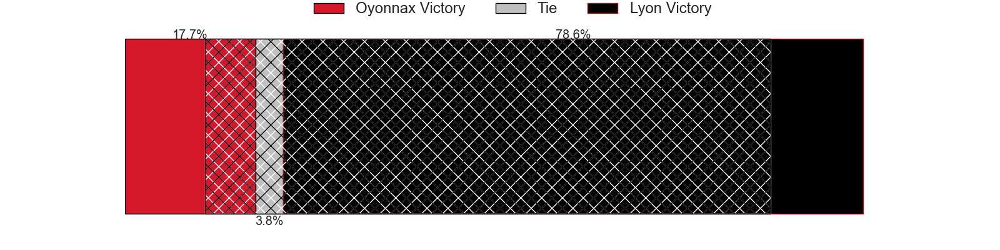

---  
layout: page  
title: Oyonnax at Lyon; 26-43  
date: 2024-02-24 18:00:00 -0500  
categories: "Top 14 Orange 2023" match review  
---
# Oyonnax at Lyon; 26-43

# Club Level Predictions

The first set of predictions treats a club as the smallest object, as the club develops its members, organizes a gameplan, and deploys its players as needed for each match. This club model has a prediction of 0.737, which translates to predicting Lyon to win by 9.1.

Our Over/Under is 56.5 - and combined with the spread above, we have a predicted scoreline of 23 to 33

Each club has a rating and a rating deviation (similar to a Glicko rating), and expected performances can be generated. This allows for simulated matches and spreads like the ones below.
## Projected Performances - Club Model

## Projected Spreads - Club Model

## Projected Results - Club Model

# Player Level Predictions - Version 2

Treating teams instead as an entity made up of the currently active players, I have ratings for each player in an altogether different system. These can be combined to form team ratings once teamsheets are announced, weighting starters a bit higher than the reserves. After the match is played, players can be weighted by their minutes on the field, allowing for an accurate measure of the team's composition. With these compiled team ratings, we can make predictions, measure inaccuracy, and update the individual player ratings.
## Prediction without Player Minutes: Lyon by 6.5

Oyonnax by 0.9 on a neutral pitch

## Projected Performances - Player Model

## Projected Spreads - Player Model

## Projected Results - Player Model

|   Away Minutes | Away Player        |   Away Percentile |   Number |   Home Percentile | Home Player          |   Home Minutes |
|---------------:|:-------------------|------------------:|---------:|------------------:|:---------------------|---------------:|
|             55 | Tommy Raynaud      |             81.49 |        1 |             25.68 | Jerome Rey           |             53 |
|             48 | Benjamin Geledan   |             17.74 |        2 |             81.7  | Liam Coltman         |             60 |
|             64 | Christopher Vaotoa |             34.03 |        3 |             57.89 | Feao Fotuaika        |             51 |
|             53 | Phoenix Battye     |             97.53 |        4 |             76.71 | Felix Lambey         |             69 |
|             62 | Hugo Fabregue      |             40.12 |        5 |             64.94 | Alban Roussel        |             74 |
|             60 | Wandrille Picault  |             31.53 |        6 |             23.76 | Theo William         |             68 |
|             85 | Loic Credoz        |             31.32 |        7 |             64.25 | Liam Allen           |             85 |
|             76 | Rory Grice         |             58.69 |        8 |             63.38 | Mickael Guillard     |             74 |
|             62 | Charlie Cassang    |             80.24 |        9 |             93.01 | Baptiste Couilloud   |             75 |
|             85 | Domingo Miotti     |             89.37 |       10 |             82.61 | Paddy Jackson        |             85 |
|             85 | Daniel Ikpefan     |             71.38 |       11 |             80.6  | Davit Niniashvili    |             85 |
|             85 | Theo Millet        |             71.97 |       12 |             15.55 | Josiah Maraku        |             85 |
|             67 | Pedro Bettencourt  |             15.9  |       13 |             61.13 | Alfred Parisien      |             53 |
|             85 | Gavin Stark        |             15.54 |       14 |             95.93 | Vincent Rattez       |             85 |
|             85 | Justin Bouraux     |             25.84 |       15 |             54.78 | Alexandre Tchaptchet |              8 |
|             37 | Teddy Durand       |             35.66 |       16 |             50.94 | Yanis Charcosset     |             25 |
|             30 | Rory Sutherland    |             34.3  |       17 |              7.99 | Hamza Kaabeche       |             32 |
|             32 | Victor Lebas       |              7.65 |       18 |             39.52 | Marvin Okuya         |             22 |
|             25 | Steve Mafi         |             21.76 |       19 |             50.76 | Joel Kpoku           |             33 |
|             23 | Ilan El Khattabi   |            nan    |       20 |             44.51 | Liam Rimet           |             10 |
|             18 | Lucas Mensa        |             74.79 |       21 |             63.04 | Leo Berdeu           |             32 |
|             32 | Loic Godener       |             11.03 |       22 |             67.26 | Kyle Godwin          |             77 |
|             21 | Thibault Berthaud  |             43.01 |       23 |            nan    | Valentin Simutoga    |             34 |

