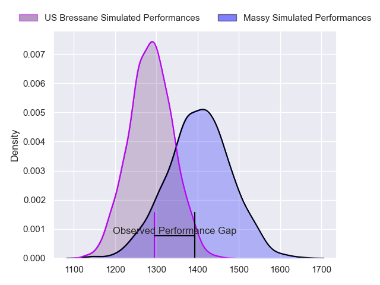
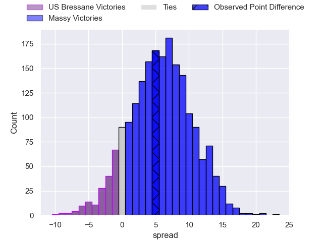
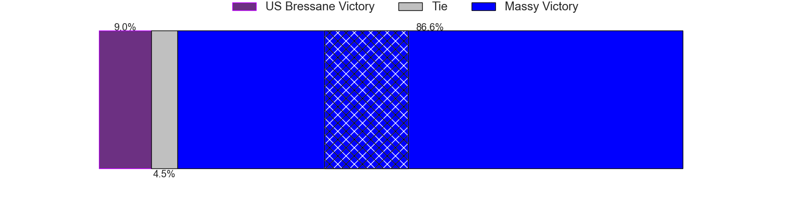
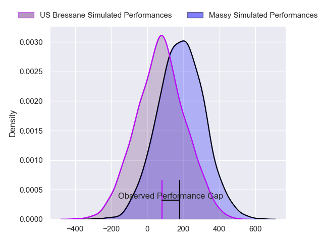
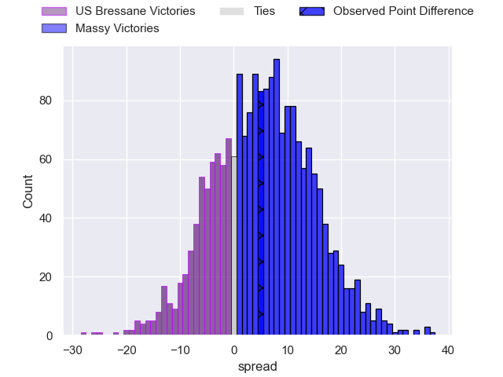
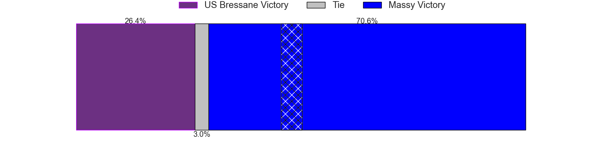

---  
layout: page  
title: US Bressane at Massy; 22-27  
date: 2024-02-24 18:00:00 -0500  
categories: "Nationale 2023" match review  
---
# US Bressane at Massy; 22-27

# Club Level Predictions

The first set of predictions treats a club as the smallest object, as the club develops its members, organizes a gameplan, and deploys its players as needed for each match. This club model has a prediction of 0.662, which translates to predicting Massy to win by 5.9.

Our Over/Under is 41.5 - and combined with the spread above, we have a predicted scoreline of 18 to 24

Each club has a rating and a rating deviation (similar to a Glicko rating), and expected performances can be generated. This allows for simulated matches and spreads like the ones below.
## Projected Performances - Club Model

## Projected Spreads - Club Model

## Projected Results - Club Model

# Player Level Predictions - Version 2

Treating teams instead as an entity made up of the currently active players, I have ratings for each player in an altogether different system. These can be combined to form team ratings once teamsheets are announced, weighting starters a bit higher than the reserves. After the match is played, players can be weighted by their minutes on the field, allowing for an accurate measure of the team's composition. With these compiled team ratings, we can make predictions, measure inaccuracy, and update the individual player ratings.
## Prediction without Player Minutes: Massy by 5.4

Massy by 1.3 on a neutral pitch

## Projected Performances - Player Model

## Projected Spreads - Player Model

## Projected Results - Player Model

|   Away Minutes | Away Player               |   Away Percentile |   Number |   Home Percentile | Home Player          |   Home Minutes |
|---------------:|:--------------------------|------------------:|---------:|------------------:|:---------------------|---------------:|
|             80 | Vazha Kapanadze           |             73.7  |        1 |              5.19 | Fernandez Correa     |             80 |
|             80 | Clement Jullien           |             85.85 |        2 |             92.46 | Pierre Trassoudaine  |             80 |
|             80 | Erich de Jager            |             63.86 |        3 |             80.05 | Tijde Visser         |             80 |
|             80 | Guillaume Marin           |             57.98 |        4 |              0.8  | Abongile Nonkontwana |             80 |
|             80 | Josh Peters               |             13.32 |        5 |             87.49 | Andrei Mahu          |             80 |
|             80 | Pierre Reynaud            |             56.73 |        6 |             16.97 | Tony Tissot          |             80 |
|             80 | Loic Baradel              |             67.66 |        7 |             94.91 | Clément Vidoni       |             80 |
|             80 | Joseph Penitito           |             65.27 |        8 |             68.53 | Samuel Nollet        |             80 |
|             80 | Jeremy Valencot           |             55.51 |        9 |             45.28 | Loris Rouet          |             80 |
|             80 | Christian Lacombe         |              6.19 |       10 |              4.76 | Hugo Verdu           |             80 |
|             80 | Élie De Fleurian          |             36.02 |       11 |             56.04 | Giorgi Gogoladze     |             80 |
|             80 | Parataiso Silafai-Lea'ana |             36.05 |       12 |             49.88 | Victorien Jacomme    |             80 |
|             80 | Maile Mamao               |             27.09 |       13 |             87.67 | Tom Cusson           |             80 |
|             80 | Dimitri Doucet            |             65.04 |       14 |              8.9  | Yanis Dit Robaglia   |             80 |
|             80 | Florent Massip            |             84.99 |       15 |             71.13 | Tom Deleuze          |             80 |

