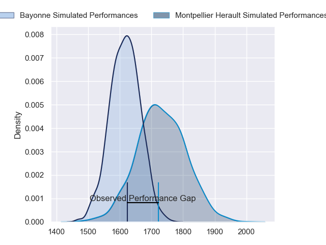
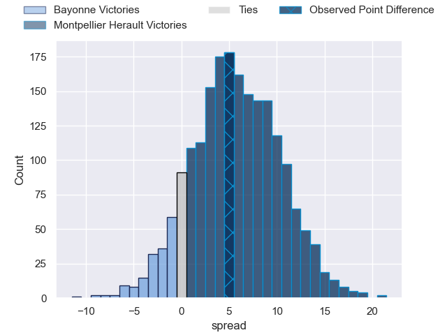
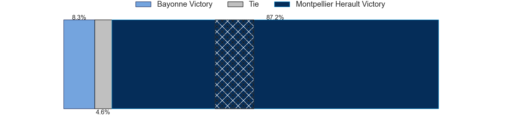
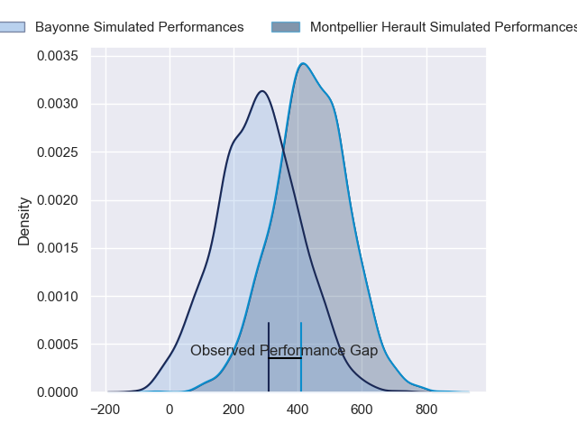
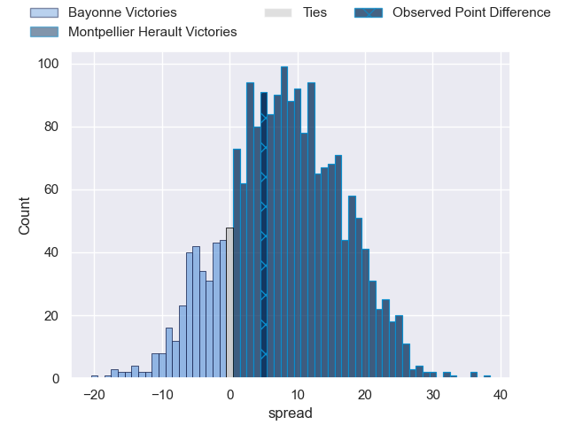
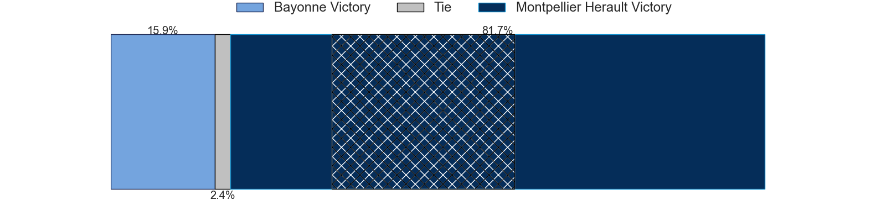

---  
layout: page  
title: Bayonne at Montpellier Herault; 23-28  
date: 2024-02-24 18:00:00 -0500  
categories: "Top 14 Orange 2023" match review  
---
# Bayonne at Montpellier Herault; 23-28

# Club Level Predictions

The first set of predictions treats a club as the smallest object, as the club develops its members, organizes a gameplan, and deploys its players as needed for each match. This club model has a prediction of 0.657, which translates to predicting Montpellier Herault to win by 5.7.

Our Over/Under is 43.5 - and combined with the spread above, we have a predicted scoreline of 19 to 25

Each club has a rating and a rating deviation (similar to a Glicko rating), and expected performances can be generated. This allows for simulated matches and spreads like the ones below.
## Projected Performances - Club Model

## Projected Spreads - Club Model

## Projected Results - Club Model

# Player Level Predictions - Version 2

Treating teams instead as an entity made up of the currently active players, I have ratings for each player in an altogether different system. These can be combined to form team ratings once teamsheets are announced, weighting starters a bit higher than the reserves. After the match is played, players can be weighted by their minutes on the field, allowing for an accurate measure of the team's composition. With these compiled team ratings, we can make predictions, measure inaccuracy, and update the individual player ratings.
## Prediction without Player Minutes: Montpellier Herault by 8.8

Montpellier Herault by 1.4 on a neutral pitch

## Projected Performances - Player Model

## Projected Spreads - Player Model

## Projected Results - Player Model

|   Away Minutes | Away Player           |   Away Percentile |   Number |   Home Percentile | Home Player                 |   Home Minutes |
|---------------:|:----------------------|------------------:|---------:|------------------:|:----------------------------|---------------:|
|             80 | Matis Perchaud        |             58.24 |        1 |             10.84 | Baptiste Erdocio            |             46 |
|             49 | Facundo Bosch         |             91.33 |        2 |             86.53 | Brandon Paenga-Amosa        |             46 |
|             52 | Luke Tagi             |             79.84 |        3 |             96.68 | Harry Williams              |             46 |
|             80 | Manuel Leindekar      |              9.56 |        4 |             93.89 | Marco Tauleigne             |             46 |
|             48 | Thomas Ceyte          |             47.12 |        5 |             66.36 | Tyler Duguid                |             80 |
|             80 | Pierre Huguet         |             54.18 |        6 |             90.05 | Nicolaas Janse van Rensburg |             62 |
|             80 | Baptiste Heguy        |             91.53 |        7 |             59.37 | Lenni Nouchi                |             46 |
|             80 | Rodrigo Bruni         |             99.53 |        8 |             75.76 | Sam Simmonds                |             80 |
|             58 | Maxime Machenaud      |             92.93 |        9 |             95.09 | Cobus Reinach               |             62 |
|             48 | Thomas Dolhagaray     |             49.88 |       10 |             67.93 | Louis Carbonel              |             80 |
|             80 | Remy Baget            |             89.84 |       11 |             99.58 | Ben Lam                     |             80 |
|             80 | Guillaume Martocq     |             37.37 |       12 |             83.47 | Jan Serfontein              |             80 |
|             80 | Arnaud Erbinartegaray |             43.31 |       13 |             66.01 | Arthur Vincent              |             80 |
|             80 | Aurelien Callandret   |             77.04 |       14 |              3.39 | Gabriel Ngandebe            |             55 |
|             80 | Cheikh Tiberghien     |             18.16 |       15 |             56.09 | Alexandre de Nardi          |             80 |
|             32 | Camille Lopez         |             94.54 |       16 |             94.81 | Yacouba Camara              |             34 |
|             32 | Arthur Iturria        |             87.72 |       17 |             77.69 | Enzo Forletta               |             34 |
|             31 | Vincent Giudicelli    |             13.84 |       18 |             93.54 | Christopher Tolofua         |             34 |
|             28 | Pieter Scholtz        |              3.58 |       19 |             70.97 | Luka Japaridze              |             34 |
|             22 | Gela Aprasidze        |             61.1  |       20 |             83.87 | Bastien Chalureau           |             34 |
|            nan | nan                   |            nan    |       21 |             96.93 | George Bridge               |             25 |
|            nan | nan                   |            nan    |       22 |             37.14 | Alexandre Becognee          |             18 |
|            nan | nan                   |            nan    |       23 |             53.63 | Leo Coly                    |             18 |

