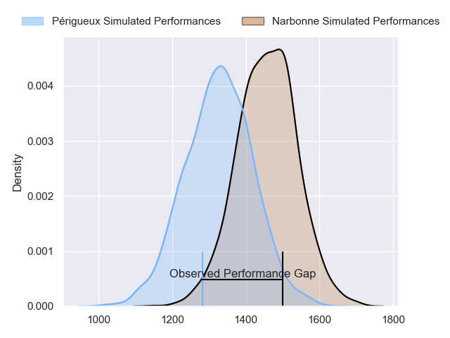
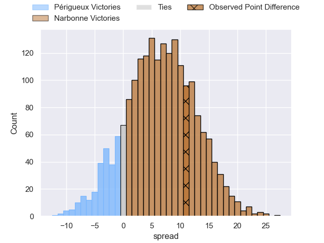
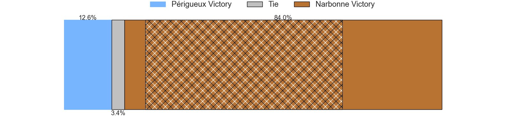
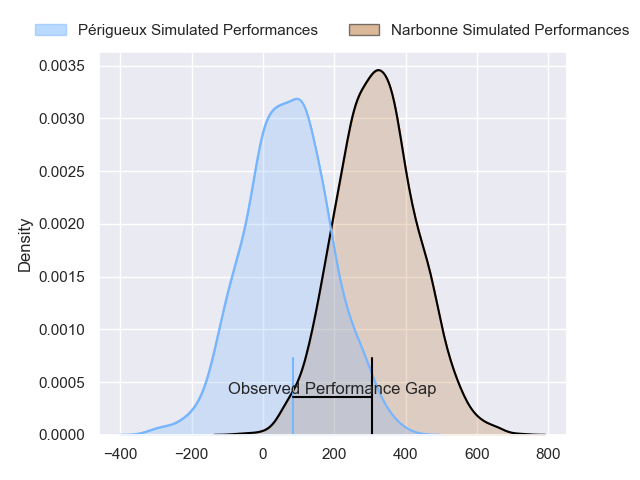
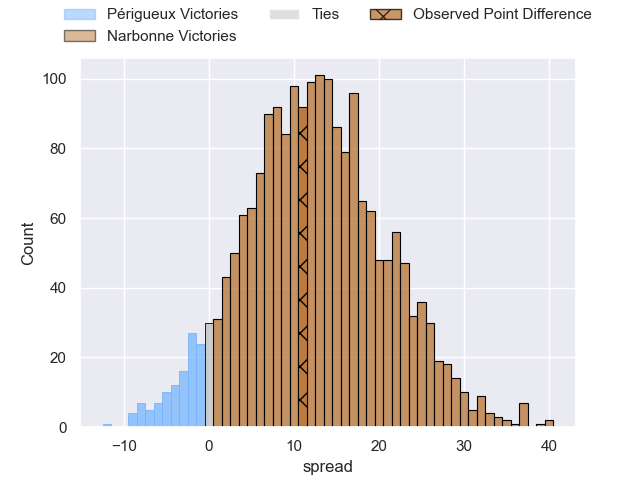
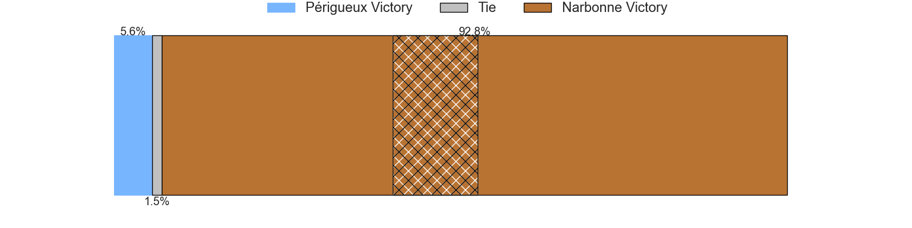

---  
layout: page  
title: Perigueux at Narbonne; 22-33  
date: 2024-02-24 18:00:00 -0500  
categories: "Nationale 2023" match review  
---
# Perigueux at Narbonne; 22-33

# Club Level Predictions

The first set of predictions treats a club as the smallest object, as the club develops its members, organizes a gameplan, and deploys its players as needed for each match. This club model has a prediction of 0.672, which translates to predicting Narbonne to win by 6.5.

Our Over/Under is 48.5 - and combined with the spread above, we have a predicted scoreline of 21 to 28

Each club has a rating and a rating deviation (similar to a Glicko rating), and expected performances can be generated. This allows for simulated matches and spreads like the ones below.
## Projected Performances - Club Model

## Projected Spreads - Club Model

## Projected Results - Club Model

# Player Level Predictions - Version 2

Treating teams instead as an entity made up of the currently active players, I have ratings for each player in an altogether different system. These can be combined to form team ratings once teamsheets are announced, weighting starters a bit higher than the reserves. After the match is played, players can be weighted by their minutes on the field, allowing for an accurate measure of the team's composition. With these compiled team ratings, we can make predictions, measure inaccuracy, and update the individual player ratings.
## Prediction without Player Minutes: Narbonne by 13.3

Narbonne by 5.5 on a neutral pitch

## Projected Performances - Player Model

## Projected Spreads - Player Model

## Projected Results - Player Model

|   Away Minutes | Away Player       |   Away Percentile |   Number |   Home Percentile | Home Player            |   Home Minutes |
|---------------:|:------------------|------------------:|---------:|------------------:|:-----------------------|---------------:|
|             53 | Jason Tindiliere  |             27.31 |        1 |             54.9  | Sylvain Abadie         |             55 |
|             53 | Lucas Marijon     |             68.49 |        2 |             24.34 | Clément Esteriola      |             62 |
|             53 | Anthony Pelmard   |             55.17 |        3 |             63.61 | Jamie Hagan            |             45 |
|             53 | Richard Fourcade  |             20.12 |        4 |             73.41 | Marius Antonescu       |             57 |
|             53 | Jaco Willemse     |             19.76 |        5 |             17.53 | Leva Fifita            |             80 |
|             80 | Marius Vialle     |             12.31 |        6 |             69.98 | Luke Nakobukobua       |             80 |
|             80 | Hendri Storm      |             48.49 |        7 |             56.37 | Arthur Christienne     |             80 |
|             53 | Clement Lanen     |             25.35 |        8 |             32.86 | Charles Malet          |             55 |
|             53 | Enzo Hardy        |             27.35 |        9 |             18.56 | Pierrick Nova          |             62 |
|             80 | Yann Caillat      |             25.12 |       10 |              4.11 | Gilles Bosch           |             67 |
|             80 | Pierre Tournebize |             13.18 |       11 |             68.9  | Ambrose Curtis         |             80 |
|             40 | Cyril Couturier   |             79.27 |       12 |             98.82 | Peter Betham           |             67 |
|             80 | Vincent Fouillade |             51.71 |       13 |             44.88 | Pierre Nueno           |             80 |
|             80 | Benjamin Yarde    |             20.47 |       14 |             75.56 | Clément Clavières      |             80 |
|             80 | Arthur Duhau      |             78.95 |       15 |             58.61 | Paul Auradou           |             80 |
|             40 | Fred Hickes       |             84.92 |       16 |             34.85 | Mohammed Loukia        |             35 |
|             27 | Gaëtan Chapon     |             38.52 |       17 |             53.29 | Baptiste Abescat-Leroy |             25 |
|             27 | Madioke Konate    |             11.65 |       18 |             63.7  | Théo Castinel          |             25 |
|             27 | Pierre Rousserie  |             52.59 |       19 |             34.47 | Dennis Visser          |             23 |
|             27 | Damien Lavergne   |             19.51 |       20 |             69.06 | Pablo Barbaste         |             18 |
|             27 | Kalaveti Tawake   |             57.08 |       21 |             69.43 | Christophe David       |             18 |
|             27 | Baptiste Arvouet  |             32.26 |       22 |             39.81 | Théo Mias              |             13 |
|             27 | Emilien Borges    |            nan    |       23 |             39.61 | Tom Chauvet            |             13 |

